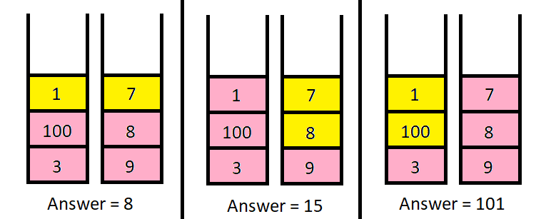

### [2218\. 从栈中取出 K 个硬币的最大面值和](https://leetcode.cn/problems/maximum-value-of-k-coins-from-piles/)

难度：困难

一张桌子上总共有 `n` 个硬币 **栈**。每个栈有 **正整数** 个带面值的硬币。

每一次操作中，你可以从任意一个栈的 **顶部** 取出 1 个硬币，从栈中移除它，并放入你的钱包里。

给你一个列表 `piles`，其中 `piles[i]` 是一个整数数组，分别表示第 `i` 个栈里 **从顶到底** 的硬币面值。同时给你一个正整数 `k`，请你返回在 **恰好** 进行 `k` 次操作的前提下，你钱包里硬币面值之和 **最大为多少**。

**示例 1：**

> **输入：** piles = \[[1,100,3],[7,8,9]], k = 2
> **输出：** 101
> **解释：**
> 上图展示了几种选择 k 个硬币的不同方法。
> 我们可以得到的最大面值为 101。

**示例 2：**

> **输入：** piles = \[[100],[100],[100],[100],[100],[100],[1,1,1,1,1,1,700]], k = 7
> **输出：** 706
> **解释：**
> 如果我们所有硬币都从最后一个栈中取，可以得到最大面值和。

**提示：**

- `n == piles.length`
- `1 <= n <= 1000`
- <code>1 <= piles[i][j] <= 105</code>
- `1 <= k <= sum(piles[i].length) <= 2000`
