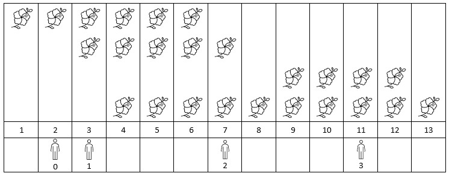

### [2251\. 花期内花的数目](https://leetcode.cn/problems/number-of-flowers-in-full-bloom/)

难度：困难

给你一个下标从 **0** 开始的二维整数数组 `flowers` ，其中 `flowers[i] = [start_i, end_i]` 表示第 `i` 朵花的 **花期** 从 `start_i` 到 `end_i` （都 **包含**）。同时给你一个下标从 **0** 开始大小为 `n` 的整数数组 `people` ，`people[i]` 是第 `i` 个人来看花的时间。

请你返回一个大小为 `n` 的整数数组 `answer` ，其中 `answer[i]`是第 `i` 个人到达时在花期内花的 **数目** 。

**示例 1：**



```
输入：flowers = [[1,6],[3,7],[9,12],[4,13]], people = [2,3,7,11]
输出：[1,2,2,2]
解释：上图展示了每朵花的花期时间，和每个人的到达时间。
对每个人，我们返回他们到达时在花期内花的数目。
```

**示例 2：**


```
输入：flowers = [[1,10],[3,3]], people = [3,3,2]
输出：[2,2,1]
解释：上图展示了每朵花的花期时间，和每个人的到达时间。
对每个人，我们返回他们到达时在花期内花的数目。
```

**提示：**

-   `1 <= flowers.length <= 5 * 10^4`
-   `flowers[i].length == 2`
-   `1 <= start_i <= end_i <= 10^9`
-   `1 <= people.length <= 5 * 10^4`
-   `1 <= people[i] <= 10^9`
