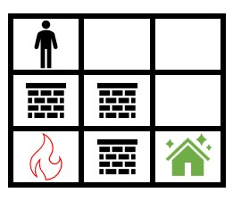

### [2258\. 逃离火灾](https://leetcode.cn/problems/escape-the-spreading-fire/)

难度：困难

给你一个下标从 **0** 开始大小为 `m x n` 的二维整数数组 `grid` ，它表示一个网格图。每个格子为下面 3 个值之一：

-   `0` 表示草地。
-   `1` 表示着火的格子。
-   `2` 表示一座墙，你跟火都不能通过这个格子。

一开始你在最左上角的格子 `(0, 0)` ，你想要到达最右下角的安全屋格子 `(m - 1, n - 1)` 。每一分钟，你可以移动到 **相邻** 的草地格子。每次你移动 **之后** ，着火的格子会扩散到所有不是墙的 **相邻** 格子。

请你返回你在初始位置可以停留的 **最多** 分钟数，且停留完这段时间后你还能安全到达安全屋。如果无法实现，请你返回 `-1` 。如果不管你在初始位置停留多久，你 **总是** 能到达安全屋，请你返回 `10^9` 。

注意，如果你到达安全屋后，火马上到了安全屋，这视为你能够安全到达安全屋。

如果两个格子有共同边，那么它们为 **相邻** 格子。

**示例 1：**


```
输入：grid = [[0,2,0,0,0,0,0],[0,0,0,2,2,1,0],[0,2,0,0,1,2,0],[0,0,2,2,2,0,2],[0,0,0,0,0,0,0]]
输出：3
解释：上图展示了你在初始位置停留 3 分钟后的情形。
你仍然可以安全到达安全屋。
停留超过 3 分钟会让你无法安全到达安全屋。
```

**示例 2：**


```
输入：grid = [[0,0,0,0],[0,1,2,0],[0,2,0,0]]
输出：-1
解释：上图展示了你马上开始朝安全屋移动的情形。
火会蔓延到你可以移动的所有格子，所以无法安全到达安全屋。
所以返回 -1 。

```

**示例 3：**



```
输入：grid = [[0,0,0],[2,2,0],[1,2,0]]
输出：1000000000
解释：上图展示了初始网格图。
注意，由于火被墙围了起来，所以无论如何你都能安全到达安全屋。
所以返回 109 。
```

**提示：**

-   `m == grid.length`
-   `n == grid[i].length`
-   `2 <= m, n <= 300`
-   `4 <= m * n <= 2 * 10^4`
-   `grid[i][j]` 是 `0` ，`1` 或者 `2` 。
-   `grid[0][0] == grid[m - 1][n - 1] == 0`
