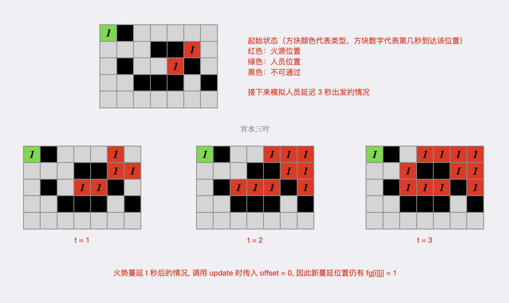
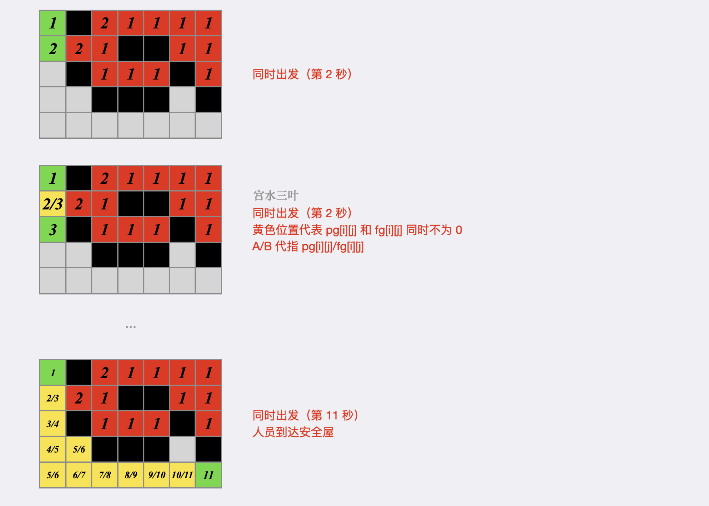

### [【宫水三叶】详解如何从「二分」到「分类讨论」(图解过程)](https://leetcode.cn/problems/escape-the-spreading-fire/solutions/2518985/gong-shui-san-xie-xiang-jie-ru-he-cong-e-458x/)

#### 二分 + BFS

火势蔓延是一个固定的过程，只有人员移动需要决策。

假设人员最晚在 $t$ 秒后出发，仍能到达安全屋，说明人员对逃走路线的访问，要比火势更快。那么人员在更早的时间点（$[0, t - 1]$ 秒后）出发，必然仍能按照原定路线到达安全屋（火势对路径的影响不变）。

因此，在以 $t$ 为分割点的（正整数）数轴上，具有二段性，可运用「二分」求分割点。

假设存在某个判定函数 `check`，用于检查人员在 $x$ 秒后出发能否到达安全屋，那么可知：

-   当实际延迟出发的秒数，小于等于 $t$ 秒，必然能安全到达
-   当实际延迟出发的描述，超过 $t$ 秒，必然不能安全到达

在人员移动路线中，“回头路”是没有意义的，因此人员对每个点的访问次数最多为一次。同时，不考虑墙的阻拦，火势也最多在不超过棋盘大小的时间内完全蔓延。

这指导我们最大延迟出发时间不会超过 $n \times m$，可在 $[0, n \times m]$ 值域内进行二分。

接下来，考虑如何实现 `check` 函数，函数入参为延迟出发秒数 $t$，返回值为延迟出发后能否到达安全屋。

首先，对于普通位置，如果火势和人员同时到达，是不允许的，而安全屋 $(n - 1, m - 1)$ 位置的同时到达，是允许的。

因此，我们需要使用两个二维数组 `fg` 和 `pg` 分别记录「火势」和「人员」到达某个位置的最早时间。

1.  创建用于模拟火势蔓延的队列 `fire`，遍历网格，将火源位置进行入队，更新火源位置 $fg[i][j] = 1$，表示火势在第一秒时最早出现在此处；
    
2.  运用 `BFS`，模拟 $t$ 秒的火势蔓延，火势在这 $t$ 秒内所蔓延到的新位置，均看作为起始火源，即有 $fg[i][j] = 1$。
    若执行完 $t$ 秒后，火势已蔓延到人员起始位置 $(0, 0)$，那么延迟 $t$ 秒出发不可行，直接返回 `False`；
3.  创建用于模拟人员移动的队列 `people`，将起始位置 $(0, 0)$ 进行入队，更新 $pg[0][0] = 1$。
    运用 `BFS`，按照「先火后人」的方式，同步模拟「火势蔓延」和「人员移动」过程。普通位置，只要火势蔓延到，那么人将无法移动到此处；安全屋位置，需要判断是否与火势同一时刻到达。

为了方便，将「火势蔓延」和「人员移动」统一成 `update` 操作，入参包括当前队列 `d`，标识位 `isFire`，以及移动偏移量 `offset`。

在进行 $t$ 秒的火势蔓延时，调用 $t$ 次的 `update(fire, true, 0)`。在火势和人员同步模拟时，分别调用 `update(fire, true, 1)` 和 `update(people, false, 1)`。

使用示例 $1$ 来举个 🌰：




代码：

```java
class Solution {
    int[][] dirs = new int[][]{{0,1}, {0,-1}, {1,0}, {-1,0}};
    int n, m;
    boolean ok;
    int[][] g, fg, pg;
    public int maximumMinutes(int[][] grid) {
        g = grid;
        n = g.length; m = g[0].length;
        fg = new int[n][m]; pg = new int[n][m];
        if (!check(0)) return -1;
        int l = 0, r = n * m;
        while (l < r) {
            int mid = l + r + 1 >> 1;
            if (check(mid)) l = mid;
            else r = mid - 1;
        }
        return r == m * n ? (int)1e9 : r;
    }
    boolean check(int t) {
        ok = false;
        Deque<int[]> frie = new ArrayDeque<>();
        for (int i = 0; i < n; i++) {
            for (int j = 0; j < m; j++) {
                fg[i][j] = pg[i][j] = 0;
                if (g[i][j] == 1) {
                    fg[i][j] = 1;
                    frie.addLast(new int[]{i, j});
                }
            }
        }
        while(t-- > 0) update(frie, true, 0);  // 先执行 t 秒的火势蔓延
        if (fg[0][0] != 0) return false;
        Deque<int[]> people = new ArrayDeque<>();
        pg[0][0] = 1;
        people.addLast(new int[]{0, 0});
        while (!people.isEmpty()) {
            // 先火后人, 同步进行
            update(frie, true, 1);
            update(people, false, 1);
            if (ok) return true;
        }
        return false;
    }
    void update(Deque<int[]> deque, boolean isFire, int offset) {
        int sz = deque.size();
        while (sz-- > 0) {
            int[] info = deque.pollFirst();
            int x = info[0], y = info[1];
            for (int[] dir : dirs) {
                int nx = x + dir[0], ny = y + dir[1];
                if (nx < 0 || nx >= n || ny < 0 || ny >= m) continue;
                if (g[nx][ny] == 2) continue;
                if (isFire) {
                    if (fg[nx][ny] != 0) continue;
                    fg[nx][ny] = fg[x][y] + offset;
                } else {
                    if (nx == n - 1 && ny == m - 1 && (fg[nx][ny] == 0 || fg[nx][ny] == pg[x][y] + offset)) ok = true;  // 火尚未到达 或 同时到达
                    if (fg[nx][ny] != 0 || pg[nx][ny] != 0) continue;
                    pg[nx][ny] = pg[x][y] + offset;
                }
                deque.addLast(new int[]{nx, ny});
            }
        }
    }
}
```

```c++
class Solution {
public:
    vector<vector<int>> dirs = {{0,1}, {0,-1}, {1,0}, {-1,0}};
    int n, m;
    bool ok;
    vector<vector<int>> g, fg, pg;
    int maximumMinutes(vector<vector<int>>& grid) {
        g = grid;
        n = g.size(); m = g[0].size();
        fg = vector<vector<int>>(n, vector<int>(m, 0)), pg = vector<vector<int>>(n, vector<int>(m, 0));
        if (!check(0)) return -1;
        int l = 0, r = n * m;
        while (l < r) {
            int mid = l + r + 1 >> 1;
            if (check(mid)) l = mid;
            else r = mid - 1;
        }
        return r == n * m ? (int)1e9 : r;
    }
    bool check(int t) {
        ok = false;
        deque<vector<int>> frie;   
        for (int i = 0; i < n; i++) {
            for (int j = 0; j < m; j++) {
                fg[i][j] = pg[i][j] = 0;
                if (g[i][j] == 1) {
                    fg[i][j] = 1;
                    frie.push_back({i, j});
                }
            }
        }
        while (t-- > 0) update(frie, true, 0);
        if (fg[0][0] != 0) return false;
        deque<vector<int>> people;
        pg[0][0] = 1;
        people.push_back({0, 0});
        while (!people.empty()) {
            update(frie, true, 1);
            update(people, false, 1);
            if (ok) return true;
        }
        return false;
    }
    void update(deque<vector<int>>& deque, bool isFire, int offset) {
        int sz = deque.size();
        while (sz-- > 0) {
            vector<int> info = deque.front();
            deque.pop_front();
            int x = info[0], y = info[1];
            for (vector<int> dir : dirs) {
                int nx = x + dir[0], ny = y + dir[1];
                if (nx < 0 || nx >= n || ny < 0 || ny >= m) continue;
                if (g[nx][ny] == 2) continue;
                if (isFire) {
                    if (fg[nx][ny] != 0) continue;                    
                    fg[nx][ny] = fg[x][y] + offset;
                } else {
                    if (nx == n - 1 && ny == m - 1 && (fg[nx][ny] == 0 || fg[nx][ny] == pg[x][y] + offset)) ok = true;
                    if (fg[nx][ny] != 0 || pg[nx][ny] != 0) continue;
                    pg[nx][ny] = pg[x][y] + offset;
                }
                deque.push_back({nx, ny});
            }
        }
    }
};
```

```python
from collections import deque

class Solution:
    def maximumMinutes(self, grid: List[List[int]]) -> int:
        dirs = [(0,1),(0,-1),(1,0),(-1,0)]
        g = grid
        n, m = len(g), len(g[0])
        fg, pg, ok = None, None, False

        def update(d, isFire, offset):
            nonlocal ok
            for _ in range(len(d)):
                x, y = d.popleft()
                for dx, dy in dirs:
                    nx, ny = x + dx, y + dy
                    if nx < 0 or nx >= n or ny < 0 or ny >= m: continue
                    if g[nx][ny] == 2: continue
                    if isFire:
                        if fg[nx][ny] != 0: continue
                        fg[nx][ny] = fg[x][y] + offset
                    else:
                        if nx == n - 1 and ny == m - 1 and (fg[nx][ny] == 0 or fg[nx][ny] == pg[x][y] + offset): ok = True
                        if fg[nx][ny] != 0 or pg[nx][ny] != 0: continue
                        pg[nx][ny] = pg[x][y] + offset
                    d.append((nx, ny))

        def check(t):
            nonlocal pg, fg, ok
            ok = False
            pg = [[0] * m for _ in range(n)]
            fg = [[g[i][j] == 1 for j in range(m)] for i in range(n)]
            fire = deque([(i, j) for i, j in product(range(n), range(m)) if g[i][j] == 1])
            for _ in range(t): update(fire, True, 0)
            if fg[0][0] != 0: return False
            people = deque()
            pg[0][0] = 1
            people.append((0, 0))
            while people:
                update(fire, True, 1)
                update(people, False, 1)
                if ok: return True
            return False

        if not check(0): return -1
        l, r = 0, n * m
        while l < r:
            mid = l + r + 1 >> 1
            if check(mid): l = mid
            else: r = mid - 1
        return int(1e9) if r == n * m else r
```

```typescript
function maximumMinutes(grid: number[][]): number {
    const dirs = [[0,1],[0,-1],[1,0],[-1,0]];
    const g = grid;
    const n = g.length, m = g[0].length;
    const fg = Array.from({length: n}, () => Array(m).fill(0)), pg = Array.from({length: n}, () => Array(m).fill(0));
    let ok = false;
    const update = function(d: number[][], isFire: boolean, offset: number) {
        let sz = d.length;
        while (sz-- > 0) {
            const info = d.shift();
            const x = info[0], y = info[1];
            for (let di of dirs) {
                const nx = x + di[0], ny = y + di[1];
                if (nx < 0 || nx >= n || ny < 0 || ny >= m) continue;
                if (g[nx][ny] == 2) continue;
                if (isFire) {
                    if (fg[nx][ny] != 0) continue;
                    fg[nx][ny] = fg[x][y] + offset;
                } else {
                    if (nx == n - 1 && ny == m - 1 && (fg[nx][ny] == 0 || fg[nx][ny] == pg[x][y] + offset)) ok = true;
                    if (fg[nx][ny] != 0 || pg[nx][ny] != 0) continue;
                    pg[nx][ny] = pg[x][y] + offset;
                }
                d.push([nx, ny]);
            }
        }
    }
    const check = function(t: number): boolean {
        ok = false
        const fire = new Array()
        for (let i = 0; i < n; i++) {
            for (let j = 0; j < m; j++) {
                fg[i][j] = pg[i][j] = 0;
                if (g[i][j] == 1) {
                    fg[i][j] = 1;
                    fire.push([i, j]);
                }
            }
        }
        while (t-- > 0) update(fire, true, 0);
        if (fg[0][0] != 0) return false;
        const people = new Array();
        pg[0][0] = 1;
        people.push([0, 0]);
        while (people.length != 0) {
            update(fire, true, 1);
            update(people, false, 1);
            if (ok) return true;
        }
        return false;
    }
    if (!check(0)) return -1;
    let l = 0, r = n * m;
    while (l < r) {
        const mid = l + r + 1 >> 1;
        if (check(mid)) l = mid;
        else r = mid - 1;
    }
    return r == n * m ? 1e9 : r;
};
```

-   时间复杂度：在值域 $[0, n \times m]$ 范围内进行二分，二分 `check` 的 `BFS` 实现复杂度为 $O(n \times m)$。整体复杂度为 $O(nm \log{nm})$
-   空间复杂度：$O(n \times m)$

#### BFS + 分类讨论

经过上述解法，我们发现存在大量重复计算：例如每次唯一确定的“火势蔓延”过程，以及每次根据最新起始火势（由延迟出发时间 $t$ 所决定）进行的“人员移动”过程，都是不必要的，可通过比较双方到达时间来求解。

具体的，还是用 `fg` 和 `pg`，分别预处理出「火势」和「人员」到达每个网格的最早时间。其中火势蔓延唯一确定，而人员的预处理是在不考虑火势的情况下进行。

根据 $f = fg[n-1][m-1]$ 和 $p = pg[n-1][m-1]$ 进行分情况讨论：

-   若 $p = 0$：人与安全屋不连通，返回 $-1$；
-   若 $f = 0$：火与安全屋不连通，同时上述条件不满足（$p \neq 0$），即人与安全屋是联通 ，返回 1e91e91e9；
-   若 $f < p$：火和人都能到达安全屋。即使不考虑人员中途被火影响（人员可能无法按照最佳路线前往安全屋）的情况下，火也比人要更早到达安全屋，返回 $-1$；
-   若 $f \geqslant p$：理想情况下，人比火更早到达安全屋，但存在「人火同时到达」、「人员中途被烧」或「通路被火拦截」等问题，需要进一步分情况讨论：
    不难发现，由于安全屋的位于 $(n - 1, m - 1)$，人员只能从 $(n - 1, m - 2)$ 或 $(n - 2, m - 1)$ 两个位置之一到达安全屋（这两个属于普通位置，不允许人和火同时到达），因此可以将「对特殊位置安全屋」的讨论转为「对普通位置」的讨论：
    -   若 $pg[n - 1][m - 2] \neq 0$，人与该位置联通，且 $f - p + pg[n - 1][m - 2] < fg[n - 1][m - 2]$，人比火更早到达该位置，返回 $f - p$；
    -   若 $pg[n - 2][m - 1] \neq 0$，人与该位置联通，且 $f - p + pg[n - 2][m - 1] < fg[n - 2][m - 1]$，人比火更早到达该位置，返回 $f - p$；
    -   否则，说明延迟 $f - p$ 秒出发，唯二的通路会被火提前拦截，需要早一秒出发，返回 $f - p - 1$;

代码：

```java
class Solution {
    int[][] dirs = new int[][]{{0,1}, {0,-1}, {1,0}, {-1,0}};
    int[][] g;
    int n, m;
    public int maximumMinutes(int[][] grid) {
        g = grid;
        n = g.length; m = g[0].length;
        int[][] fg = new int[n][m], pg = new int[n][m];
        Deque<int[]> fire = new ArrayDeque<>();
        for (int i = 0; i < n; i++) {
            for (int j = 0; j < m; j++) {
                if (g[i][j] == 1) {
                    fg[i][j] = 1;
                    fire.addLast(new int[]{i, j});
                }
            }
        }
        bfs(fire, fg);
        Deque<int[]> people = new ArrayDeque<>();
        people.addLast(new int[]{0, 0});
        pg[0][0] = 1;
        bfs(people, pg);
        int p = pg[n - 1][m - 1], f = fg[n - 1][m - 1], ans = f - p;
        if (p == 0) return -1;
        if (f == 0) return (int)1e9;
        if (p > f) return -1;
        if (pg[n - 1][m - 2] != 0 && ans + pg[n - 1][m - 2] < fg[n - 1][m - 2]) return ans;
        if (pg[n - 2][m - 1] != 0 && ans + pg[n - 2][m - 1] < fg[n - 2][m - 1]) return ans;
        return ans - 1;
    }
    void bfs(Deque<int[]> d, int[][] time) {
        while (!d.isEmpty()) {
            int[] info = d.pollFirst();
            int x = info[0], y = info[1];
            for (int[] dir : dirs) {
                int nx = x + dir[0], ny = y + dir[1];
                if (nx < 0 || nx >= n || ny < 0 || ny >= m) continue;
                if (g[nx][ny] == 2) continue;
                if (time[nx][ny] != 0) continue;
                time[nx][ny] = time[x][y] + 1;
                d.addLast(new int[]{nx, ny});
            }
        }
    }
}
```

```c++
class Solution {
public:
    vector<vector<int>> dirs = {{0,1}, {0,-1}, {1,0}, {-1,0}};
    vector<vector<int>> g;
    int n, m;
    int maximumMinutes(vector<vector<int>>& grid) {
        g = grid;
        n = g.size(); m = g[0].size();
        vector<vector<int>> fg = vector<vector<int>>(n, vector<int>(m, 0)), pg = vector<vector<int>>(n, vector<int>(m, 0));
        deque<pair<int, int>> fire;
        for (int i = 0; i < n; i++) {
            for (int j = 0; j < m; j++) {
                if (g[i][j] == 1) {
                    fg[i][j] = 1;
                    fire.push_back({i, j});
                }
            }
        }
        bfs(fire, fg);
        deque<pair<int, int>> people;
        people.push_back({0, 0});
        pg[0][0] = 1;
        bfs(people, pg);
        int p = pg[n - 1][m - 1], f = fg[n - 1][m - 1], ans = f - p;
        if (p == 0) return -1;
        if (f == 0) return (int)1e9;
        if (p > f) return -1;
        if (pg[n - 1][m - 2] != 0 && ans + pg[n - 1][m - 2] < fg[n - 1][m - 2]) return ans;
        if (pg[n - 2][m - 1] != 0 && ans + pg[n - 2][m - 1] < fg[n - 2][m - 1]) return ans;
        return ans - 1;
    }
    void bfs(deque<pair<int, int>>& d, vector<vector<int>>& time) {
        while (!d.empty()) {
            pair<int, int> info = d.front();
            d.pop_front();
            int x = info.first, y = info.second;
            for (vector<int> dir : dirs) {
                int nx = x + dir[0], ny = y + dir[1];
                if (nx < 0 || nx >= n || ny < 0 || ny >= m) continue;
                if (g[nx][ny] == 2) continue;
                if (time[nx][ny] != 0) continue;
                time[nx][ny] = time[x][y] + 1;
                d.push_back({nx, ny});
            }
        }
    }
};
```

```python
from collections import deque

class Solution:
    def maximumMinutes(self, grid: List[List[int]]) -> int:
        dirs = [(0,1), (0,-1), (1,0), (-1,0)]
        g = grid
        n, m = len(g), len(g[0])

        def bfs(d, tn):
            while d:
                x, y = d.popleft()
                for dx, dy in dirs:
                    nx, ny = x + dx, y + dy
                    if nx < 0 or nx >= n or ny < 0 or ny >= m: continue
                    if g[nx][ny] == 2 or tn[nx][ny]: continue
                    tn[nx][ny] = tn[x][y] + 1
                    d.append((nx, ny))

        fg = [[g[i][j] == 1 for j in range(m)] for i in range(n)]
        fire = deque([(i, j) for i, j in product(range(n), range(m)) if g[i][j] == 1])
        bfs(fire, fg)
        people = deque([(0, 0)])
        pg = [[0] * m for _ in range(n)]
        pg[0][0] = 1
        bfs(people, pg)

        p, f = pg[-1][-1], fg[-1][-1]
        ans = f - p
        if p == 0: return -1
        if f == 0: return int(1e9)
        if p > f: return -1
        if pg[-1][-2] != 0 and ans + pg[-1][-2] < fg[-1][-2]: return ans
        if pg[-2][-1] != 0 and ans + pg[-2][-1] < fg[-2][-1]: return ans
        return ans - 1
```

```typescript
function maximumMinutes(grid: number[][]): number {
    const g = grid;
    const n = g.length, m = g[0].length;
    const dirs = [[0, 1], [0, -1], [1, 0], [-1, 0]];
    const bfs = function (d: number[][], time: number[][]): void {
        while (d.length > 0) {
            const info = d.shift() as number[];
            const x = info[0], y = info[1];
            for (const dir of dirs) {
                const nx = x + dir[0], ny = y + dir[1];
                if (nx < 0 || nx >= n || ny < 0 || ny >= m) continue;
                if (g[nx][ny] == 2) continue;
                if (time[nx][ny] != 0) continue;
                time[nx][ny] = time[x][y] + 1;
                d.push([nx, ny]);
            }
        }
    }
    const fg = Array.from({ length: n }, () => Array(m).fill(0));
    const pg = Array.from({ length: n }, () => Array(m).fill(0));
    const fire = [];
    for (let i = 0; i < n; i++) {
        for (let j = 0; j < m; j++) {
            if (g[i][j] == 1) {
                fg[i][j] = 1;
                fire.push([i, j]);
            }
        }
    }
    bfs(fire, fg);
    const people = [];
    people.push([0, 0]);
    pg[0][0] = 1;
    bfs(people, pg);
    const p = pg[n - 1][m - 1], f = fg[n - 1][m - 1], ans = f - p;
    if (p == 0) return -1;
    if (f == 0) return 1e9;
    if (p > f) return -1;
    if (pg[n - 1][m - 2] != 0 && ans + pg[n - 1][m - 2] < fg[n - 1][m - 2]) return ans;
    if (pg[n - 2][m - 1] != 0 && ans + pg[n - 2][m - 1] < fg[n - 2][m - 1]) return ans;
    return ans - 1;
};
```

-   时间复杂度：$O(n \times m)$
-   空间复杂度：$O(n \times m)$
