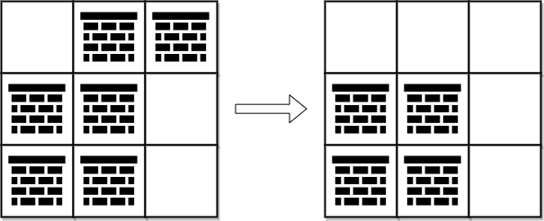
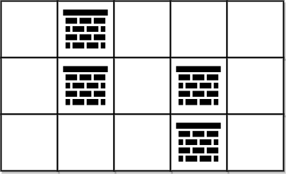

### [2290\. 到达角落需要移除障碍物的最小数目](https://leetcode.cn/problems/minimum-obstacle-removal-to-reach-corner/)

难度：困难

给你一个下标从 **0** 开始的二维整数数组 `grid`，数组大小为 <code>m &times; n</code>。每个单元格都是两个值之一：

- `0` 表示一个 **空** 单元格，
- `1` 表示一个可以移除的 **障碍物**。

你可以向上、下、左、右移动，从一个空单元格移动到另一个空单元格。

现在你需要从左上角 `(0, 0)` 移动到右下角 `(m - 1, n - 1)`，返回需要移除的障碍物的 **最小** 数目。

**示例 1：**

> 
>
> **输入：** grid = \[[0,1,1],[1,1,0],[1,1,0]]
> **输出：** 2
> **解释：** 可以移除位于 (0, 1) 和 (0, 2) 的障碍物来创建从 (0, 0) 到 (2, 2) 的路径。
> 可以证明我们至少需要移除两个障碍物，所以返回 2。
> 注意，可能存在其他方式来移除 2 个障碍物，创建出可行的路径。

**示例 2：**

> 
>
> **输入：** grid = \[[0,1,0,0,0],[0,1,0,1,0],[0,0,0,1,0]]
> **输出：** 0
> **解释：** 不移除任何障碍物就能从 (0, 0) 到 (2, 4)，所以返回 0。

**提示：**

- `m == grid.length`
- `n == grid[i].length`
- <code>1 <= m, n <= 105</code>
- <code>2 <= m &times; n <= 105</code>
- `grid[i][j]` 为 `0` **或** `1`
- `grid[0][0] == grid[m - 1][n - 1] == 0`
