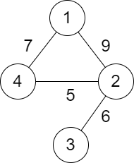

### [2492\. 两个城市间路径的最小分数](https://leetcode.cn/problems/minimum-score-of-a-path-between-two-cities/)

难度：中等

给你一个正整数 `n`，表示总共有 `n` 个城市，城市从 `1` 到 `n` 编号。给你一个二维数组 `roads`，其中 <code>roads[i] = [ai, bi, distancei]</code> 表示城市 <code>ai</code> 和 <code>bi</code> 之间有一条 **双向** 道路，道路距离为 <code>distancei</code>。城市构成的图不一定是连通的。

两个城市之间一条路径的 **分数** 定义为这条路径中道路的 **最小** 距离。

返回城市 `1` 和城市 `n` 之间的所有路径的 **最小** 分数。

**注意：**

- 一条路径指的是两个城市之间的道路序列。
- 一条路径可以 **多次** 包含同一条道路，你也可以沿着路径多次到达城市 `1` 和城市 `n`。
- 测试数据保证城市 `1` 和城市`n` 之间 **至少** 有一条路径。

**示例 1：**

> 
>
> **输入：** n = 4, roads = \[[1,2,9],[2,3,6],[2,4,5],[1,4,7]]
> **输出：** 5
> **解释：** 城市 1 到城市 4 的路径中，分数最小的一条为：1 -> 2 -> 4。这条路径的分数是 min(9,5) = 5。
> 不存在分数更小的路径。

**示例 2：**

> 
>
> **输入：** n = 4, roads = \[[1,2,2],[1,3,4],[3,4,7]]
> **输出：** 2
> **解释：** 城市 1 到城市 4 分数最小的路径是：1 -> 2 -> 1 -> 3 -> 4。这条路径的分数是 min(2,2,4,7) = 2。

**提示：**

- <code>2 <= n <= 105</code>
- <code>1 <= roads.length <= 105</code>
- `roads[i].length == 3`
- <code>1 <= ai, bi <= n</code>
- <code>ai != bi</code>
- <code>1 <= distancei <= 104</code>
- 不会有重复的边。
- 城市 `1` 和城市 `n` 之间至少有一条路径。
