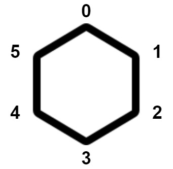

### [2550\. 猴子碰撞的方法数](https://leetcode.cn/problems/count-collisions-of-monkeys-on-a-polygon/)

难度：中等

现在有一个正凸多边形，其上共有 `n` 个顶点。顶点按顺时针方向从 `0` 到 `n - 1` 依次编号。每个顶点上 **正好有一只猴子**。下图中是一个 6 个顶点的凸多边形。

每个猴子同时移动到相邻的顶点。顶点 `i` 的相邻顶点可以是：

- 顺时针方向的顶点 `(i + 1) % n`，或
- 逆时针方向的顶点 `(i - 1 + n) % n`。

如果移动后至少有两只猴子停留在同一个顶点上或者相交在一条边上，则会发生 **碰撞**。

返回猴子至少发生 **一次碰撞** 的移动方法数。由于答案可能非常大，请返回对 <code>109+7</code> 取余后的结果。

**注意**，每只猴子只能移动一次。

**示例 1：**

> **输入：** n = 3
> **输出：** 6
> **解释：** 共计 8 种移动方式。
> 下面列出两种会发生碰撞的方式：
> 
> - 猴子 1 顺时针移动；猴子 2 逆时针移动；猴子 3 顺时针移动。猴子 1 和猴子 2 碰撞。
> - 猴子 1 逆时针移动；猴子 2 逆时针移动；猴子 3 顺时针移动。猴子 1 和猴子 3 碰撞。
> 
> 可以证明，有 6 种让猴子碰撞的方法。

**示例 2：**

> **输入：** n = 4
> **输出：** 14
> **解释：** 可以证明，有 14 种让猴子碰撞的方法。

**提示：**

- <code>3 <= n <= 109</code>
