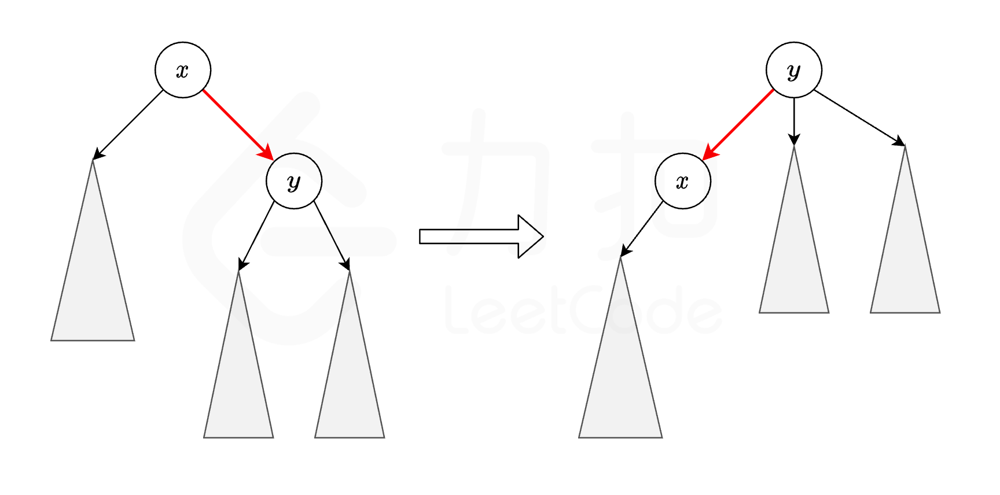

### [统计可能的树根数目](https://leetcode.cn/problems/count-number-of-possible-root-nodes/solutions/2654312/tong-ji-ke-neng-de-shu-gen-shu-mu-by-lee-3gzg/)

#### 方法一：树形动态规划

##### 思路与算法

首先计算固定树根时猜对的次数，假设以 $0$ 号节点为树根，从它开始执行深度优先搜索，使用哈希表统计所有树边 $(x, y)$ 在 $\textit{guesses}$ 中出现的个数，其中 $x$ 是 $y$ 的父节点。

然后考虑树根从 $0$ 移动到 $0$ 的子节点后，所有 $\textit{guesses}$ 的状态变化。如下图所示，树根从 $x$ 变成 $y$ 之后，只有 $(x, y)$ 和 $(y, x)$ 这两个猜测的正确性发生变化。



因此基于已经计算出以 $x$ 为树根时猜对的次数，很容易就可以计算出以 $y$ 为树根时猜对的次数：

- 如果 $(x, y)$ 存在于 $\textit{guesses}$，猜对次数减一；
- 如果 $(y, x)$ 存在于 $\textit{guesses}$，猜对次数加一。

最终答案就是所有猜对次数大于等于 kkk 的节点个数。

需要注意的是，某些语言可能需要手写树边 $(x, y)$ 的哈希函数，由于树上节点编号不超过 $10^5$，而且 $2^{20} > 10^5$，因此我们可以用 $x \times 2^{20} + y$ 作为哈希函数。

##### 代码

```c++
class Solution {
public:
    using ll = long long;
    int rootCount(vector<vector<int>>& edges, vector<vector<int>>& guesses, int k) {
        int n = edges.size() + 1;
        vector<vector<int>> g(n);
        unordered_set<ll> st;
        for (auto &v : edges) {
            g[v[0]].push_back(v[1]);
            g[v[1]].push_back(v[0]);
        }
        auto h = [&](int x, int y) -> ll {
            return (ll) x << 20 | y;
        };
        for (auto &v : guesses) {
            st.insert(h(v[0], v[1]));
        }

        int cnt = 0, res = 0;
        function<void(int, int)> dfs = [&](int x, int fat) -> void {
            for (auto &y : g[x]) {
                if (y == fat) {
                    continue;
                }
                cnt += st.count(h(x, y));
                dfs(y, x);
            }
        };
        dfs(0, -1);

        function<void(int, int, int)> redfs = [&](int x, int fat, int cnt) {
            if (cnt >= k) {
                res++;
            }
            for (auto &y : g[x]) {
                if (y == fat) {
                    continue;
                }
                redfs(y, x, cnt - st.count(h(x, y)) + st.count(h(y, x)));
            }
        };
        redfs(0, -1, cnt);
        return res;
    }
};
```

```java
class Solution {
    int cnt = 0, res = 0;
    int k;
    List<Integer>[] g;
    Set<Long> set;

    public int rootCount(int[][] edges, int[][] guesses, int k) {
        this.k = k;
        int n = edges.length + 1;
        g = new List[n];
        for (int i = 0; i < n; i++) {
            g[i] = new ArrayList<Integer>();
        }
        set = new HashSet<Long>();
        for (int[] v : edges) {
            g[v[0]].add(v[1]);
            g[v[1]].add(v[0]);
        }
        for (int[] v : guesses) {
            set.add(h(v[0], v[1]));
        }

        dfs(0, -1);
        redfs(0, -1, cnt);
        return res;
    }

    public long h(int x, int y) {
        return (long) x << 20 | y;
    }

    public void dfs(int x, int fat) {
        for (int y : g[x]) {
            if (y == fat) {
                continue;
            }
            cnt += set.contains(h(x, y)) ? 1 : 0;
            dfs(y, x);
        }
    }

    public void redfs(int x, int fat, int cnt) {
        if (cnt >= k) {
            res++;
        }
        for (int y : g[x]) {
            if (y == fat) {
                continue;
            }
            redfs(y, x, cnt - (set.contains(h(x, y)) ? 1 : 0) + (set.contains(h(y, x)) ? 1 : 0));
        }
    }
}
```

```c
typedef struct {
    long long key;
    int val;
    UT_hash_handle hh;
} HashItem; 

HashItem *hashFindItem(HashItem **obj, long long key) {
    HashItem *pEntry = NULL;
    HASH_FIND_INT(*obj, &key, pEntry);
    return pEntry;
}

bool hashAddItem(HashItem **obj, long long key, int val) {
    if (hashFindItem(obj, key)) {
        return false;
    }
    HashItem *pEntry = (HashItem *)malloc(sizeof(HashItem));
    pEntry->key = key;
    pEntry->val = val;
    HASH_ADD_INT(*obj, key, pEntry);
    return true;
}

int hashGetItem(HashItem **obj, long long key, int defaultVal) {
    HashItem *pEntry = hashFindItem(obj, key);
    if (!pEntry) {
        return defaultVal;
    }
    return pEntry->val;
}

void hashFree(HashItem **obj) {
    HashItem *curr = NULL, *tmp = NULL;
    HASH_ITER(hh, *obj, curr, tmp) {
        HASH_DEL(*obj, curr);  
        free(curr);
    }
}

long long h(int x, int y) {
    return (long long) x << 20 | (long long) y;
}

void dfs(int x, int fat, struct ListNode **g, HashItem *st, int *cnt) {
    for (struct ListNode *p = g[x]; p; p = p->next) {
        int y = p->val;
        if (y == fat) {
            continue;
        }
        (*cnt) += hashGetItem(&st, h(x, y), 0);
        dfs(y, x, g, st, cnt);
    }
}

void redfs(int x, int fat, int cnt, int k, int *res, struct ListNode **g, HashItem *st) {
    if (cnt >= k) {
        (*res)++;
    }
    for (struct ListNode *p = g[x]; p; p = p->next) {
        int y = p->val;
        if (y == fat) {
            continue;
        }
        redfs(y, x, cnt - hashGetItem(&st, h(x, y), 0) + hashGetItem(&st, h(y, x), 0), k, res, g, st);
    }
}

struct ListNode *createListNode(int val) {
    struct ListNode *obj = (struct ListNode *)malloc(sizeof(struct ListNode));
    obj->val = val;
    obj->next = NULL;
    return obj;
}

void freeList(struct ListNode *list) {
    while(list) {
        struct ListNode *p = list;
        list = list->next;
        free(p);
    }
}

int rootCount(int** edges, int edgesSize, int* edgesColSize, int** guesses, int guessesSize, int* guessesColSize, int k) {
    int n = edgesSize + 1;
    struct ListNode *g[n];
    for (int i = 0; i < n; i++) {
        g[i] = NULL;
    }
    HashItem *st = NULL;
    for (int i = 0; i < edgesSize; i++) {
        int x = edges[i][0], y = edges[i][1];
        struct ListNode *nodex = createListNode(x);
        nodex->next = g[y];
        g[y] = nodex;
        struct ListNode *nodey = createListNode(y);
        nodey->next = g[x];
        g[x] = nodey;
    }
    for (int i = 0; i < guessesSize; i++) {
        hashAddItem(&st, h(guesses[i][0], guesses[i][1]), 1);
    }
    
    int cnt = 0, res = 0;
    dfs(0, -1, g, st, &cnt);
    redfs(0, -1, cnt, k, &res, g, st);
    for (int i = 0; i < n; i++) {
        free(g[i]);
    }
    hashFree(&st);
    return res;
}
```

```python
class Solution:
    def rootCount(self, edges: List[List[int]], guesses: List[List[int]], k: int) -> int:
        n = len(edges) + 1
        g = [[] for _ in range(n)]
        st = set()
        
        def h(x, y):
            return x << 20 | y
        for x, y in edges:
            g[x].append(y)
            g[y].append(x)
        for u, v in guesses:
            st.add(h(u, v))

        res, cnt = 0, 0
        def dfs(x, fat):
            nonlocal cnt
            for y in g[x]:
                if y == fat:
                    continue
                cnt += h(x, y) in st
                dfs(y, x)
        dfs(0, -1)

        def redfs(x, fat, cnt):
            nonlocal res
            if cnt >= k:
                res += 1
            for y in g[x]:
                if y == fat:
                    continue
                redfs(y, x, cnt - (h(x, y) in st) + (h(y, x) in st))
        redfs(0, -1, cnt)

        return res
```

```go
func rootCount(edges [][]int, guesses [][]int, k int) int {
    n := len(edges) + 1
    g := make([][]int, n)
    st := make(map[int64]int)

    for _, v := range edges {
        g[v[0]] = append(g[v[0]], v[1])
        g[v[1]] = append(g[v[1]], v[0])
    }
    for _, v := range guesses {
        st[h(v[0], v[1])] = 1
    }

    cnt, res := 0, 0
    var dfs func(int, int)
    dfs = func(x, fat int) {
        for _, y := range g[x] {
            if y == fat {
                continue
            }
            if st[h(x, y)] == 1 {
                cnt++
            }
            dfs(y, x)
        }
    }
    dfs(0, -1)

    var redfs func(int, int, int)
    redfs = func(x, fat, cnt int) {
        if cnt >= k {
            res++
        }
        for _, y := range g[x] {
            if y == fat {
                continue
            }
            redfs(y, x, cnt - st[h(x, y)] + st[h(y, x)])
        }
    }
    redfs(0, -1, cnt)
    return res
}

func h(x, y int) int64 {
    return int64(x) << 20 | int64(y)
}
```

```javascript
var rootCount = function(edges, guesses, k) {
    const n = edges.length + 1;
    const g = Array.from({ length: n }, () => []);
    const st = new Set();

    const h = (x, y) => {
        return x << 20 | y;
    }

    edges.forEach(v => {
        g[v[0]].push(v[1]);
        g[v[1]].push(v[0]);
    });

    guesses.forEach(v => {
        st.add(h(v[0], v[1]));
    });

    let cnt = 0;
    let res = 0;

    function dfs(x, fat) {
        for (const y of g[x]) {
            if (y === fat) {
                continue;
            }
            cnt += st.has(h(x, y));
            dfs(y, x);
        }
    }
    dfs(0, -1);

    function redfs(x, fat, cnt) {
        if (cnt >= k) {
            res++;
        }
        for (const y of g[x]) {
            if (y === fat) {
                continue;
            }
            redfs(y, x, cnt - (st.has(h(x, y))) + (st.has(h(y, x))));
        }
    }
    redfs(0, -1, cnt);
    return res;
};
```

```typescript
function rootCount(edges: number[][], guesses: number[][], k: number): number {
    const n = edges.length + 1;
    const g: number[][] = Array.from({ length: n }, () => []);
    const st: Set<number> = new Set();
    const h = (x, y) => {
        return x << 20 | y;
    }

    edges.forEach(v => {
        g[v[0]].push(v[1]);
        g[v[1]].push(v[0]);
    });

    guesses.forEach(v => {
        st.add(h(v[0], v[1]));
    });

    let cnt = 0;
    let res = 0;

    function dfs(x: number, fat: number): void {
        for (const y of g[x]) {
            if (y === fat) {
                continue;
            }
            cnt += Number(st.has(h(x, y)));
            dfs(y, x);
        }
    }
    dfs(0, -1);

    function redfs(x: number, fat: number, cnt: number): void {
        if (cnt >= k) {
            res++;
        }
        for (const y of g[x]) {
            if (y === fat) {
                continue;
            }
            redfs(y, x, cnt - Number(st.has(h(x, y))) + Number(st.has(h(y, x))));
        }
    }
    redfs(0, -1, cnt);
    return res;
};
```

#### 复杂度分析

- 时间复杂度：$O(n + m)$，其中 $n$ 为树上点的个数，$m$ 是 $\textit{guesses}$ 的长度。
- 空间复杂度：$O(n + m)$。
