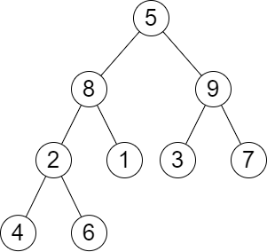

### [2583\. 二叉树中的第 K 大层和](https://leetcode.cn/problems/kth-largest-sum-in-a-binary-tree/)

难度：中等

给你一棵二叉树的根节点 `root` 和一个正整数 `k` 。

树中的 **层和** 是指 **同一层** 上节点值的总和。

返回树中第 `k` 大的层和（不一定不同）。如果树少于 `k` 层，则返回 `-1` 。

**注意**，如果两个节点与根节点的距离相同，则认为它们在同一层。

**示例 1：**

> **输入：** root = [5,8,9,2,1,3,7,4,6], k = 2
> **输出：** 13
> **解释：** 树中每一层的层和分别是：
>  
> - Level 1: 5
> - Level 2: 8 + 9 = 17
> - Level 3: 2 + 1 + 3 + 7 = 13
> - Level 4: 4 + 6 = 10
>  
> 第 2 大的层和等于 13 。

**示例 2：**

> **输入：** root = [1,2,null,3], k = 1
> **输出：** 3
> **解释：** 最大的层和是 3 。

**提示：**

- 树中的节点数为 `n`
- `2 <= n <= 10^5`
- `1 <= Node.val <= 10^6`
- `1 <= k <= n`
