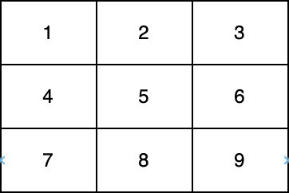

### [2614\. 对角线上的质数](https://leetcode.cn/problems/prime-in-diagonal/)

难度：简单

给你一个下标从 **0** 开始的二维整数数组 `nums` 。

返回位于 `nums` 至少一条 **对角线** 上的最大 **质数** 。如果任一对角线上均不存在质数，返回 _0 。_

注意：

- 如果某个整数大于 `1` ，且不存在除 `1` 和自身之外的正整数因子，则认为该整数是一个质数。
- 如果存在整数 `i` ，使得 `nums[i][i] = val` 或者 `nums[i][nums.length - i - 1]= val` ，则认为整数 `val` 位于 `nums` 的一条对角线上。

在上图中，一条对角线是 **[1,5,9]** ，而另一条对角线是 **[3,5,7]** 。

**示例 1：**

> **输入：** nums = \[[1,2,3],[5,6,7],[9,10,11]]
> **输出：** 11
> **解释：** 数字 1、3、6、9 和 11 是所有 "位于至少一条对角线上" 的数字。由于 11 是最大的质数，故返回 11 。

**示例 2：**

> **输入：** nums = \[[1,2,3],[5,17,7],[9,11,10]]
> **输出：** 17
> **解释：** 数字 1、3、9、10 和 17 是所有满足"位于至少一条对角线上"的数字。由于 17 是最大的质数，故返回 17 。

**提示：**

- `1 <= nums.length <= 300`
- `nums.length == nums_i.length`
- `1 <= nums[i][j] <= 4*10^6`
