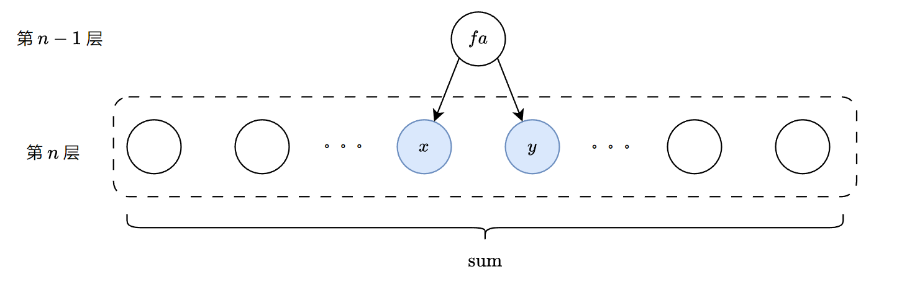

### [二叉树的堂兄弟节点 II](https://leetcode.cn/problems/cousins-in-binary-tree-ii/solutions/2626702/er-cha-shu-de-tang-xiong-di-jie-dian-ii-1b9oj/)

#### 方法一：广度优先搜索

##### 思路与算法

题目要求将二叉树中每个节点的值替换为所有堂兄弟节点的和，而堂兄弟节点就是指那些和当前节点深度相同但父节点不同的节点。例如下图中，$x$ 的堂兄弟节点是第 $n$ 层除去 $x$ 和 $y$ 的其他所有节点。假设第 $n$ 层所有节点的和为 $\textit{sum}$，那么 $x$ 的值应该被替换为 $\textit{sum} - x - y$。



在广度优先搜索的过程中，通过第 $n - 1$ 层去遍历第 $n$ 层的节点时，可以顺便统计第 $n$ 层节点的和 $\textit{sum}$。由于更新 $x$ 的值时需要知道 $y$ 的值（有可能不存在），因此需要通过 $n - 1$ 层对第 $n$ 层进行第二次遍历，这时就可以使用 $\textit{sum} - x - y$ 更新 $x$ 的值了。

在代码实现时，我们需要遍历每一层的节点两次，因此使用动态数组或链表表示的队列会更方便。

##### 代码

```c++
class Solution {
public:
    TreeNode* replaceValueInTree(TreeNode* root) {
        vector<TreeNode*> q = {root};
        root->val = 0;
        while (!q.empty()) {
            vector<TreeNode*> q2;
            int sum = 0;
            for (auto fa : q) {
                if (fa->left) {
                    q2.push_back(fa->left);
                    sum += fa->left->val;
                }
                if (fa->right) {
                    q2.push_back(fa->right);
                    sum += fa->right->val;
                }
            }
            for (auto fa : q) {
                int child_sum = (fa->left ? fa->left->val : 0) + 
                                (fa->right ? fa->right->val : 0);
                if (fa->left) {
                    fa->left->val = sum - child_sum;
                }
                if (fa->right) {
                    fa->right->val = sum - child_sum;
                }
            }
            q = move(q2);
        }
        return root;
    }
};
```

```java
class Solution {
    public TreeNode replaceValueInTree(TreeNode root) {
        Queue<TreeNode> queue = new ArrayDeque<TreeNode>();
        queue.offer(root);
        root.val = 0;
        while (!queue.isEmpty()) {
            Queue<TreeNode> queue2 = new ArrayDeque<TreeNode>();
            int sum = 0;
            for (TreeNode fa : queue) {
                if (fa.left != null) {
                    queue2.offer(fa.left);
                    sum += fa.left.val;
                }
                if (fa.right != null) {
                    queue2.offer(fa.right);
                    sum += fa.right.val;
                }
            }
            for (TreeNode fa : queue) {
                int childSum = (fa.left != null ? fa.left.val : 0) + 
                                (fa.right != null ? fa.right.val : 0);
                if (fa.left != null) {
                    fa.left.val = sum - childSum;
                }
                if (fa.right != null) {
                    fa.right.val = sum - childSum;
                }
            }
            queue = queue2;
        }
        return root;
    }
}
```

```csharp
public class Solution {
    public TreeNode ReplaceValueInTree(TreeNode root) {
        Queue<TreeNode> queue = new Queue<TreeNode>();
        queue.Enqueue(root);
        root.val = 0;
        while (queue.Count > 0) {
            Queue<TreeNode> queue2 = new Queue<TreeNode>();
            int sum = 0;
            foreach (TreeNode fa in queue) {
                if (fa.left != null) {
                    queue2.Enqueue(fa.left);
                    sum += fa.left.val;
                }
                if (fa.right != null) {
                    queue2.Enqueue(fa.right);
                    sum += fa.right.val;
                }
            }
            foreach (TreeNode fa in queue) {
                int childSum = (fa.left != null ? fa.left.val : 0) + 
                                (fa.right != null ? fa.right.val : 0);
                if (fa.left != null) {
                    fa.left.val = sum - childSum;
                }
                if (fa.right != null) {
                    fa.right.val = sum - childSum;
                }
            }
            queue = queue2;
        }
        return root;
    }
}
```

```go
func replaceValueInTree(root *TreeNode) *TreeNode {
    q := []*TreeNode{root}
    root.Val = 0
    for len(q) > 0 {
        var q2 []*TreeNode
        sum := 0
        for _, fa := range q {
            if fa.Left != nil {
                q2 = append(q2, fa.Left)
                sum += fa.Left.Val
            }
            if fa.Right != nil {
                q2 = append(q2, fa.Right)
                sum += fa.Right.Val
            }
        }
        for _, fa := range q {
            childSum := 0
            if fa.Left != nil {
                childSum += fa.Left.Val
            }
            if fa.Right != nil {
                childSum += fa.Right.Val
            }
            if fa.Left != nil {
                fa.Left.Val = sum - childSum
            }
            if fa.Right != nil {
                fa.Right.Val = sum - childSum
            }
        }
        q = q2
    }
    return root
}
```

```python
class Solution:
    def replaceValueInTree(self, root: Optional[TreeNode]) -> Optional[TreeNode]:
        q = [root]
        root.val = 0
        while len(q) > 0:
            q2 = []
            sum = 0
            for fa in q:
                if fa.left:
                    q2.append(fa.left)
                    sum += fa.left.val
                if fa.right:
                    q2.append(fa.right)
                    sum += fa.right.val
            for fa in q:
                childSum = (fa.left.val if fa.left else 0) + (fa.right.val if fa.right else 0)
                if fa.left:
                    fa.left.val = sum - childSum
                if fa.right:
                    fa.right.val = sum - childSum
            q = q2
        return root
```

```c
typedef struct Node {
    struct TreeNode* val;
    struct Node *next;
} Node;

struct Node *creatNode(struct TreeNode* val) {
    struct Node *obj = (struct Node *)malloc(sizeof(struct Node));
    obj->val = val;
    obj->next = NULL;
    return obj;
}

void freeList(struct Node *list) {
    while (list) {
        struct Node *cur = list;
        list = list->next;
        free(cur);
    }
}

struct TreeNode* replaceValueInTree(struct TreeNode* root) {
    struct Node *q = creatNode(root);
    root->val = 0;
    while (q != NULL) {
        struct Node *q2 = NULL;
        int sum = 0;
        for (struct Node* cur = q; cur; cur = cur->next) {
            struct TreeNode* fa = cur->val;
            if (fa->left) {
                struct Node* obj = creatNode(fa->left);
                obj->next = q2;
                q2 = obj;
                sum += fa->left->val;
            }
            if (fa->right) {
                struct Node* obj = creatNode(fa->right);
                obj->next = q2;
                q2 = obj;
                sum += fa->right->val;
            }
        }
        for (struct Node* cur = q; cur; cur = cur->next) {
            struct TreeNode* fa = cur->val;
            int child_sum = (fa->left ? fa->left->val : 0) + 
                            (fa->right ? fa->right->val : 0);
            if (fa->left) {
                fa->left->val = sum - child_sum;
            }
            if (fa->right) {
                fa->right->val = sum - child_sum;
            }
        }
        freeList(q);
        q = q2;
    }
    return root;
}
```

```javascript
var replaceValueInTree = function(root) {
    const q = [root];
    root.val = 0;
    while (q.length > 0) {
        const q2 = [];
        let sum = 0;
        
        for (const fa of q) {
            if (fa.left) {
                q2.push(fa.left);
                sum += fa.left.val;
            }
            if (fa.right) {
                q2.push(fa.right);
                sum += fa.right.val;
            }
        }
        
        for (const fa of q) {
            const child_sum = (fa.left ? fa.left.val : 0) + (fa.right ? fa.right.val : 0);
            
            if (fa.left) {
                fa.left.val = sum - child_sum;
            }
            if (fa.right) {
                fa.right.val = sum - child_sum;
            }
        }
        q.length = 0;
        q.push(...q2);
    }
    
    return root;
};
```

```typescript
function replaceValueInTree(root: TreeNode | null): TreeNode | null {
    if (!root) {
        return null;
    }
    
    const q: TreeNode[] = [root];
    root.val = 0;
    while (q.length > 0) {
        const q2: TreeNode[] = [];
        let sum = 0;
        for (const fa of q) {
            if (fa.left) {
                q2.push(fa.left);
                sum += fa.left.val;
            }
            if (fa.right) {
                q2.push(fa.right);
                sum += fa.right.val;
            }
        }
        for (const fa of q) {
            const child_sum = (fa.left ? fa.left.val : 0) + (fa.right ? fa.right.val : 0);
            if (fa.left) {
                fa.left.val = sum - child_sum;
            }
            if (fa.right) {
                fa.right.val = sum - child_sum;
            }
        }
        q.length = 0;
        q.push(...q2);
    }

    return root;
};
```

#### 复杂度分析

- 时间复杂度：$O(n)$，其中 $n$ 为二叉树中节点的个数。
- 空间复杂度：$O(n)$。
