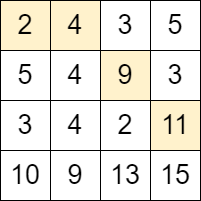

### [2684. 矩阵中移动的最大次数](https://leetcode.cn/problems/maximum-number-of-moves-in-a-grid/)

难度：中等

给你一个下标从 **0** 开始、大小为 `m x n` 的矩阵 `grid` ，矩阵由若干 **正** 整数组成。

你可以从矩阵第一列中的 **任一** 单元格出发，按以下方式遍历 `grid` ：

- 从单元格 `(row, col)` 可以移动到 `(row - 1, col + 1)`、`(row, col + 1)` 和 `(row + 1, col + 1)` 三个单元格中任一满足值 **严格** 大于当前单元格的单元格。

返回你在矩阵中能够 **移动** 的 **最大** 次数。

**示例 1：**

> **输入：** grid = \[[2,4,3,5],[5,4,9,3],[3,4,2,11],[10,9,13,15]]
> **输出：** 3
> **解释：** 可以从单元格 (0, 0) 开始并且按下面的路径移动：
>  
> - (0, 0) -> (0, 1).
> - (0, 1) -> (1, 2).
> - (1, 2) -> (2, 3).
>  
> 可以证明这是能够移动的最大次数。

**示例 2：**

> **输入：** grid = \[[3,2,4],[2,1,9],[1,1,7]]
> **输出：** 0
> **解释：** 从第一列的任一单元格开始都无法移动。

**提示：**

> `m == grid.length`
> `n == grid[i].length`
> `2 <= m, n <= 1000`
> `4 <= m * n <= 10^5`
> `1 <= grid[i][j] <= 10^6`
