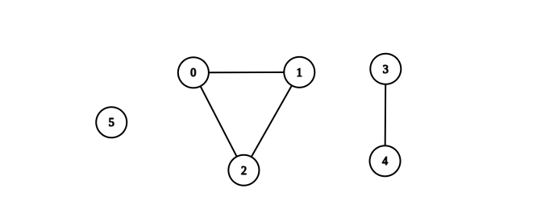
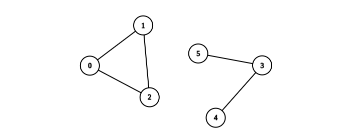

### [2685\. 统计完全连通分量的数量](https://leetcode.cn/problems/count-the-number-of-complete-components/)

难度：中等

给你一个整数 `n`。现有一个包含 `n` 个顶点的 **无向** 图，顶点按从 `0` 到 `n - 1` 编号。给你一个二维整数数组 `edges` 其中 <code>edges[i] = [ai, bi]</code> 表示顶点 <code>ai</code> 和 <code>bi</code> 之间存在一条 **无向** 边。

返回图中 **完全连通分量** 的数量。

如果在子图中任意两个顶点之间都存在路径，并且子图中没有任何一个顶点与子图外部的顶点共享边，则称其为 **连通分量**。

如果连通分量中每对节点之间都存在一条边，则称其为 **完全连通分量**。

**示例 1：**

> 
>
> **输入：** n = 6, edges = \[[0,1],[0,2],[1,2],[3,4]]
> **输出：** 3
> **解释：** 如上图所示，可以看到此图所有分量都是完全连通分量。

**示例 2：**

> 
>
> **输入：** n = 6, edges = \[[0,1],[0,2],[1,2],[3,4],[3,5]]
> **输出：** 1
> **解释：** 包含节点 0、1 和 2 的分量是完全连通分量，因为每对节点之间都存在一条边。
> 包含节点 3 、4 和 5 的分量不是完全连通分量，因为节点 4 和 5 之间不存在边。
> 因此，在图中完全连接分量的数量是 1。

**提示：**

- `1 <= n <= 50`
- <code>0 <= edges.length <= n &times; (n - 1) / 2</code>
- `edges[i].length == 2`
- <code>0 <= ai, bi <= n - 1</code>
- <code>ai != bi</code>
- 不存在重复的边
