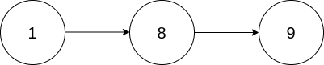
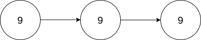

### [2816\. 翻倍以链表形式表示的数字](https://leetcode.cn/problems/double-a-number-represented-as-a-linked-list/)

难度：中等

给你一个 **非空** 链表的头节点 `head`，表示一个不含前导零的非负数整数。

将链表 **翻倍** 后，返回头节点 `head`。

**示例 1：**

> 
> **输入：** head = [1,8,9]
> **输出：** [3,7,8]
> **解释：** 上图中给出的链表，表示数字 189。返回的链表表示数字 189 &times; 2 = 378。

**示例 2：**

> 
> **输入：** head = [9,9,9]
> **输出：** [1,9,9,8]
> **解释：** 上图中给出的链表，表示数字 999。返回的链表表示数字 999 &times; 2 = 1998。

**提示：**

- 链表中节点的数目在范围 <code>[1, 104]</code> 内
- `0 <= Node.val <= 9`
- 生成的输入满足：链表表示一个不含前导零的数字，除了数字 `0` 本身。
