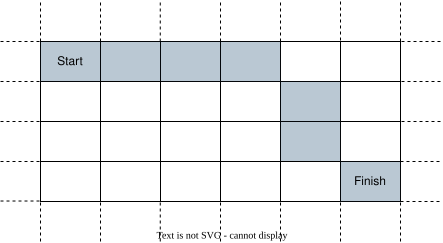
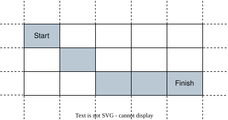

### [2849\. 判断能否在给定时间到达单元格](https://leetcode.cn/problems/determine-if-a-cell-is-reachable-at-a-given-time/)

难度：中等

给你四个整数 `sx`、`sy`、`fx`、`fy`  以及一个 **非负整数** `t`。

在一个无限的二维网格中，你从单元格 `(sx, sy)` 开始出发。每一秒，你 **必须** 移动到任一与之前所处单元格相邻的单元格中。

如果你能在 **恰好** `t` **秒** 后到达单元格 `(fx, fy)`，返回 `true`；否则，返回  `false`。

单元格的 **相邻单元格** 是指该单元格周围与其至少共享一个角的 8 个单元格。你可以多次访问同一个单元格。

**示例 1：**

> 
> **输入：** sx = 2, sy = 4, fx = 7, fy = 7, t = 6
> **输出：** true
> **解释：** 从单元格 (2, 4) 开始出发，穿过上图标注的单元格，可以在恰好 6 秒后到达单元格 (7, 7)。

**示例 2：**

> 
> **输入：** sx = 3, sy = 1, fx = 7, fy = 3, t = 3
> **输出：** false
> **解释：** 从单元格 (3, 1) 开始出发，穿过上图标注的单元格，至少需要 4 秒后到达单元格 (7, 3)。因此，无法在 3 秒后到达单元格 (7, 3)。

**提示：**

- <code>1 <= sx, sy, fx, fy <= 109</code>
- <code>0 <= t <= 109</code>
