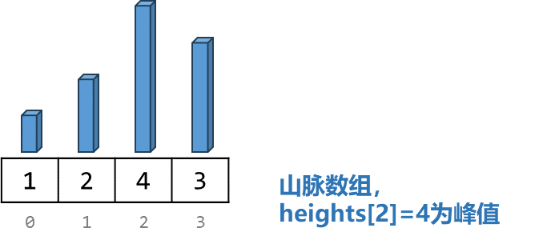
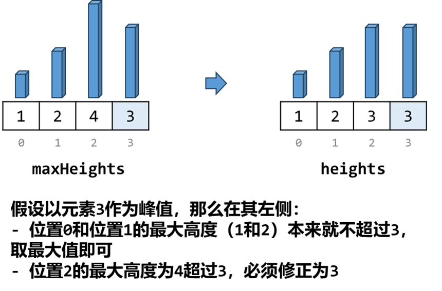
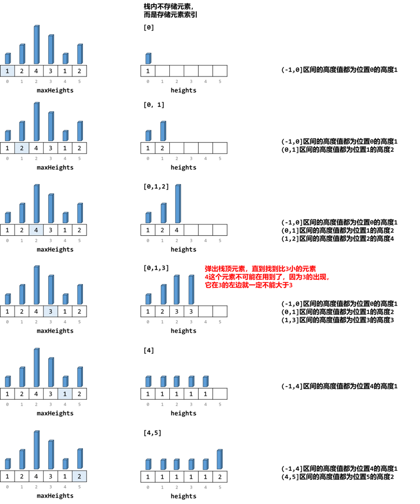
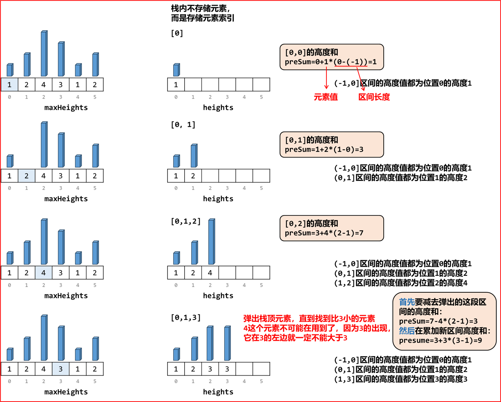
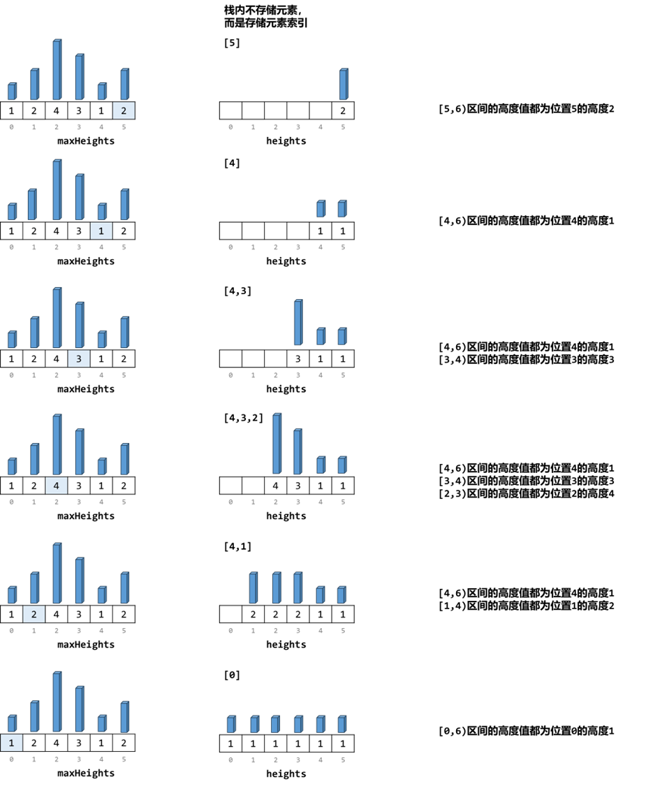
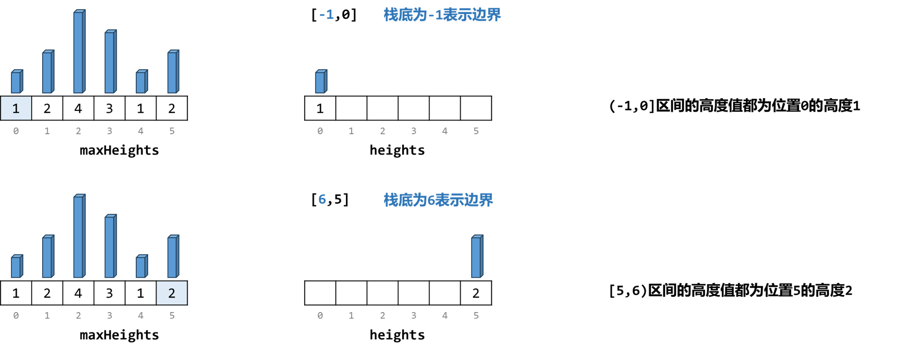

### [[Java/Python3/C++]前后缀和+单调栈：以每个最大高度为峰值构造美丽塔【图解】](https://leetcode.cn/problems/beautiful-towers-ii/solutions/2574217/javapython3cqian-hou-zhui-he-dan-diao-zh-6fxl/)

#### 题目

##### 2866\. 美丽塔 II

给你一个长度为 `n` 下标从 `0` 开始的整数数组 `maxHeights` 。

你的任务是在坐标轴上建 `n` 座塔。第 `i` 座塔的下标为 `i` ，高度为 `heights[i]` 。

如果以下条件满足，我们称这些塔是 **美丽** 的：

1. `1 <= heights[i] <= maxHeights[i]`
2. `heights` 是一个 **山脉** 数组。

如果存在下标 `i` 满足以下条件，那么我们称数组 `heights` 是一个 **山脉** 数组：

- 对于所有 `0 < j <= i` ，都有 `heights[j - 1] <= heights[j]`
- 对于所有 `i <= k < n - 1` ，都有 `heights[k + 1] <= heights[k]`

请你返回满足 **美丽塔** 要求的方案中，**高度和的最大值** 。

#### 题目分析

##### 思路分析

这道题是要去构造一个高度数组 `hegihts` ，其中每个位置 `i` 的值不能超过限定的最大高度 `maxHeights[i]`。并且构造出来的 `heights` 必须满足先增后减的形式。




本来，我们要得到最大高度和，根据贪心的策略，每个位置都去放置最大高度得到的高度一定最高。而现在加入了山脉数组的限定，那么只有山脉数组中的峰值一定是最大值，其他位置不一定。

要求构造出来的高度数组和最大的情况，**暴力求解的思路** 应该是这样：以每个位置 `i` 的最大高度 `maxHeights[i]` 为峰值，去构造高度数组。然后取其中和最大的情况。

**我们如何来求解以 `maxHeights[i]` 为峰值的高度数组的高度和呢？**  
如果 `maxHeights[i]` 为峰值，那么 `[0,i)` 和 `[i, n)` 的所有位置 `j` 的高度都不得大于 `maxHeights[i]`。那么：

- 如果 `maxHeights[j] <= maxHeights[i]`，那么这些位置本来就不可能取到大于 `maxHeights[i]` 的值，直接取其最大值 `maxHeights[j]` 即可。
- 如果 `maxHeights[j] > maxHeights[i]`，那么这些位置的值最大只能取 `maxHeight[i]`。




##### 单调栈

如果我们依次遍历 `maxHeights`，我们可以发现：

- 如果后一个数大于等于前一个数，其可以直接使用；
- 如果后一个数小于前一个数，那么后一个数就要把之前所有大于它的数都变成和它一样。

这其实就是一个单调栈的思想，从栈底到栈顶元素单调递增。我们通过单调栈可以实现什么呢？




通过上图我们可以发现，单调栈内存储的每个元素（为 `maxHeights` 数组的下标）其实定义了**一段区间：设栈内元素`i`，其前一个元素为`j`，则定义了 `(j,i]` 这段区间的高度值为 `maxHeights[i]`**。

当我们通过单调栈遍历到位置 `i` 时，就确定了以`maxHeights[i]` 为峰值时 `[0, i]` 的高度值。

> 整道题的核心：单调栈内的元素，是确定了一段段高度值区间。

##### 前缀和

通过上面的分析，我们可以得到位置 `i` 的前缀高度值，对应的高度和其实就是前缀高度和。

我们可以定义 `preSum[i]` 表示以 `maxHeights[i]` 为峰值时 `[0, i]` 的高度和。每一次对栈内元素的加入与弹出，其实都是在**加入一段区间和或者是删除一段区间和**。因此我们可以随着站内元素的改变而改变区间和的值，从而得到前缀高度和。




即每一次弹出元素，我们都要将当前前缀和 减去 弹出元素对应的高度值所覆盖的区间的高度和；  
每一次加入元素，都要将当前前缀和 累加 压入元素对应的高度值所覆盖的区间的高度和。

##### 后缀数组

同理可得，我们可以逆序遍历，完成对每个位置 `i` 作为峰值时 的右半部分 `[i, n)` 的高度值的获取。




定义 `sufSum[i]` 表示以 `maxHeights[i]` 为峰值时 `[i, n)` 的高度和。

那么以 `maxHeights[i]` 为峰值构成的高度数组的高度和为 `preSum[i] + sufSum[i]`。  
但要注意，`preSum[i]` 表示的是 `[0,i]` 的高度和， `sufSum[i]` 表示的是 `[i.n)` 的高度和，位置 `i` 的高度两个变量都包含，因此要减去一个 `i` 的高度，即峰值 `maxHeights[i]`。

因此最终高度为 `preSum[i] + sufSum[i] - maxHeights[i]`

#### 代码

> 前缀和变量和后缀和数组

前缀和与后缀和同时出现的题一般是先计算后缀和，并以数组记录每个位置的后缀和。  
然后再计算前缀和，这个过程每个位置的前缀和与后缀和同时得到了，就可以对最终高度进行计算，并更新最值。

> 单调栈计算区间的细节

当我们从栈内弹出一个元素后，这个元素就是区间的右边界，而此时的栈顶元素就是区间的左边界；  
当我们要往栈内压入一个元素前，这个元素就是区间右边界，而时的栈顶元素就是区间的左边界；  
这个时候就会出现栈为空的情况。空栈的含义是到达边界（前缀边界就是索引 `-1`，后缀边界就是索引 `n`）。因此我们可以保持栈底为 `-1` (计算前缀) / `n`（计算后缀），保证栈顶元素一定存在。  




```java
class Solution {
    public long maximumSumOfHeights(List<Integer> maxHeights) {
        int n = maxHeights.size();
        long[] sufSums = new long[n];   // 后缀和数组
        Stack<Integer> st = new Stack<>();      // 单调栈
        st.push(n);         // 栈底为n表示后缀和边界
        long sufS = 0; // 后缀和
        for(int i = n - 1; i >= 0; i--){
            while(st.size() > 1 && maxHeights.get(i) <= maxHeights.get(st.peek())){
                // 在到达栈底n之前，弹出位于当前位置右侧的小于等于当前位置最大高度的索引
                int t = st.pop();   // 获取要弹出的元素
                sufS -= (long)maxHeights.get(t) * (st.peek() - t);  // 后缀和减去弹出索引对应的区间包含的高度和
            }
            sufS += (long)maxHeights.get(i) * (st.peek() - i);      // 后缀和累加要加入的索引对应的区间包含的高度和
            sufSums[i] = sufS;      // 记录后缀和
            st.push(i);             // 元素入栈
        }
        st.clear(); // 清空栈
        st.push(-1);                // 栈底为-1表示前缀和边界
        long res = 0;  // 结果值
        long preS = 0; // 前缀和
        for(int i = 0; i < n; i++){
            while(st.size() > 1 && maxHeights.get(i) <= maxHeights.get(st.peek())){
                // 在到达栈底-1之前，弹出位于当前位置左侧的小于等于当前位置最大高度的索引
                int t = st.pop();
                preS -= (long)maxHeights.get(t) * (t - st.peek());  // 前缀和和减去弹出索引对应的区间包含的高度和
            }
            preS += (long)maxHeights.get(i) * (i - st.peek());      // 前缀和累加要加入的索引对应的区间包含的高度和
            res = Math.max(res, preS + sufSums[i] - maxHeights.get(i));      // 得到当前位置前后缀和，更新最大值
            st.push(i);     // 元素入栈
        }
        return res; 
    }
}
```

```python
class Solution:
    def maximumSumOfHeights(self, maxHeights: List[int]) -> int:
        n = len(maxHeights)
        sufSums = [0] * n   # 后缀和数组
        st = [n]            # 单调栈, 栈底为n表示后缀和边界
        sufS = 0            # 后缀和
        for i in range(n-1, -1, -1):
            while len(st) > 1 and maxHeights[i] <= maxHeights[st[-1]]:
                # 在到达栈底n之前，弹出位于当前位置右侧的小于等于当前位置最大高度的索引
                t = st.pop()   # 获取要弹出的元素
                sufS -= maxHeights[t] * (st[-1] - t)  # 后缀和减去弹出索引对应的区间包含的高度和
                
            sufS += maxHeights[i] * (st[-1] - i)      # 后缀和累加要加入的索引对应的区间包含的高度和
            sufSums[i] = sufS      # 记录后缀和
            st.append(i)             # 元素入栈
            
        st = [-1]   # 单调栈, 栈底为-1表示前缀和边界
        res = 0     # 结果值
        preS = 0    # 前缀和
        for i, h in enumerate(maxHeights):
            while len(st) > 1 and h <= maxHeights[st[-1]]:
                # 在到达栈底-1之前，弹出位于当前位置左侧的小于等于当前位置最大高度的索引
                t = st.pop()
                preS -= maxHeights[t] * (t - st[-1])  # 前缀和和减去弹出索引对应的区间包含的高度和

            preS += h * (i - st[-1])                  # 前缀和累加要加入的索引对应的区间包含的高度和
            res = max(res, preS + sufSums[i] - h)     # 得到当前位置前后缀和，更新最大值
            st.append(i)     # 元素入栈

        return res  
```

```c++
class Solution {
public:
    long long maximumSumOfHeights(vector<int>& maxHeights) {
        int n = maxHeights.size();
        vector<long long> sufSums(n);   // 后缀和数组
        stack<int> st;      // 单调栈
        st.push(n);         // 栈底为n表示后缀和边界
        long long sufS = 0; // 后缀和
        for(int i = n - 1; i >= 0; i--){
            while(st.size() > 1 && maxHeights[i] <= maxHeights[st.top()]){
                // 在到达栈底n之前，弹出位于当前位置右侧的小于等于当前位置最大高度的索引
                int t = st.top();   // 获取要弹出的元素
                st.pop();           // 弹出
                sufS -= (long long)maxHeights[t] * (st.top() - t);  // 后缀和减去弹出索引对应的区间包含的高度和
            }
            sufS += (long long)maxHeights[i] * (st.top() - i);      // 后缀和累加要加入的索引对应的区间包含的高度和
            sufSums[i] = sufS;      // 记录后缀和
            st.push(i);             // 元素入栈
        }
        while(!st.empty())st.pop(); // 清空栈
        st.push(-1);                // 栈底为-1表示前缀和边界
        long long res = 0;  // 结果值
        long long preS = 0; // 前缀和
        for(int i = 0; i < n; i++){
            while(st.size() > 1 && maxHeights[i] <= maxHeights[st.top()]){
                // 在到达栈底-1之前，弹出位于当前位置左侧的小于等于当前位置最大高度的索引
                int t = st.top();
                st.pop();
                preS -= (long long)maxHeights[t] * (t - st.top());  // 前缀和和减去弹出索引对应的区间包含的高度和
            }
            preS += (long long)maxHeights[i] * (i - st.top());      // 前缀和累加要加入的索引对应的区间包含的高度和
            res = max(res, preS + sufSums[i] - maxHeights[i]);      // 得到当前位置前后缀和，更新最大值
            st.push(i);     // 元素入栈
        }
        return res;        
    }
};
```
