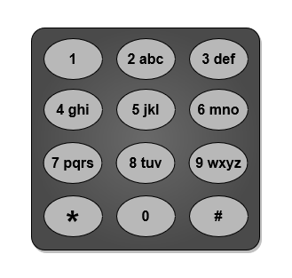
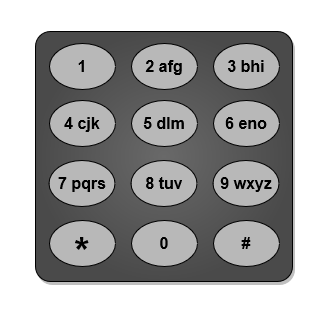
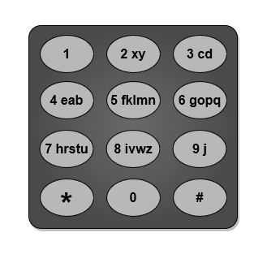

### [3014\. 输入单词需要的最少按键次数 I](https://leetcode.cn/problems/minimum-number-of-pushes-to-type-word-i/)

难度：简单

给你一个字符串 `word`，由 **不同** 小写英文字母组成。

电话键盘上的按键与 **不同** 小写英文字母集合相映射，可以通过按压按键来组成单词。例如，按键 `2` 对应 `["a","b","c"]`，我们需要按一次键来输入 `"a"`，按两次键来输入 `"b"`，按三次键来输入 `"c"`_。_

现在允许你将编号为 `2` 到 `9` 的按键重新映射到 **不同** 字母集合。每个按键可以映射到 **任意数量** 的字母，但每个字母 **必须** **恰好** 映射到 **一个** 按键上。你需要找到输入字符串 `word` 所需的 **最少** 按键次数。

返回重新映射按键后输入 `word` 所需的 **最少** 按键次数。

下面给出了一种电话键盘上字母到按键的映射作为示例。注意 `1`，`*`，`#` 和 `0` **不** 对应任何字母。

**示例 1：**

> **输入：** word = "abcde"
> **输出：** 5
> **解释：** 图片中给出的重新映射方案的输入成本最小。
> "a" -&gt; 在按键 2 上按一次
> "b" -&gt; 在按键 3 上按一次
> "c" -&gt; 在按键 4 上按一次
> "d" -&gt; 在按键 5 上按一次
> "e" -&gt; 在按键 6 上按一次
> 总成本为 1 + 1 + 1 + 1 + 1 = 5 。
> 可以证明不存在其他成本更低的映射方案。

**示例 2：**

> **输入：** word = "xycdefghij"
> **输出：** 12
> **解释：** 图片中给出的重新映射方案的输入成本最小。
> "x" -&gt; 在按键 2 上按一次
> "y" -&gt; 在按键 2 上按两次
> "c" -&gt; 在按键 3 上按一次
> "d" -&gt; 在按键 3 上按两次
> "e" -&gt; 在按键 4 上按一次
> "f" -&gt; 在按键 5 上按一次
> "g" -&gt; 在按键 6 上按一次
> "h" -&gt; 在按键 7 上按一次
> "i" -&gt; 在按键 8 上按一次
> "j" -&gt; 在按键 9 上按一次
> 总成本为 1 + 2 + 1 + 2 + 1 + 1 + 1 + 1 + 1 + 1 = 12 。
> 可以证明不存在其他成本更低的映射方案。

**提示：**

- `1 <= word.length <= 26`
- `word` 仅由小写英文字母组成。
- `word` 中的所有字母互不相同。
