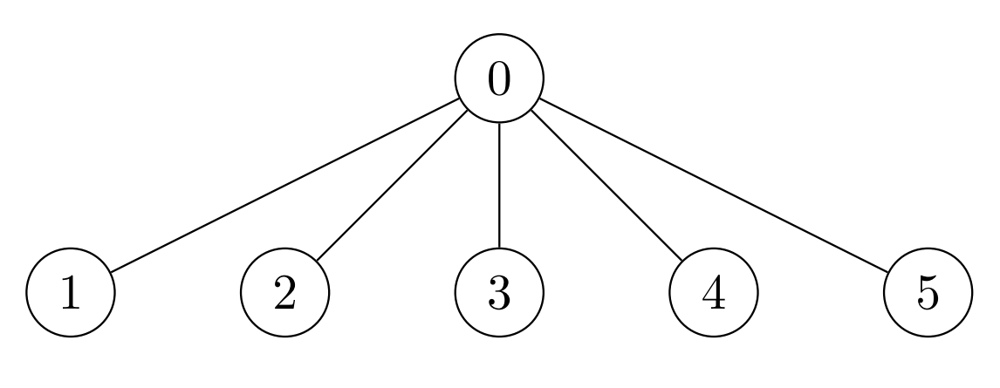

### [3068\. 最大节点价值之和](https://leetcode.cn/problems/find-the-maximum-sum-of-node-values/)

难度：困难

给你一棵 `n` 个节点的 **无向** 树，节点从 `0` 到 `n - 1` 编号。树以长度为 `n - 1` 下标从 **0** 开始的二维整数数组 `edges` 的形式给你，其中 <code>edges[i] = [ui, vi]</code> 表示树中节点 <code>ui</code> 和 <code>vi</code> 之间有一条边。同时给你一个 **正** 整数 `k` 和一个长度为 `n` 下标从 **0** 开始的 **非负** 整数数组 `nums`，其中 `nums[i]` 表示节点 `i` 的 **价值**。

Alice 想 **最大化** 树中所有节点价值之和。为了实现这一目标，Alice 可以执行以下操作 **任意** 次（**包括** **0 次**）：

- 选择连接节点 `u` 和 `v` 的边 `[u, v]`，并将它们的值更新为：
  - `nums[u] = nums[u] XOR k`
  - `nums[v] = nums[v] XOR k`

请你返回 Alice 通过执行以上操作 **任意次** 后，可以得到所有节点 **价值之和** 的 **最大值**。

**示例 1：**

> **输入：** nums = [1,2,1], k = 3, edges = \[[0,1],[0,2]]
> **输出：** 6
> **解释：** Alice 可以通过一次操作得到最大价值和 6 ：
>
> - 选择边 [0,2]。nums[0] 和 nums[2] 都变为：1 XOR 3 = 2，数组 nums 变为：[1,2,1] -> [2,2,2]。
>
> 所有节点价值之和为 2 + 2 + 2 = 6。
> 6 是可以得到最大的价值之和。

**示例 2：**

> **输入：** nums = [2,3], k = 7, edges = \[[0,1]]
> **输出：** 9
> **解释：** Alice 可以通过一次操作得到最大和 9 ：
>
> - 选择边 [0,1]。nums[0] 变为：2 XOR 7 = 5，nums[1] 变为：3 XOR 7 = 4，数组 nums 变为：[2,3] -> [5,4]。
>
> 所有节点价值之和为 5 + 4 = 9。
> 9 是可以得到最大的价值之和。

**示例 3：**

> **输入：** nums = [7,7,7,7,7,7], k = 3, edges = \[[0,1],[0,2],[0,3],[0,4],[0,5]]
> **输出：** 42
> **解释：** Alice 不需要执行任何操作，就可以得到最大价值之和 42。

**提示：**

- <code>2 <= n == nums.length <= 2 &times; 104</code>
- <code>1 <= k <= 109</code>
- <code>0 <= nums[i] <= 109</code>
- `edges.length == n - 1`
- `edges[i].length == 2`
- `0 <= edges[i][0], edges[i][1] <= n - 1`
- 输入保证 `edges` 构成一棵合法的树。
