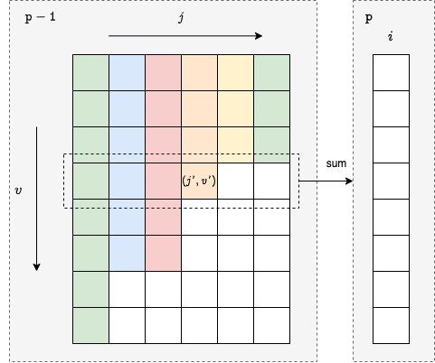

### [求出所有子序列的能量和](https://leetcode.cn/problems/find-the-sum-of-subsequence-powers/solutions/2852864/qiu-chu-suo-you-zi-xu-lie-de-neng-liang-y4rjd/)

#### 方法一：动态规划

**思路与算法**

由于子序列的能量为任意两个元素的差值绝对值的最小值，因此对子序列排序后，其能量为两两相邻元素的差值绝对值的最小值。在对原数组 $nums$ 排序后，我们在计算子序列能量时只需考虑相邻元素之间的差值即可。

采用求解数组最长上升子序列的思想，我们从小到大枚举 $i$ 作为子序列中的最后一个元素，再从 $0$ 到 $i-1$ 去枚举 $j$ 作为 $i$ 的前置元素，这样一来产生差值 $diff=∣nums[i]-nums[j]∣$。接着我们再枚举子序列的长度 $p$，然后考虑从「以 $j$ 结尾且长度为 $p-1$ 的子序列」等一系列状态进行转移求解。

设 $d[i][p][v]$ 表示以 $i$ 为结尾时，有多少个长度为 $p$ 且能量为 $v$ 的子序列。这样一来，就有如下转移方程：

$$d[i][p][v]=\left\{\begin{array}{lr}\sum_j d[j][p-1][v] & for v < diff \\ \sum_j d[j][p-1][diff] + d[j][p-1][diff+1] + \cdots & for v = diff \\ 0 & for v > diff \end{array}\right.$$

在实现时，我们只需枚举所有 $d[j][p-1][v]$，然后更新到 $d[i][p][min(diff,v)]$ 即可。

最后，我们枚举所有长度为 $k$ 的状态，并将 $v \times d[i][k][v]$ 累加到答案中，即可得到 $nums$ 中长度等于 $k$ 的所有子序列的能量和。

**细节**

1. 长度为 $n$ 的整数数组，两两元素之间的差值种类数不会超过 $2n \times (n-1)$，因此状态表示中 $v$ 的数量级大致在 $n^2$ 量级。具体到每个状态 $d[i][p][v]$，实际可取的 $v$ 更少。因此，在代码实现时可以将 $d[i][p]$ 定义为字典（哈希表），来减少状态枚举数量，并减少代码量。
2. 将 $d[i][1][inf]$ 初始化为 $1$，方便后续状态转移，其中 $inf$ 表示无穷大。

**代码**

```Python
class Solution:
    mod = int(1e9 + 7)
    inf = float('inf')

    def sumOfPowers(self, nums: List[int], k: int) -> int:
        n = len(nums)
        res = 0
        d = [[defaultdict(int) for _ in range(k + 1)] for _ in range(n)]
        nums.sort()

        for i in range(n):
            d[i][1][self.inf] = 1
            for j in range(i):
                diff = abs(nums[i] - nums[j])
                for p in range(2, k + 1):
                    for v, cnt in d[j][p - 1].items():
                        d[i][p][min(diff, v)] = (d[i][p][min(diff, v)] + cnt) % self.mod

            for v, cnt in d[i][k].items():
                res = (res + v * cnt % self.mod) % self.mod

        return res
```

```C++
class Solution {
public:
    using ump = unordered_map<int, int>;
    static constexpr int mod = 1e9 + 7;
    static constexpr int inf = 0x3f3f3f3f;
    int sumOfPowers(vector<int>& nums, int k) {
        int n = nums.size();
        int res = 0;
        vector<vector<ump>> d(n, vector<ump>(k + 1));
        sort(nums.begin(), nums.end());
        for (int i = 0; i < n; i++) {
            d[i][1][inf] = 1;
            for (int j = 0; j < i; j++) {
                int diff = abs(nums[i] - nums[j]);
                for (int p = 2; p <= k; p++) {
                    for (auto &[v, cnt] : d[j][p - 1]) {
                        d[i][p][min(diff, v)] = (d[i][p][min(diff, v)] + cnt) % mod;
                    }
                }
            }

            for (auto &[v, cnt] : d[i][k]) {
                res = (res + 1ll * v * cnt % mod) % mod;
            }
        }
        return res;
    }
};
```

```Java
class Solution {
    static final int MOD = 1000000007, INF = 0x3f3f3f3f;

    public int sumOfPowers(int[] nums, int k) {
        int n = nums.length;
        int res = 0;
        Map<Integer, Integer>[][] d = new Map[n][k + 1];
        for (int i = 0; i < n; i++) {
            for (int j = 0; j <= k; j++) {
                d[i][j] = new HashMap<Integer, Integer>();
            }
        }
        Arrays.sort(nums);
        for (int i = 0; i < n; i++) {
            d[i][1].put(INF, 1);
            for (int j = 0; j < i; j++) {
                int diff = Math.abs(nums[i] - nums[j]);
                for (int p = 2; p <= k; p++) {
                    for (Map.Entry<Integer, Integer> entry : d[j][p - 1].entrySet()) {
                        int v = entry.getKey(), cnt = entry.getValue();
                        int currKey = Math.min(diff, v);
                        d[i][p].put(currKey, (d[i][p].getOrDefault(currKey, 0) + cnt) % MOD);
                    }
                }
            }

            for (Map.Entry<Integer, Integer> entry : d[i][k].entrySet()) {
                int v = entry.getKey(), cnt = entry.getValue();
                res = (int) ((res + 1L * v * cnt % MOD) % MOD);
            }
        }
        return res;
    }
}
```

```CSharp
public class Solution {
    const int MOD = 1000000007, INF = 0x3f3f3f3f;

    public int SumOfPowers(int[] nums, int k) {
        int n = nums.Length;
        int res = 0;
        IDictionary<int, int>[][] d = new IDictionary<int, int>[n][];
        for (int i = 0; i < n; i++) {
            d[i] = new IDictionary<int, int>[k + 1];
            for (int j = 0; j <= k; j++) {
                d[i][j] = new Dictionary<int, int>();
            }
        }
        Array.Sort(nums);
        for (int i = 0; i < n; i++) {
            d[i][1].Add(INF, 1);
            for (int j = 0; j < i; j++) {
                int diff = Math.Abs(nums[i] - nums[j]);
                for (int p = 2; p <= k; p++) {
                    foreach (KeyValuePair<int, int> pair in d[j][p - 1]) {
                        int v = pair.Key, cnt = pair.Value;
                        int currKey = Math.Min(diff, v);
                        d[i][p].TryAdd(currKey, 0);
                        d[i][p][currKey] = (d[i][p][currKey] + cnt) % MOD;
                    }
                }
            }

            foreach (KeyValuePair<int, int> pair in d[i][k]) {
                int v = pair.Key, cnt = pair.Value;
                res = (int) ((res + 1L * v * cnt % MOD) % MOD);
            }
        }
        return res;
    }
}
```

```C
typedef struct {
    int key;
    int val;
    UT_hash_handle hh;
} HashItem; 

HashItem *hashFindItem(HashItem **obj, int key) {
    HashItem *pEntry = NULL;
    HASH_FIND_INT(*obj, &key, pEntry);
    return pEntry;
}

bool hashAddItem(HashItem **obj, int key, int val) {
    if (hashFindItem(obj, key)) {
        return false;
    }
    HashItem *pEntry = (HashItem *)malloc(sizeof(HashItem));
    pEntry->key = key;
    pEntry->val = val;
    HASH_ADD_INT(*obj, key, pEntry);
    return true;
}

bool hashSetItem(HashItem **obj, int key, int val) {
    HashItem *pEntry = hashFindItem(obj, key);
    if (!pEntry) {
        hashAddItem(obj, key, val);
    } else {
        pEntry->val = val;
    }
    return true;
}

int hashGetItem(HashItem **obj, int key, int defaultVal) {
    HashItem *pEntry = hashFindItem(obj, key);
    if (!pEntry) {
        return defaultVal;
    }
    return pEntry->val;
}

void hashFree(HashItem **obj) {
    HashItem *curr = NULL, *tmp = NULL;
    HASH_ITER(hh, *obj, curr, tmp) {
        HASH_DEL(*obj, curr);  
        free(curr);
    }
}

const int MOD = 1e9 + 7;
const int INF = 0x3f3f3f3f;

static int cmp(const void *a, const void *b) {
    return *(int *)a - *(int *)b;
}

int sumOfPowers(int* nums, int numsSize, int k) {
    int n = numsSize;
    int res = 0;
    HashItem ***d[n][k + 1];
    for (int i = 0; i < n; i++) {
        for (int j = 0; j <= k; j++) {
            d[i][j] = NULL;
        }
    }

    qsort(nums, numsSize, sizeof(int), cmp);
    for (int i = 0; i < n; i++) {
        hashAddItem(&d[i][1], INF, 1);
        for (int j = 0; j < i; j++) {
            int diff = abs(nums[i] - nums[j]);
            for (int p = 2; p <= k; p++) {
                for (HashItem *pEntry = d[j][p - 1]; pEntry; pEntry = pEntry->hh.next) {
                    int v = pEntry->key, cnt = pEntry->val;
                    int key = fmin(diff, v);
                    hashSetItem(&d[i][p], key, (hashGetItem(&d[i][p], key, 0) + cnt) % MOD);
                }
            }
        }
        for (HashItem *pEntry = d[i][k]; pEntry; pEntry = pEntry->hh.next) {
            int v = pEntry->key, cnt = pEntry->val;
            res = (res + 1ll * v * cnt % MOD) % MOD;
        }
    }
    for (int i = 0; i < n; i++) {
        for (int j = 0; j <= k; j++) {
            hashFree(&d[i][j]);
        }
    }
    return res;
}
```

```Go
const mod = 1e9 + 7
const inf = 0x3f3f3f3f

func sumOfPowers(nums []int, k int) int {
    n := len(nums)
    res := 0
    d := make([][]map[int]int, n)
    for i := range d {
        d[i] = make([]map[int]int, k + 1)
        for j := range d[i] {
            d[i][j] = make(map[int]int)
        }
    }
    sort.Ints(nums)
    for i := 0; i < n; i++ {
        d[i][1][inf] = 1
        for j := 0; j < i; j++ {
            diff := int(math.Abs(float64(nums[i] - nums[j])))
            for p := 2; p <= k; p++ {
                for v, cnt := range d[j][p-1] {
                    d[i][p][min(diff, v)] = (d[i][p][min(diff, v)] + cnt) % mod
                }
            }
        }
        for v, cnt := range d[i][k] {
            res = (res + v * cnt % mod) % mod
        }
    }
    return res
}
```

```JavaScript
const mod = 1e9 + 7;
const inf = 0x3f3f3f3f;

var sumOfPowers = function(nums, k) {
    const n = nums.length;
    let res = 0;
    const d = Array.from({ length: n }, () => Array.from({ length: k + 1 }, () => new Map()));
    nums.sort((a, b) => a - b);
    
    for (let i = 0; i < n; i++) {
        d[i][1].set(inf, 1);
        for (let j = 0; j < i; j++) {
            const diff = Math.abs(nums[i] - nums[j]);
            for (let p = 2; p <= k; p++) {
                for (const [v, cnt] of d[j][p - 1].entries()) {
                    const key = Math.min(diff, v);
                    d[i][p].set(key, (d[i][p].get(key) || 0) + cnt % mod);
                }
            }
        }
        for (const [v, cnt] of d[i][k].entries()) {
            res = (res + v * cnt % mod) % mod;
        }
    }
    return res;
};
```

```TypeScript
const mod = 1e9 + 7;
const inf = 0x3f3f3f3f;

function sumOfPowers(nums: number[], k: number): number {
    const n = nums.length;
    let res = 0;
    const d: Array<Array<Map<number, number>>> = Array.from({ length: n }, () => Array.from({ length: k + 1 }, () => new Map()));
    nums.sort((a, b) => a - b);
    for (let i = 0; i < n; i++) {
        d[i][1].set(inf, 1);
        for (let j = 0; j < i; j++) {
            const diff = Math.abs(nums[i] - nums[j]);
            for (let p = 2; p <= k; p++) {
                for (const [v, cnt] of d[j][p - 1].entries()) {
                    const key = Math.min(diff, v);
                    d[i][p].set(key, (d[i][p].get(key) || 0) + cnt % mod);
                }
            }
        }

        for (const [v, cnt] of d[i][k].entries()) {
            res = (res + v * cnt % mod) % mod;
        }
    }
    return res;
};
```

```Rust
use std::collections::HashMap;

const MOD: i64 = 1_000_000_007;
const INF: i32 = 0x3f3f3f3f;

impl Solution {
    pub fn sum_of_powers(nums: Vec<i32>, k: i32) -> i32 {
        let mut nums = nums.clone();
        let n = nums.len();
        let mut res = 0;
        let mut d: Vec<Vec<HashMap<i32, i64>>> = vec![vec![HashMap::new(); k as usize + 1]; n];
        nums.sort();

        for i in 0..n {
            d[i][1].insert(INF, 1);
            for j in 0..i {
                let diff = (nums[i] - nums[j]).abs();
                for p in 2..=k {
                    let mut updates: Vec<(i32, i64)> = Vec::new();
                    for (&v, &cnt) in &d[j][p as usize - 1] {
                        let key = diff.min(v);
                        updates.push((key, cnt));
                    }
                    for &(key, cnt) in &updates {
                        let entry = d[i][p as usize].entry(key).or_insert(0);
                        *entry = (*entry + cnt) % MOD;
                    }
                }
            }
            for (&v, &cnt) in &d[i][k as usize] {
                res = (res + v as i64 * cnt % MOD) % MOD;
            }
        }
        res as i32
    }
}
```

**复杂度分析**

- 时间复杂度：$O(n^4k)$，其中 $n$ 为 $nums$ 的长度。所有状态的数量为 $O(n^3k)$，每个状态求解所需要的时间复杂度为 $O(n)$，因此总体的时间复杂度为 $O(n^4k)$。
- 空间复杂度：$O(n^3k)$。

#### 方法二：前缀和优化

方法一的转移方程如下：

$$d[i][p][v]=\left\{\begin{array}{lr}\sum_j d[j][p-1][v] & for v < diff \\ \sum_j d[j][p-1][diff] + d[j][p-1][diff+1] + \cdots & for v = diff \\ 0 & for v > diff \end{array}\right.$$

忽略掉 $v>diff$ 情况后，我们可以注意到 $v=diff$ 的情况可以用前缀和进行优化，但对于 $v<diff$ 的情况却束手无策，只能遍历。既然 $v$ 这一维度无法省去，那么我们可以尝试省去 $j$。

如下图所示，固定枚举 $p$，$d[i][p][v′]$ 的值为虚线框所有值之和。对于每个 $j$，白色的部分表示 $0$，彩色部分的最后一个位置（例如 $(j′,v′)$）表示 $d[j′][p-1][v′]+d[j′][p-1][v′+1]+\cdots$，其余位置为 $d[j′][p-1][v]$。这其中的 $v′$ 应等于 $nums[i]-nums[j]$。



我们可以用 $sum[p-1][v]$ 来统计每一行的和，这样就可以省去遍历 $j$ 了。在 $i$ 往后递增时，对于固定的某个 $j′$，$nums[i]-nums[j′]$ 会递增，因此彩色部分的最后一个位置会不断下移，我们可以顺便处理 $sum[p-1][v]$ 的值。

具体的，我们维护一个 $border[j][p]$ 表示每个 $j$ 彩色部分的最后一个位置。当 $vborder[j][p] <nums[i]-nums[j]$ 时不断递增。递增时：

1. 令 $sum[p][border[j][p]]=sum[p][border[j][p]]-suf[j][p]+d[j][p][border[j][p]]$；
2. 令 $suf[j][p]=suf[j][p]-d[j][p][border][j][p]$；
3. 令 $border[j][p]$ 增加 $1$；
4. 令 $sum[p][border[j][p]]=sum[p][border[j][p]]+suf[j][p]$。

其中 $suf[j][p]$ 表示彩色部分的最后一个位置上的值。简单的说，就是让彩色部分向下延伸一个长度，并修改涉及到的两个位置的值。

对于每个 $i$ 求出 $d[i][p][v]$ 后，需要将其更新到对应的 $suf[i][p]$ 以及 $sum[p][0]$ 中。

```Python
class Solution:
    mod = int(1e9 + 7)
    inf = 0x3f3f3f3f

    def sumOfPowers(self, nums: List[int], k: int) -> int:
        n = len(nums)
        nums.sort()
        vals = []
        for i in range(n):
            for j in range(i):
                vals.append(nums[i] - nums[j])
        vals.append(self.inf)
        vals = sorted(set(vals))

        d = [[[0] * len(vals) for _ in range(k + 1)] for _ in range(n)]
        border = [[0] * (k + 1) for _ in range(n)]
        sum_dp = [[0] * len(vals) for _ in range(k + 1)]
        suf = [[0] * (k + 1) for _ in range(n)]

        for i in range(n):
            for j in range(i):
                pos = bisect_left(vals, nums[i] - nums[j])
                for p in range(1, k + 1):
                    while border[j][p] < pos:
                        sum_dp[p][border[j][p]] = (sum_dp[p][border[j][p]] - suf[j][p] + self.mod) % self.mod
                        sum_dp[p][border[j][p]] = (sum_dp[p][border[j][p]] + d[j][p][border[j][p]]) % self.mod
                        suf[j][p] = (suf[j][p] - d[j][p][border[j][p]] + self.mod) % self.mod
                        border[j][p] += 1
                        sum_dp[p][border[j][p]] = (sum_dp[p][border[j][p]] + suf[j][p]) % self.mod

            d[i][1][len(vals) - 1] = 1
            for p in range(2, k + 1):
                for v in range(len(vals)):
                    d[i][p][v] = sum_dp[p - 1][v]

            for p in range(1, k + 1):
                for v in range(len(vals)):
                    suf[i][p] = (suf[i][p] + d[i][p][v]) % self.mod
                sum_dp[p][0] = (sum_dp[p][0] + suf[i][p]) % self.mod

        res = 0
        for i in range(n):
            for v in range(len(vals)):
                res = (res + vals[v] * d[i][k][v] % self.mod) % self.mod

        return res
```

```C++
class Solution {
public:
    static constexpr int mod = 1e9 + 7;
    static constexpr int inf = 0x3f3f3f3f;
    int sumOfPowers(vector<int>& nums, int k) {
        int n = nums.size();
        sort(nums.begin(), nums.end());
        vector<int> vals;
        for (int i = 0; i < n; i++) {
            for (int j = 0; j < i; j++) {
                vals.push_back(nums[i] - nums[j]);
            }
        }
        vals.push_back(inf);
        sort(vals.begin(), vals.end());
        vals.erase(unique(vals.begin(), vals.end()), vals.end());

        vector<vector<vector<int>>> d(n, vector(k + 1, vector(vals.size(), 0)));
        vector<vector<int>> border(n, vector(k + 1, 0));
        vector<vector<int>> sum(k + 1, vector(vals.size(), 0));
        vector<vector<int>> suf(n, vector(k + 1, 0));

        for (int i = 0; i < n; i++) {
            for (int j = 0; j < i; j++) {
                int pos = lower_bound(vals.begin(), vals.end(), nums[i] - nums[j]) - vals.begin();
                for (int p = 1; p <= k; p++) {
                    while (border[j][p] < pos) {
                        sum[p][border[j][p]] = (sum[p][border[j][p]] - suf[j][p] + mod) % mod;
                        sum[p][border[j][p]] = (sum[p][border[j][p]] + d[j][p][border[j][p]]) % mod;
                        suf[j][p] = (suf[j][p] - d[j][p][border[j][p]] + mod) % mod;
                        border[j][p]++;
                        sum[p][border[j][p]] = (sum[p][border[j][p]] + suf[j][p]);
                    }
                }
            }

            d[i][1][vals.size() - 1] = 1;
            for (int p = 2; p <= k; p++) {
                for (int v = 0; v < vals.size(); v++) {
                    d[i][p][v] = sum[p - 1][v];
                }
            }
            for (int p = 1; p <= k; p++) {
                for (int v = 0; v < vals.size(); v++) {
                    suf[i][p] = (suf[i][p] + d[i][p][v]) % mod;
                }
                sum[p][0] = (sum[p][0] + suf[i][p]) % mod;
            }
        }

        int res = 0;
        for (int i = 0; i < n; i++) {
            for (int v = 0; v < vals.size(); v++) {
                res = (res + 1ll * vals[v] * d[i][k][v] % mod) % mod;
            }
        }
        return res;
    }
};
```

```Java
class Solution {
    static final int MOD = 1000000007, INF = 0x3f3f3f3f;

    public int sumOfPowers(int[] nums, int k) {
        int n = nums.length;
        Arrays.sort(nums);
        Set<Integer> set = new HashSet<Integer>();
        for (int i = 0; i < n; i++) {
            for (int j = 0; j < i; j++) {
                set.add(nums[i] - nums[j]);
            }
        }
        set.add(INF);
        List<Integer> vals = new ArrayList<Integer>(set);
        Collections.sort(vals);

        int[][][] d = new int[n][k + 1][vals.size()];
        int[][] border = new int[n][k + 1];
        int[][] sum = new int[k + 1][vals.size()];
        int[][] suf = new int[n][k + 1];

        for (int i = 0; i < n; i++) {
            for (int j = 0; j < i; j++) {
                int pos = binarySearch(vals, nums[i] - nums[j]);
                for (int p = 1; p <= k; p++) {
                    while (border[j][p] < pos) {
                        sum[p][border[j][p]] = (sum[p][border[j][p]] - suf[j][p] + MOD) % MOD;
                        sum[p][border[j][p]] = (sum[p][border[j][p]] + d[j][p][border[j][p]]) % MOD;
                        suf[j][p] = (suf[j][p] - d[j][p][border[j][p]] + MOD) % MOD;
                        border[j][p]++;
                        sum[p][border[j][p]] = (sum[p][border[j][p]] + suf[j][p]);
                    }
                }
            }

            d[i][1][vals.size() - 1] = 1;
            for (int p = 2; p <= k; p++) {
                for (int v = 0; v < vals.size(); v++) {
                    d[i][p][v] = sum[p - 1][v];
                }
            }
            for (int p = 1; p <= k; p++) {
                for (int v = 0; v < vals.size(); v++) {
                    suf[i][p] = (suf[i][p] + d[i][p][v]) % MOD;
                }
                sum[p][0] = (sum[p][0] + suf[i][p]) % MOD;
            }
        }

        int res = 0;
        for (int i = 0; i < n; i++) {
            for (int v = 0; v < vals.size(); v++) {
                res = (int) ((res + 1L * vals.get(v) * d[i][k][v] % MOD) % MOD);
            }
        }
        return res;
    }

    public int binarySearch(List<Integer> vals, int target) {
        int low = 0, high = vals.size();
        while (low < high) {
            int mid = low + (high - low) / 2;
            if (vals.get(mid) >= target) {
                high = mid;
            } else {
                low = mid + 1;
            }
        }
        return low;
    }
}
```

```CSharp
public class Solution {
    const int MOD = 1000000007, INF = 0x3f3f3f3f;

    public int SumOfPowers(int[] nums, int k) {
        int n = nums.Length;
        Array.Sort(nums);
        ISet<int> set = new HashSet<int>();
        for (int i = 0; i < n; i++) {
            for (int j = 0; j < i; j++) {
                set.Add(nums[i] - nums[j]);
            }
        }
        set.Add(INF);
        IList<int> vals = new List<int>(set);
        ((List<int>) vals).Sort();

        int[][][] d = new int[n][][];
        for (int i = 0; i < n; i++) {
            d[i] = new int[k + 1][];
            for (int j = 0; j <= k; j++) {
                d[i][j] = new int[vals.Count];
            }
        }
        int[][] border = new int[n][];
        for (int i = 0; i < n; i++) {
            border[i] = new int[k + 1];
        }
        int[][] sum = new int[k + 1][];
        for (int i = 0; i <= k; i++) {
            sum[i] = new int[vals.Count];
        }
        int[][] suf = new int[n][];
        for (int i = 0; i < n; i++) {
            suf[i] = new int[k + 1];
        }

        for (int i = 0; i < n; i++) {
            for (int j = 0; j < i; j++) {
                int pos = BinarySearch(vals, nums[i] - nums[j]);
                for (int p = 1; p <= k; p++) {
                    while (border[j][p] < pos) {
                        sum[p][border[j][p]] = (sum[p][border[j][p]] - suf[j][p] + MOD) % MOD;
                        sum[p][border[j][p]] = (sum[p][border[j][p]] + d[j][p][border[j][p]]) % MOD;
                        suf[j][p] = (suf[j][p] - d[j][p][border[j][p]] + MOD) % MOD;
                        border[j][p]++;
                        sum[p][border[j][p]] = (sum[p][border[j][p]] + suf[j][p]);
                    }
                }
            }

            d[i][1][vals.Count - 1] = 1;
            for (int p = 2; p <= k; p++) {
                for (int v = 0; v < vals.Count; v++) {
                    d[i][p][v] = sum[p - 1][v];
                }
            }
            for (int p = 1; p <= k; p++) {
                for (int v = 0; v < vals.Count; v++) {
                    suf[i][p] = (suf[i][p] + d[i][p][v]) % MOD;
                }
                sum[p][0] = (sum[p][0] + suf[i][p]) % MOD;
            }
        }

        int res = 0;
        for (int i = 0; i < n; i++) {
            for (int v = 0; v < vals.Count; v++) {
                res = (int) ((res + 1L * vals[v] * d[i][k][v] % MOD) % MOD);
            }
        }
        return res;
    }

    public int BinarySearch(IList<int> vals, int target) {
        int low = 0, high = vals.Count;
        while (low < high) {
            int mid = low + (high - low) / 2;
            if (vals[mid] >= target) {
                high = mid;
            } else {
                low = mid + 1;
            }
        }
        return low;
    }
}
```

```C
typedef struct {
    int key;
    UT_hash_handle hh;
} HashItem; 

HashItem *hashFindItem(HashItem **obj, int key) {
    HashItem *pEntry = NULL;
    HASH_FIND_INT(*obj, &key, pEntry);
    return pEntry;
}

bool hashAddItem(HashItem **obj, int key) {
    if (hashFindItem(obj, key)) {
        return false;
    }
    HashItem *pEntry = (HashItem *)malloc(sizeof(HashItem));
    pEntry->key = key;
    HASH_ADD_INT(*obj, key, pEntry);
    return true;
}

void hashFree(HashItem **obj) {
    HashItem *curr = NULL, *tmp = NULL;
    HASH_ITER(hh, *obj, curr, tmp) {
        HASH_DEL(*obj, curr);  
        free(curr);
    }
}

const int MOD = 1e9 + 7;
const int INF = 0x3f3f3f3f;

static int cmp(const void *a, const void *b) {
    return *(int *)a - *(int *)b;
}

int binarySearch(const int *vals, int valsSize, int target) {
    int low = 0, high = valsSize;
    while (low < high) {
        int mid = low + (high - low) / 2;
        if (vals[mid] >= target) {
            high = mid;
        } else {
            low = mid + 1;
        }
    }
    return low;
}

int sumOfPowers(int* nums, int numsSize, int k) {
    int n = numsSize;
    qsort(nums, numsSize, sizeof(int), cmp);
    HashItem *set = NULL;
    for (int i = 0; i < n; i++) {
        for (int j = 0; j < i; j++) {
            hashAddItem(&set, nums[i] - nums[j]);
        }
    }
    hashAddItem(&set, INF);
    int valsSize = HASH_COUNT(set);
    int *vals = (int *)malloc(sizeof(int) * valsSize);
    int pos = 0;
    for (HashItem *pEntry = set; pEntry; pEntry = pEntry->hh.next) {
        vals[pos++] = pEntry->key;
    }
    hashFree(&set);
    qsort(vals, valsSize, sizeof(int), cmp);

    int d[n][k + 1][valsSize];
    int border[n][k + 1];
    int sum[k + 1][valsSize];
    int suf[n][k + 1];
    memset(d, 0, sizeof(d));
    memset(border, 0, sizeof(border));
    memset(sum, 0, sizeof(sum));
    memset(suf, 0, sizeof(suf));

    for (int i = 0; i < n; i++) {
        for (int j = 0; j < i; j++) {
            pos = binarySearch(vals, valsSize, nums[i] - nums[j]);
            for (int p = 1; p <= k; p++) {
                while (border[j][p] < pos) {
                    sum[p][border[j][p]] = (sum[p][border[j][p]] - suf[j][p] + MOD) % MOD;
                    sum[p][border[j][p]] = (sum[p][border[j][p]] + d[j][p][border[j][p]]) % MOD;
                    suf[j][p] = (suf[j][p] - d[j][p][border[j][p]] + MOD) % MOD;
                    border[j][p]++;
                    sum[p][border[j][p]] = (sum[p][border[j][p]] + suf[j][p]);
                }
            }
        }

        d[i][1][valsSize - 1] = 1;
        for (int p = 2; p <= k; p++) {
            for (int v = 0; v < valsSize; v++) {
                d[i][p][v] = sum[p - 1][v];
            }
        }
        for (int p = 1; p <= k; p++) {
            for (int v = 0; v < valsSize; v++) {
                suf[i][p] = (suf[i][p] + d[i][p][v]) % MOD;
            }
            sum[p][0] = (sum[p][0] + suf[i][p]) % MOD;
        }
    }

    int res = 0;
    for (int i = 0; i < n; i++) {
        for (int v = 0; v < valsSize; v++) {
            res = (res + 1ll * vals[v] * d[i][k][v] % MOD) % MOD;
        }
    }
    return res;
}
```

```Go
const mod = 1e9 + 7
const inf = 0x3f3f3f3f

func sumOfPowers(nums []int, k int) int {
    n := len(nums)
    sort.Ints(nums)
    
    var vals []int
    for i := 0; i < n; i++ {
        for j := 0; j < i; j++ {
            vals = append(vals, nums[i] - nums[j])
        }
    }
    vals = append(vals, inf)
    sort.Ints(vals)
    vals = unique(vals)

    d := make([][][]int, n)
    for i := range d {
        d[i] = make([][]int, k+1)
        for j := range d[i] {
            d[i][j] = make([]int, len(vals))
        }
    }

    border := make([][]int, n)
    for i := range border {
        border[i] = make([]int, k+1)
    }

    sum := make([][]int, k+1)
    for i := range sum {
        sum[i] = make([]int, len(vals))
    }

    suf := make([][]int, n)
    for i := range suf {
        suf[i] = make([]int, k+1)
    }
    for i := 0; i < n; i++ {
        for j := 0; j < i; j++ {
            pos := sort.SearchInts(vals, nums[i] - nums[j])
            for p := 1; p <= k; p++ {
                for border[j][p] < pos {
                    sum[p][border[j][p]] = (sum[p][border[j][p]] - suf[j][p] + mod) % mod
                    sum[p][border[j][p]] = (sum[p][border[j][p]] + d[j][p][border[j][p]]) % mod
                    suf[j][p] = (suf[j][p] - d[j][p][border[j][p]] + mod) % mod
                    border[j][p]++
                    sum[p][border[j][p]] = (sum[p][border[j][p]] + suf[j][p]) % mod
                }
            }
        }

        d[i][1][len(vals) - 1] = 1
        for p := 2; p <= k; p++ {
            for v := 0; v < len(vals); v++ {
                d[i][p][v] = sum[p - 1][v]
            }
        }
        for p := 1; p <= k; p++ {
            for v := 0; v < len(vals); v++ {
                suf[i][p] = (suf[i][p] + d[i][p][v]) % mod
            }
            sum[p][0] = (sum[p][0] + suf[i][p]) % mod
        }
    }

    res := 0
    for i := 0; i < n; i++ {
        for v := 0; v < len(vals); v++ {
            res = (res + int(int64(vals[v]) * int64(d[i][k][v]) % mod)) % mod
        }
    }
    return res
}

func unique(arr []int) []int {
    if len(arr) == 0 {
        return arr
    }
    result := []int{arr[0]}
    for _, v := range arr {
        if v != result[len(result)-1] {
            result = append(result, v)
        }
    }
    return result
}
```

```JavaScript
const mod = 1e9 + 7;
const inf = 0x3f3f3f3f;

var sumOfPowers = function(nums, k) {
    const n = nums.length;
    nums.sort((a, b) => a - b);

    const vals = [];
    for (let i = 0; i < n; i++) {
        for (let j = 0; j < i; j++) {
            vals.push(nums[i] - nums[j]);
        }
    }
    vals.push(inf);
    vals.sort((a, b) => a - b);
    const uniqueVals = [...new Set(vals)];

    const d = Array.from({ length: n }, () => 
        Array.from({ length: k + 1 }, () => Array(uniqueVals.length).fill(0))
    );
    const border = Array.from({ length: n }, () => Array(k + 1).fill(0));
    const sum = Array.from({ length: k + 1 }, () => Array(uniqueVals.length).fill(0));
    const suf = Array.from({ length: n }, () => Array(k + 1).fill(0));

    for (let i = 0; i < n; i++) {
        for (let j = 0; j < i; j++) {
            const pos = binarySearch(uniqueVals, nums[i] - nums[j]);
            for (let p = 1; p <= k; p++) {
                while (border[j][p] < pos) {
                    sum[p][border[j][p]] = (sum[p][border[j][p]] - suf[j][p] + mod) % mod;
                    sum[p][border[j][p]] = (sum[p][border[j][p]] + d[j][p][border[j][p]]) % mod;
                    suf[j][p] = (suf[j][p] - d[j][p][border[j][p]] + mod) % mod;
                    border[j][p]++;
                    sum[p][border[j][p]] = (sum[p][border[j][p]] + suf[j][p]) % mod;
                }
            }
        }

        d[i][1][uniqueVals.length - 1] = 1;
        for (let p = 2; p <= k; p++) {
            for (let v = 0; v < uniqueVals.length; v++) {
                d[i][p][v] = sum[p - 1][v];
            }
        }
        for (let p = 1; p <= k; p++) {
            for (let v = 0; v < uniqueVals.length; v++) {
                suf[i][p] = (suf[i][p] + d[i][p][v]) % mod;
            }
            sum[p][0] = (sum[p][0] + suf[i][p]) % mod;
        }
    }

    let res = 0;
    for (let i = 0; i < n; i++) {
        for (let v = 0; v < uniqueVals.length; v++) {
            res = (res + uniqueVals[v] * d[i][k][v] % mod) % mod;
        }
    }
    return res;
};

const binarySearch = (vals, target) => {
    let low = 0, high = vals.length;
    while (low < high) {
        let mid = Math.floor(low + (high - low) / 2);
        if (vals[mid] >= target) {
            high = mid;
        } else {
            low = mid + 1;
        }
    }
    return low;
}
```

```TypeScript
const mod = 1e9 + 7;
const inf = 0x3f3f3f3f;

function sumOfPowers(nums: number[], k: number): number {
    const n = nums.length;
    nums.sort((a, b) => a - b);

    const vals: number[] = [];
    for (let i = 0; i < n; i++) {
        for (let j = 0; j < i; j++) {
            vals.push(nums[i] - nums[j]);
        }
    }
    vals.push(inf);
    vals.sort((a, b) => a - b);
    const uniqueVals = Array.from(new Set(vals));
    const d: number[][][] = Array.from({ length: n }, () => 
        Array.from({ length: k + 1 }, () => Array(uniqueVals.length).fill(0))
    );
    const border: number[][] = Array.from({ length: n }, () => Array(k + 1).fill(0));
    const sum: number[][] = Array.from({ length: k + 1 }, () => Array(uniqueVals.length).fill(0));
    const suf: number[][] = Array.from({ length: n }, () => Array(k + 1).fill(0));

     for (let i = 0; i < n; i++) {
        for (let j = 0; j < i; j++) {
            const pos = binarySearch(uniqueVals, nums[i] - nums[j]);
            for (let p = 1; p <= k; p++) {
                while (border[j][p] < pos) {
                    sum[p][border[j][p]] = (sum[p][border[j][p]] - suf[j][p] + mod) % mod;
                    sum[p][border[j][p]] = (sum[p][border[j][p]] + d[j][p][border[j][p]]) % mod;
                    suf[j][p] = (suf[j][p] - d[j][p][border[j][p]] + mod) % mod;
                    border[j][p]++;
                    sum[p][border[j][p]] = (sum[p][border[j][p]] + suf[j][p]) % mod;
                }
            }
        }

        d[i][1][uniqueVals.length - 1] = 1;
        for (let p = 2; p <= k; p++) {
            for (let v = 0; v < uniqueVals.length; v++) {
                d[i][p][v] = sum[p - 1][v];
            }
        }
        for (let p = 1; p <= k; p++) {
            for (let v = 0; v < uniqueVals.length; v++) {
                suf[i][p] = (suf[i][p] + d[i][p][v]) % mod;
            }
            sum[p][0] = (sum[p][0] + suf[i][p]) % mod;
        }
    }

    let res = 0;
    for (let i = 0; i < n; i++) {
        for (let v = 0; v < uniqueVals.length; v++) {
            res = (res + uniqueVals[v] * d[i][k][v] % mod) % mod;
        }
    }
    return res;
};

const binarySearch = (vals, target) => {
    let low = 0, high = vals.length;
    while (low < high) {
        let mid = Math.floor(low + (high - low) / 2);
        if (vals[mid] >= target) {
            high = mid;
        } else {
            low = mid + 1;
        }
    }
    return low;
}
```

```Rust
use std::cmp::Ordering;
use std::collections::HashSet;

const MOD: i64 = 1_000_000_007;
const INF: i32 = 0x3f3f3f3f;

impl Solution {
    pub fn sum_of_powers(nums: Vec<i32>, k: i32) -> i32 {
        let mut nums = nums.clone();
        nums.sort();
        let n = nums.len();
        let mut vals: Vec<i32> = vec![];

        for i in 0..n {
            for j in 0..i {
                vals.push(nums[i] - nums[j]);
            }
        }
        vals.push(INF);
        vals.sort();
        vals.dedup();

        let m = vals.len();
        let mut d = vec![vec![vec![0; m]; k as usize + 1]; n];
        let mut border = vec![vec![0; k as usize + 1]; n];
        let mut sum = vec![vec![0; m]; k as usize + 1];
        let mut suf = vec![vec![0; k as usize + 1]; n];

        for i in 0..n {
            for j in 0..i {
                let pos = vals.binary_search(&(&nums[i] - &nums[j])).unwrap_or_else(|e| e);
                for p in 1..=k {
                    let p = p as usize;
                    while border[j][p] < pos {
                        sum[p][border[j][p]] = (sum[p][border[j][p]] - suf[j][p] + MOD) % MOD;
                        sum[p][border[j][p]] = (sum[p][border[j][p]] + d[j][p][border[j][p]] as i64) % MOD;
                        suf[j][p] = (suf[j][p] - d[j][p][border[j][p]] as i64 + MOD) % MOD;
                        border[j][p] += 1;
                        sum[p][border[j][p]] = (sum[p][border[j][p]] + suf[j][p]) % MOD;
                    }
                }
            }

            d[i][1][m - 1] = 1;
            for p in 2..=k {
                let p = p as usize;
                for v in 0..m {
                    d[i][p as usize][v] = sum[p - 1][v] as usize;
                }
            }
            for p in 1..=k {
                let p = p as usize;
                for v in 0..m {
                    suf[i][p] = (suf[i][p] + d[i][p][v] as i64) % MOD;
                }
                sum[p][0] = (sum[p][0] + suf[i][p]) % MOD;
            }
        }

        let mut res = 0;
        for i in 0..n {
            for v in 0..m {
                res = (res + vals[v] as i64 * d[i][k as usize][v] as i64 % MOD) % MOD;
            }
        }
        res as i32
    }
}
```

**复杂度分析**

- 时间复杂度：$O(n^3k+n^2logn^2)$，其中 $n$ 为 $nums$ 的长度。共有 $O(n^3k)$ 个状态，每个状态的求解时间为 $O(1)$。在更新 $sum$ 时，每个 $d[j][p][v]$ 只会被遍历一次，因此这部分总的时间复杂度为 $O(n^3k)$。另外代码中使用了离散化操作，因此二分查找 $nums[i]-nums[j]$ 所处的位置消耗的时间复杂度为 $O(n^2logn^2)$。因此，总的时间复杂度为 $O(n^3k+n^2logn^2)$。
- 空间复杂度：$O(n^3k)$。
