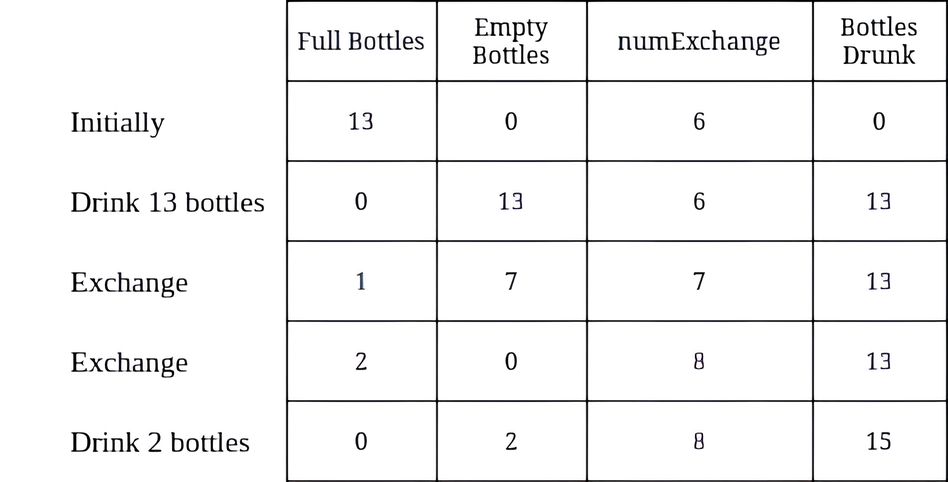
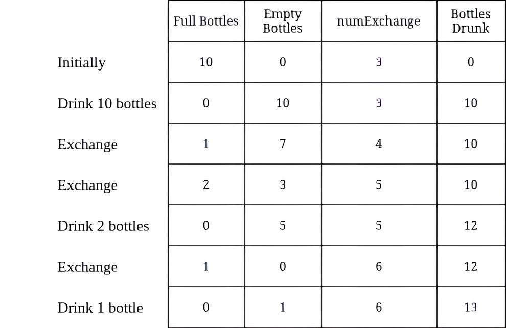

### [3100\. 换水问题 II](https://leetcode.cn/problems/water-bottles-ii/)

难度：中等

给你两个整数 `numBottles` 和 `numExchange`。

`numBottles` 代表你最初拥有的满水瓶数量。在一次操作中，你可以执行以下操作之一：

- 喝掉任意数量的满水瓶，使它们变成空水瓶。
- 用 `numExchange` 个空水瓶交换一个满水瓶。然后，将 `numExchange` 的值增加 1。

注意，你不能使用相同的 `numExchange` 值交换多批空水瓶。例如，如果 `numBottles == 3` 并且 `numExchange == 1`，则不能用 `3` 个空水瓶交换成 `3` 个满水瓶。

返回你 **最多** 可以喝到多少瓶水。

**示例 1：**

> **输入：** numBottles = 13, numExchange = 6
> **输出：** 15
> **解释：** 上表显示了满水瓶的数量、空水瓶的数量、numExchange 的值，以及累计喝掉的水瓶数量。

**示例 2：**

> **输入：** numBottles = 10, numExchange = 3
> **输出：** 13
> **解释：** 上表显示了满水瓶的数量、空水瓶的数量、numExchange 的值，以及累计喝掉的水瓶数量。

**提示：**

- `1 <= numBottles <= 100`
- `1 <= numExchange <= 100`
