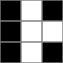
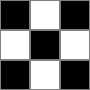

### [3127\. 构造相同颜色的正方形](https://leetcode.cn/problems/make-a-square-with-the-same-color/)

难度：简单

给你一个二维 `3 x 3` 的矩阵 `grid`，每个格子都是一个字符，要么是 `'B'`，要么是 `'W'`。字符 `'W'` 表示白色，字符 `'B'` 表示黑色。

你的任务是改变 **至多一个** 格子的颜色，使得矩阵中存在一个 `2 x 2` 颜色完全相同的正方形。

如果可以得到一个相同颜色的 `2 x 2` 正方形，那么返回 `true` ，否则返回 `false`。

**示例 1：**

> **输入：** grid = \[["B","W","B"],["B","W","W"],["B","W","B"]]
> **输出：** true
> **解释：**
> 修改 `grid[0][2]` 的颜色，可以满足要求。

**示例 2：**

> **输入：** grid = \[["B","W","B"],["W","B","W"],["B","W","B"]]
> **输出：** false
> **解释：**
> 只改变一个格子颜色无法满足要求。

**示例 3：**

> **输入：** grid = \[["B","W","B"],["B","W","W"],["B","W","W"]]
> **输出：** true
> **解释：**
> `grid` 已经包含一个 `2 x 2` 颜色相同的正方形了。

**提示：**

- `grid.length == 3`
- `grid[i].length == 3`
- `grid[i][j]` 要么是 `'W'` ，要么是 `'B'`。
