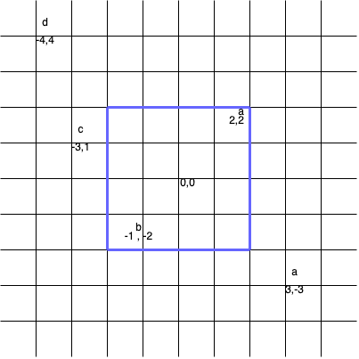

### [3143\. 正方形中的最多点数](https://leetcode.cn/problems/maximum-points-inside-the-square/)

难度：中等

给你一个二维数组 `points` 和一个字符串 `s` ，其中 `points[i]` 表示第 `i` 个点的坐标，`s[i]` 表示第 `i` 个点的 **标签** 。

如果一个正方形的中心在 `(0, 0)` ，所有边都平行于坐标轴，且正方形内 **不** 存在标签相同的两个点，那么我们称这个正方形是 **合法** 的。

请你返回 **合法** 正方形中可以包含的 **最多** 点数。

**注意：**

- 如果一个点位于正方形的边上或者在边以内，则认为该点位于正方形内。
- 正方形的边长可以为零。

**示例 1：**

> **输入：** points = \[[2,2],[-1,-2],[-4,4],[-3,1],[3,-3]], s = "abdca"
> **输出：** 2
> **解释：**
> 边长为 4 的正方形包含两个点 `points[0]` 和 `points[1]` 。

**示例 2：**

> **输入：** points = \[[1,1],[-2,-2],[-2,2]], s = "abb"
> **输出：** 1
> **解释：**
> 边长为 2 的正方形包含 1 个点 `points[0]` 。

**示例 3：**

> **输入：** points = \[[1,1],[-1,-1],[2,-2]], s = "ccd"
> **输出：** 0
> **解释：**
> 任何正方形都无法只包含 `points[0]` 和 `points[1]` 中的一个点，所以合法正方形中都不包含任何点。

**提示：**

- <code>1 <= s.length, points.length <= 105</code>
- `points[i].length == 2`
- <code>-109 <= points[i][0], points[i][1] <= 109</code>
- `s.length == points.length`
- `points` 中的点坐标互不相同。
- `s` 只包含小写英文字母。
