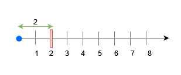
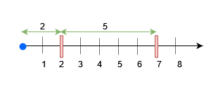

### [3161\. 物块放置查询](https://leetcode.cn/problems/block-placement-queries/)

难度：困难

有一条无限长的数轴，原点在 0 处，沿着 x 轴 **正** 方向无限延伸。

给你一个二维数组 `queries`，它包含两种操作：

1. 操作类型 1：`queries[i] = [1, x]`。在距离原点 `x` 处建一个障碍物。数据保证当操作执行的时候，位置 `x` 处 **没有** 任何障碍物。
2. 操作类型 2：`queries[i] = [2, x, sz]`。判断在数轴范围 `[0, x]` 内是否可以放置一个长度为 `sz` 的物块，这个物块需要 **完全** 放置在范围 `[0, x]` 内。如果物块与任何障碍物有重合，那么这个物块 **不能** 被放置，但物块可以与障碍物刚好接触。注意，你只是进行查询，并 **不是** 真的放置这个物块。每个查询都是相互独立的。

请你返回一个 boolean 数组`results`，如果第 `i` 个操作类型 2 的操作你可以放置物块，那么 `results[i]` 为 `true`，否则为 `false`。

**示例 1：**

> **输入：**queries = \[[1,2],[2,3,3],[2,3,1],[2,2,2]]
> **输出：**[false,true,true]
> **解释：**
> 
> 查询 0，在 `x = 2` 处放置一个障碍物。在 `x = 3` 之前任何大小不超过 2 的物块都可以被放置。

**示例 2：**

> **输入：**queries = \[[1,7],[2,7,6],[1,2],[2,7,5],[2,7,6]]
> **输出：**[true,true,false]
> **解释：**
> 
>
> - 查询 0 在 `x = 7` 处放置一个障碍物。在 `x = 7` 之前任何大小不超过 7 的物块都可以被放置。
> - 查询 2 在 `x = 2` 处放置一个障碍物。现在，在 `x = 7` 之前任何大小不超过 5 的物块可以被放置，`x = 2` 之前任何大小不超过 2 的物块可以被放置。

**提示：**

- <code>1 <= queries.length <= 15 &times; 104</code>
- `2 <= queries[i].length <= 3`
- `1 <= queries[i][0] <= 2`
- <code>1 <= x, sz <= min(5 &times; 104, 3 &times; queries.length)</code>
- 输入保证操作 1 中，`x` 处不会有障碍物。
- 输入保证至少有一个操作类型 2。
