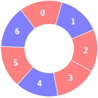

### [3208\. 交替组 II](https://leetcode.cn/problems/alternating-groups-ii/)

难度：中等

给你一个整数数组 `colors` 和一个整数 `k`，`colors`表示一个由红色和蓝色瓷砖组成的环，第 `i` 块瓷砖的颜色为 `colors[i]` ：

- `colors[i] == 0` 表示第 `i` 块瓷砖的颜色是 **红色**。
- `colors[i] == 1` 表示第 `i` 块瓷砖的颜色是 **蓝色**。

环中连续 `k` 块瓷砖的颜色如果是 **交替** 颜色（也就是说除了第一块和最后一块瓷砖以外，中间瓷砖的颜色与它 **左边** 和 **右边** 的颜色都不同），那么它被称为一个 **交替** 组。

请你返回 **交替** 组的数目。

**注意**，由于 `colors` 表示一个 **环**，**第一块** 瓷砖和 **最后一块** 瓷砖是相邻的。

**示例 1：**

> **输入：** colors = [0,1,0,1,0], k = 3
> **输出：** 3
> **解释：**
> 
> 交替组包括：
> 
> 
> 

**示例 2：**

> **输入：** colors = [0,1,0,0,1,0,1], k = 6
> **输出：** 2
> **解释：**
> 
> 交替组包括：
> 
> 

**示例 3：**

> **输入：** colors = [1,1,0,1], k = 4
> **输出：** 0
> **解释：**
> 

**提示：**

- <code>3 <= colors.length <= 105</code>
- `0 <= colors[i] <= 1`
- `3 <= k <= colors.length`
