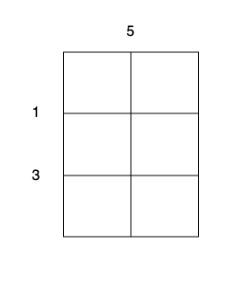

### [3218\. 切蛋糕的最小总开销 I](https://leetcode.cn/problems/minimum-cost-for-cutting-cake-i/)

难度：中等

有一个 <code>m &times; n</code> 大小的矩形蛋糕，需要切成 <code>1 &times; 1</code> 的小块。

给你整数 `m`，`n` 和两个数组：

- `horizontalCut` 的大小为 `m - 1`，其中 `horizontalCut[i]` 表示沿着水平线 `i` 切蛋糕的开销。
- `verticalCut` 的大小为 `n - 1`，其中 `verticalCut[j]` 表示沿着垂直线 `j` 切蛋糕的开销。

一次操作中，你可以选择任意不是 <code>1 &times; 1</code> 大小的矩形蛋糕并执行以下操作之一：

1. 沿着水平线 `i` 切开蛋糕，开销为 `horizontalCut[i]`。
2. 沿着垂直线 `j` 切开蛋糕，开销为 `verticalCut[j]`。

每次操作后，这块蛋糕都被切成两个独立的小蛋糕。

每次操作的开销都为最开始对应切割线的开销，并且不会改变。

请你返回将蛋糕全部切成 <code>1 &times; 1</code> 的蛋糕块的 **最小** 总开销。

**示例 1：**

> **输入：** m = 3, n = 2, horizontalCut = [1,3], verticalCut = [5]
> **输出：** 13
> **解释：**
> 
>
> - 沿着垂直线 0 切开蛋糕，开销为 5。
> - 沿着水平线 0 切开 <code>3 &times; 1</code> 的蛋糕块，开销为 1。
> - 沿着水平线 0 切开 <code>3 &times; 1</code> 的蛋糕块，开销为 1。
> - 沿着水平线 1 切开 <code>2 &times; 1</code> 的蛋糕块，开销为 3。
> - 沿着水平线 1 切开 <code>2 &times; 1</code> 的蛋糕块，开销为 3。
>
> 总开销为 `5 + 1 + 1 + 3 + 3 = 13`。

**示例 2：**

> **输入：** m = 2, n = 2, horizontalCut = [7], verticalCut = [4]
> **输出：** 15
> **解释：**
>
> - 沿着水平线 0 切开蛋糕，开销为 7。
> - 沿着垂直线 0 切开 <code>1 &times; 2</code> 的蛋糕块，开销为 4。
> - 沿着垂直线 0 切开 <code>1 &times; 2</code> 的蛋糕块，开销为 4。
>
> 总开销为 `7 + 4 + 4 = 15`。

**提示：**

- `1 <= m, n <= 20`
- `horizontalCut.length == m - 1`
- `verticalCut.length == n - 1`
- <code>1 <= horizontalCut[i], verticalCut[i] <= 103</code>
