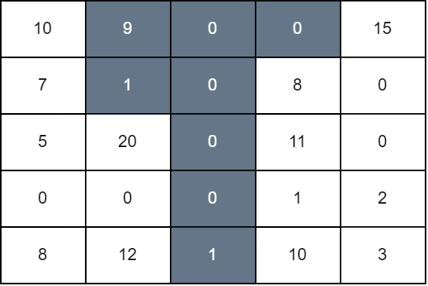

### [3225\. 网格图操作后的最大分数](https://leetcode.cn/problems/maximum-score-from-grid-operations/)

难度：困难

给你一个大小为 <code>n &times; n</code> 的二维矩阵 `grid`，一开始所有格子都是白色的。一次操作中，你可以选择任意下标为 `(i, j)` 的格子，并将第 `j` 列中从最上面到第 `i` 行所有格子改成黑色。

如果格子 `(i, j)` 为白色，且左边或者右边的格子至少一个格子为黑色，那么我们将 `grid[i][j]` 加到最后网格图的总分中去。

请你返回执行任意次操作以后，最终网格图的 **最大** 总分数。

**示例 1：**

> **输入：** grid = \[[0,0,0,0,0],[0,0,3,0,0],[0,1,0,0,0],[5,0,0,3,0],[0,0,0,0,2]]
> **输出：** 11
> **解释：**
> 
> 第一次操作中，我们将第 1 列中，最上面的格子到第 3 行的格子染成黑色。第二次操作中，我们将第 4 列中，最上面的格子到最后一行的格子染成黑色。最后网格图总分为 `grid[3][0] + grid[1][2] + grid[3][3]` 等于 11。

**示例 2：**

> **输入：** grid = \[[10,9,0,0,15],[7,1,0,8,0],[5,20,0,11,0],[0,0,0,1,2],[8,12,1,10,3]]
> **输出：** 94
> **解释：**
> 
> 我们对第 1，2，3 列分别从上往下染黑色到第 1，4，0 行。最后网格图总分为 `grid[0][0] + grid[1][0] + grid[2][1] + grid[4][1] + grid[1][3] + grid[2][3] + grid[3][3] + grid[4][3] + grid[0][4]` 等于 94。

**提示：**

- `1 <= n == grid.length <= 100`
- `n == grid[i].length`
- <code>0 <= grid[i][j] <= 109</code>
