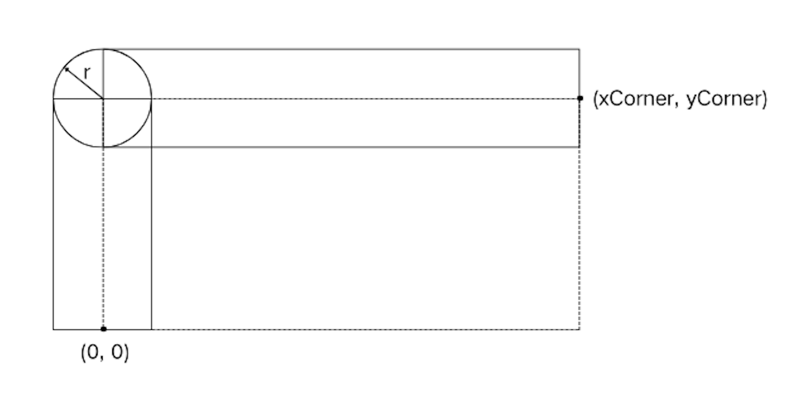

### [判断矩形的两个角落是否可达](https://leetcode.cn/problems/check-if-the-rectangle-corner-is-reachable/solutions/2973328/pan-duan-ju-xing-de-liang-ge-jiao-luo-sh-ug24/)

#### 方法一：深度优先搜索

**思路**

首先我们考虑 $circles$ 只有一个圆。在三种情况下，不存在这样的路径：

- 起点在圆内或圆上（圆内或圆上不影响结果，下文均简写为圆内）；
- 终点在圆内；
- 圆与矩形的左侧边或者上侧边相切或相交（相切或相交不影响结果，下文均简写为相交），并且圆与矩形的右侧边或者下侧边相交。

前两种情况好理解，题目规定路径不能触碰圆的边界或者内部，因此当起点或者终点位于圆内时，肯定不存在这样的路径。第三种情况，圆作为一个单一的障碍物，既与矩形的左上边界相交，又与矩形的右下边界相交，使得不存在一条路径可以从矩形内部经过，又不碰触圆的边界或者内部。

接下来，考虑 $circles$ 中有多个圆的情况。类似的，上文讨论的前两种情况仍然成立，当起点或终点位于某一个圆内时，不存在这样的路径。当有多个圆时，圆可能会在矩形内相交。当圆在矩形内相交时，这些圆可以合并成为一个障碍物，当这个合并的障碍物也满足与矩形的左上边界相交，且与矩形的右下边界相交，那么就不存在所求的路径。当圆的相交区域在矩形之外时，这些圆不能进行合并，因为相交的区域不会阻止在矩形内部的路径的生成。这样，我们可以从与矩形的左上边界相交的圆形开始深度优先搜索，然后遍历可以与当前圆合并的相邻点，重复如此，直到遍历到与矩形的右下边界相交的圆，这样的情况下，就表示不存在所求的路径。如果遍历完所有的圆后，都无法遍历到与矩形的右下边界相交的圆，那么表示存在所求的路径。

特殊情况是圆的相交区域的一部分位于矩形内，另一部分位于矩形外，即圆的相交区域又和矩形的边相交。按照上述的推导，这些圆需要进行合并。在实际中，我们可以对它们进行合并，也可以不对它们进行合并。理由如下：当两个圆的相交区和矩形的边相交时，这两个圆本身就都与矩形的边相交。如果这两个圆本身就都与矩形的左上边界相交，那么我们可以不合并它们，因为它们可以各自作为起点。如果这两个圆本身就都与矩形的右下边界相交，那么我们可以不合并它们，因为它们可以各自作为终点。不存在其中一个圆仅与矩形的左上边界相交，另一个圆仅与矩形的右下边界相交的情况。这就得出了接下来的结论：判断两个相交的圆是否需要合并时，我们可以任取相交区域的一点，如果点在矩形内部，那么我们合并它们，否则不合并。

接下来，我们需要将上文提到的几何关系用代码来表示。

首先是判断点是否在圆内，这个我们可以用点到圆心的距离和半径进行比较。为了避免精度问题，我们可以将两边都进行平方操作。



接下来是判断圆是否与矩形的左上边界相交。记圆心的坐标为 $(x,y)$，半径为 $r$。圆心需要位于图中的两个实线矩形或者圆内。在已经满足圆不包含起点或者终点的情况下，前一句话的条件已经足够。

判断圆是否与右下边界相交，与上面的判断类似。

最后是判断两个相交的圆内的任意一点是否与位于矩形内部。记两个圆的圆心分别为 $O_1$​，$O_2$​，坐标分别为 $(x_1​,y_1​$)，$(x_2​,y_2​)$，半径分别为 $r_1$​，$r_2$​。首先判断两圆是否相交，也可以用圆心之间的距离与半径之和进行比较。如果相交，再在线段 $O_1​O_2$ 取点 $A$ 满足 $\dfrac{\vert O_1A \vert}{\vert O_1O_2 \vert} = \dfrac{r_1}{r_1+r_2}$​​。这样点 $A$ 一定满足在两圆的相交区域，因为点 $A$ 到两个圆心的距离均小于等于对应的半径。计算得到点 $A$ 的坐标为 $(\dfrac{x_1 \times r_2 + x_2 \times r_1}{r_1 + r_2}, \dfrac{y_1 \times r_2 + y_2 \times r_1}{r_1 + r_2}​​)$。再判断这个点是否位于矩形内部即可。这样选取点 $A$，也可以避免精度带来的误差。

**代码**

```Python
class Solution:
    def canReachCorner(self, xCorner: int, yCorner: int, circles: List[List[int]]) -> bool:

        def pointInCircle(px: int, py: int, x: int, y: int, r: int) -> bool:
            return (x - px) ** 2 + (y - py) ** 2 <= r ** 2

        def circleIntersectsTopLeftOfRectangle(x: int, y: int, r: int, xCorner: int, yCorner: int) -> bool:
            return (abs(x) <= r and 0 <= y <= yCorner) or (0 <= x <= xCorner and abs(y - yCorner) <= r) or pointInCircle(x, y, 0, yCorner, r)
        
        def circleIntersectsBottomRightOfRectangle(x: int, y: int, r: int, xCorner: int, yCorner: int) -> bool:
            return (abs(y) <= r and 0 <= x <= xCorner) or (0 <= y <= yCorner and abs(x - xCorner) <= r) or (pointInCircle(x, y, xCorner, 0, r))

        def circlesIntersectInRectangle(x1: int, y1: int, r1: int, x2: int, y2: int, r2: int, xCorner: int, yCorner: int) -> bool:
            return (x1 - x2) ** 2 + (y1 - y2) ** 2 <= (r1 + r2) ** 2 and x1 * r2 + x2 * r1 < (r1 + r2) * xCorner and y1 * r2 + y2 * r1 < (r1 + r2) * yCorner

        visited = [False] * len(circles)
        def dfs(i: int) -> bool:
            x1, y1, r1 = circles[i]
            if circleIntersectsBottomRightOfRectangle(x1, y1, r1, xCorner, yCorner):
                return True
            visited[i] = True
            for j, (x2, y2, r2) in enumerate(circles):
                if (not visited[j]) and circlesIntersectInRectangle(x1, y1, r1, x2, y2, r2, xCorner, yCorner) and dfs(j):
                    return True
            return False

        for i, (x, y, r) in enumerate(circles):
            if pointInCircle(0, 0, x, y, r) or pointInCircle(xCorner, yCorner, x, y, r):
                return False
            if (not visited[i]) and circleIntersectsTopLeftOfRectangle(x, y, r, xCorner, yCorner) and dfs(i):
                return False
        return True
```

```Java
class Solution {
    public boolean canReachCorner(int xCorner, int yCorner, int[][] circles) {
        boolean[] visited = new boolean[circles.length];
        for (int i = 0; i < circles.length; i++) {
            int[] circle = circles[i];
            int x = circle[0], y = circle[1], r = circle[2];
            if (pointInCircle(0, 0, x, y, r) || pointInCircle(xCorner, yCorner, x, y, r)) {
                return false;
            }
            if (!visited[i] && circleIntersectsTopLeftOfRectangle(x, y, r, xCorner, yCorner) 
                && dfs(i, circles, xCorner, yCorner, visited)) {
                return false;
            }
        }
        return true;
    }

    public boolean dfs(int i, int[][] circles, int xCorner, int yCorner, boolean[] visited) {
        int x1 = circles[i][0], y1 = circles[i][1], r1 = circles[i][2];
        if (circleIntersectsBottomRightOfRectangle(x1, y1, r1, xCorner, yCorner)) {
            return true;
        }
        visited[i] = true;
        for (int j = 0; j < circles.length; j++) {
            if (!visited[j]) {
                int x2 = circles[j][0], y2 = circles[j][1], r2 = circles[j][2];
                if (circlesIntersectInRectangle(x1, y1, r1, x2, y2, r2, xCorner, yCorner) 
                    && dfs(j, circles, xCorner, yCorner, visited)) {
                    return true;
                }
            }
        }
        return false;
    }

    public boolean pointInCircle(long px, long py, long x, long y, long r) {
        return (x - px) * (x - px) + (y - py) * (y - py) <= r * r;
    }

    public boolean circleIntersectsTopLeftOfRectangle(int x, int y, int r, int xCorner, int yCorner) {
        return (Math.abs(x) <= r && 0 <= y && y <= yCorner) ||
               (0 <= x && x <= xCorner && Math.abs(y - yCorner) <= r) ||
               pointInCircle(x, y, 0, yCorner, r);
    }

    public boolean circleIntersectsBottomRightOfRectangle(int x, int y, int r, int xCorner, int yCorner) {
        return (Math.abs(y) <= r && 0 <= x && x <= xCorner) ||
               (0 <= y && y <= yCorner && Math.abs(x - xCorner) <= r) ||
               pointInCircle(x, y, xCorner, 0, r);
    }

    public boolean circlesIntersectInRectangle(long x1, long y1, long r1, long x2, long y2, long r2, long xCorner, long yCorner) {
        return (x1 - x2) * (x1 - x2) + (y1 - y2) * (y1 - y2) <= (r1 + r2) * (r1 + r2) &&
               x1 * r2 + x2 * r1 < (r1 + r2) * xCorner &&
               y1 * r2 + y2 * r1 < (r1 + r2) * yCorner;
    }
}
```

```CSharp
public class Solution {
    public bool CanReachCorner(int xCorner, int yCorner, int[][] circles) {
        bool[] visited = new bool[circles.Length];
        for (int i = 0; i < circles.Length; i++) {
            int[] circle = circles[i];
            int x = circle[0], y = circle[1], r = circle[2];
            if (PointInCircle(0, 0, x, y, r) || PointInCircle(xCorner, yCorner, x, y, r)) {
                return false;
            }
            if (!visited[i] && CircleIntersectsTopLeftOfRectangle(x, y, r, xCorner, yCorner) 
                && Dfs(i, circles, xCorner, yCorner, visited)) {
                return false;
            }
        }
        return true;
    }

    private bool Dfs(int i, int[][] circles, int xCorner, int yCorner, bool[] visited) {
        int x1 = circles[i][0], y1 = circles[i][1], r1 = circles[i][2];
        if (CircleIntersectsBottomRightOfRectangle(x1, y1, r1, xCorner, yCorner)) {
            return true;
        }
        visited[i] = true;
        for (int j = 0; j < circles.Length; j++) {
            if (!visited[j]) {
                int x2 = circles[j][0], y2 = circles[j][1], r2 = circles[j][2];
                if (CirclesIntersectInRectangle(x1, y1, r1, x2, y2, r2, xCorner, yCorner) 
                    && Dfs(j, circles, xCorner, yCorner, visited)) {
                    return true;
                }
            }
        }
        return false;
    }

    private bool PointInCircle(long px, long py, long x, long y, long r) {
        return (x - px) * (x - px) + (y - py) * (y - py) <= r * r;
    }

    private bool CircleIntersectsTopLeftOfRectangle(int x, int y, int r, int xCorner, int yCorner) {
        return (Math.Abs(x) <= r && 0 <= y && y <= yCorner) ||
               (0 <= x && x <= xCorner && Math.Abs(y - yCorner) <= r) ||
               PointInCircle(x, y, 0, yCorner, r);
    }

    private bool CircleIntersectsBottomRightOfRectangle(int x, int y, int r, int xCorner, int yCorner) {
        return (Math.Abs(y) <= r && 0 <= x && x <= xCorner) ||
               (0 <= y && y <= yCorner && Math.Abs(x - xCorner) <= r) ||
               PointInCircle(x, y, xCorner, 0, r);
    }

    private bool CirclesIntersectInRectangle(long x1, long y1, long r1, long x2, long y2, long r2, long xCorner, long yCorner) {
        return (x1 - x2) * (x1 - x2) + (y1 - y2) * (y1 - y2) <= (r1 + r2) * (r1 + r2) &&
               x1 * r2 + x2 * r1 < (r1 + r2) * xCorner &&
               y1 * r2 + y2 * r1 < (r1 + r2) * yCorner;
    }
}
```

```C++
class Solution {
public:
    bool canReachCorner(int xCorner, int yCorner, vector<vector<int>>& circles) {
        vector<bool> visited(circles.size(), false);

        function<bool(int)> dfs = [&](int i) -> bool {
            int x1 = circles[i][0], y1 = circles[i][1], r1 = circles[i][2];
            if (circleIntersectsBottomRightOfRectangle(x1, y1, r1, xCorner, yCorner)) {
                return true;
            }
            visited[i] = true;
            for (int j = 0; j < circles.size(); ++j) {
                int x2 = circles[j][0], y2 = circles[j][1], r2 = circles[j][2];
                if (!visited[j] && circlesIntersectInRectangle(x1, y1, r1, x2, y2, r2, xCorner, yCorner) && dfs(j)) {
                    return true;
                }
            }
            return false;
        };

        for (int i = 0; i < circles.size(); ++i) {
            int x = circles[i][0], y = circles[i][1], r = circles[i][2];
            if (pointInCircle(0, 0, x, y, r) || pointInCircle(xCorner, yCorner, x, y, r)) {
                return false;
            }
            if (!visited[i] && circleIntersectsTopLeftOfRectangle(x, y, r, xCorner, yCorner) && dfs(i)) {
                return false;
            }
        }
        return true;
    }

    bool pointInCircle(long long px, long long py, long long x, long long y, long long r) {
        return (x - px) * (x - px) + (y - py) * (y - py) <= (long long)r * r;
    }

    bool circleIntersectsTopLeftOfRectangle(int x, int y, int r, int xCorner, int yCorner) {
        return (abs(x) <= r && 0 <= y && y <= yCorner) ||
            (0 <= x && x <= xCorner && abs(y - yCorner) <= r) ||
            pointInCircle(x, y, 0, yCorner, r);
    }

    bool circleIntersectsBottomRightOfRectangle(int x, int y, int r, int xCorner, int yCorner) {
        return (abs(y) <= r && 0 <= x && x <= xCorner) ||
            (0 <= y && y <= yCorner && abs(x - xCorner) <= r) ||
            pointInCircle(x, y, xCorner, 0, r);
    }

    bool circlesIntersectInRectangle(long long x1, long long y1, long long r1, long long x2, long long y2, long long r2, long long xCorner, long long yCorner) {
        return (x1 - x2) * (x1 - x2) + (y1 - y2) * (y1 - y2) <= (r1 + r2) * (r1 + r2) &&
            x1 * r2 + x2 * r1 < (r1 + r2) * xCorner &&
            y1 * r2 + y2 * r1 < (r1 + r2) * yCorner;
    }
};
```

```Go
func canReachCorner(xCorner int, yCorner int, circles [][]int) bool {
    visited := make([]bool, len(circles))

    var dfs func(i int) bool
    dfs = func(i int) bool {
        x1, y1, r1 := circles[i][0], circles[i][1], circles[i][2]
        if circleIntersectsBottomRightOfRectangle(x1, y1, r1, xCorner, yCorner) {
            return true
        }
        visited[i] = true
        for j := 0; j < len(circles); j++ {
            if !visited[j] && circlesIntersectInRectangle(x1, y1, r1, circles[j][0], circles[j][1], circles[j][2], xCorner, yCorner) && dfs(j) {
                return true
            }
        }
        return false
    }

    for i := range circles {
        x, y, r := circles[i][0], circles[i][1], circles[i][2]
        if pointInCircle(0, 0, x, y, r) || pointInCircle(xCorner, yCorner, x, y, r) {
            return false
        }
        if !visited[i] && circleIntersectsTopLeftOfRectangle(x, y, r, xCorner, yCorner) && dfs(i) {
            return false
        }
    }
    return true
}

func pointInCircle(px, py, x, y, r int) bool {
    return (x - px) * (x - px) + (y - py) * (y - py) <= r * r
}

func circleIntersectsTopLeftOfRectangle(x, y, r, xCorner, yCorner int) bool {
    return (abs(x) <= r && 0 <= y && y <= yCorner) ||
        (0 <= x && x <= xCorner && abs(y - yCorner) <= r) ||
        pointInCircle(x, y, 0, yCorner, r)
}

func circleIntersectsBottomRightOfRectangle(x, y, r, xCorner, yCorner int) bool {
    return (abs(y) <= r && 0 <= x && x <= xCorner) ||
        (0 <= y && y <= yCorner && abs(x - xCorner) <= r) ||
        pointInCircle(x, y, xCorner, 0, r)
}

func circlesIntersectInRectangle(x1, y1, r1, x2, y2, r2, xCorner, yCorner int) bool {
    return (x1 - x2) * (x1 - x2) + (y1 - y2) * (y1 - y2) <= (r1 + r2) * (r1 + r2) &&
        x1 * r2 + x2 * r1 < (r1 + r2) * xCorner &&
        y1 * r2 + y2 * r1 < (r1 + r2) * yCorner
}

func abs(x int) int {
    if x < 0 {
        return -x
    }
    return x
}
```

```C
bool pointInCircle(long long px, long long py, long long x, long long y, long long r) {
    return (x - px) * (x - px) + (y - py) * (y - py) <= (long long)r * r;
}

bool circleIntersectsTopLeftOfRectangle(int x, int y, int r, int xCorner, int yCorner) {
    return (abs(x) <= r && 0 <= y && y <= yCorner) ||
        (0 <= x && x <= xCorner && abs(y - yCorner) <= r) ||
        pointInCircle(x, y, 0, yCorner, r);
}

bool circleIntersectsBottomRightOfRectangle(int x, int y, int r, int xCorner, int yCorner) {
    return (abs(y) <= r && 0 <= x && x <= xCorner) ||
        (0 <= y && y <= yCorner && abs(x - xCorner) <= r) ||
        pointInCircle(x, y, xCorner, 0, r);
}

bool circlesIntersectInRectangle(long long x1, long long y1, long long r1, long long x2, long long y2, long long r2, long long xCorner, long long yCorner) {
    return (x1 - x2) * (x1 - x2) + (y1 - y2) * (y1 - y2) <= (r1 + r2) * (r1 + r2) &&
        x1 * r2 + x2 * r1 < (r1 + r2) * xCorner &&
        y1 * r2 + y2 * r1 < (r1 + r2) * yCorner;
}

bool dfs(int i, int** circles, int circlesSize, int xCorner, int yCorner, int* visited) {
    int x1 = circles[i][0], y1 = circles[i][1], r1 = circles[i][2];
    if (circleIntersectsBottomRightOfRectangle(x1, y1, r1, xCorner, yCorner)) {
        return true;
    }
    visited[i] = 1;
    for (int j = 0; j < circlesSize; ++j) {
        int x2 = circles[j][0], y2 = circles[j][1], r2 = circles[j][2];
        if (!visited[j] && circlesIntersectInRectangle(x1, y1, r1, x2, y2, r2, xCorner, yCorner) \
            && dfs(j, circles, circlesSize, xCorner, yCorner, visited)) {
            return true;
        }
    }
    return false;
};

bool canReachCorner(int xCorner, int yCorner, int** circles, int circlesSize, int* circlesColSize) {
    int visited[circlesSize];
    memset(visited, 0, sizeof(visited));
    for (int i = 0; i < circlesSize; ++i) {
        int x = circles[i][0], y = circles[i][1], r = circles[i][2];
        if (pointInCircle(0, 0, x, y, r) || pointInCircle(xCorner, yCorner, x, y, r)) {
            return false;
        }
        if (!visited[i] && circleIntersectsTopLeftOfRectangle(x, y, r, xCorner, yCorner) \
            && dfs(i, circles, circlesSize, xCorner, yCorner, visited)) {
            return false;
        }
    }
    return true;
}
```

```JavaScript
var canReachCorner = function(xCorner, yCorner, circles) {
    const pointInCircle = (px, py, x, y, r) => {
        return BigInt(x - px) ** 2n + BigInt(y - py) ** 2n <= BigInt(r) ** 2n;
    };

    const circleIntersectsTopLeftOfRectangle = (x, y, r, xCorner, yCorner) => {
        return (Math.abs(x) <= r && y >= 0 && y <= yCorner) ||
               (x >= 0 && x <= xCorner && Math.abs(y - yCorner) <= r) ||
               pointInCircle(x, y, 0, yCorner, r);
    };

    const circleIntersectsBottomRightOfRectangle = (x, y, r, xCorner, yCorner) => {
        return (Math.abs(y) <= r && x >= 0 && x <= xCorner) ||
               (y >= 0 && y <= yCorner && Math.abs(x - xCorner) <= r) ||
               pointInCircle(x, y, xCorner, 0, r);
    };

    const circlesIntersectInRectangle = (x1, y1, r1, x2, y2, r2, xCorner, yCorner) => {
        return BigInt(x1 - x2) ** 2n + BigInt(y1 - y2) ** 2n <= BigInt(r1 + r2) ** 2n &&
               BigInt(x1) * BigInt(r2) + BigInt(x2) * BigInt(r1) < BigInt(r1 + r2) * BigInt(xCorner) &&
               BigInt(y1) * BigInt(r2) + BigInt(y2) * BigInt(r1) < BigInt(r1 + r2) * BigInt(yCorner);
    };

    const visited = new Array(circles.length).fill(false);

    const dfs = (i) => {
        const [x1, y1, r1] = circles[i];
        if (circleIntersectsBottomRightOfRectangle(x1, y1, r1, xCorner, yCorner)) {
            return true;
        }
        visited[i] = true;
        for (let j = 0; j < circles.length; j++) {
            const [x2, y2, r2] = circles[j];
            if (!visited[j] && circlesIntersectInRectangle(x1, y1, r1, x2, y2, r2, xCorner, yCorner) && dfs(j)) {
                return true;
            }
        }
        return false;
    };

    for (let i = 0; i < circles.length; i++) {
        const [x, y, r] = circles[i];
        if (pointInCircle(0, 0, x, y, r) || pointInCircle(xCorner, yCorner, x, y, r)) {
            return false;
        }
        if (!visited[i] && circleIntersectsTopLeftOfRectangle(x, y, r, xCorner, yCorner) && dfs(i)) {
            return false;
        }
    }
    return true;
};
```

```TypeScript
function canReachCorner(xCorner: number, yCorner: number, circles: number[][]): boolean {
    const pointInCircle = (px: number, py: number, x: number, y: number, r: number): boolean => {
        return BigInt(x - px) ** 2n + BigInt(y - py) ** 2n <= BigInt(r) ** 2n;
    };

    const circleIntersectsTopLeftOfRectangle = (x: number, y: number, r: number, xCorner: number, yCorner: number): boolean => {
        return (Math.abs(x) <= r && y >= 0 && y <= yCorner) ||
               (x >= 0 && x <= xCorner && Math.abs(y - yCorner) <= r) ||
               pointInCircle(x, y, 0, yCorner, r);
    };

    const circleIntersectsBottomRightOfRectangle = (x: number, y: number, r: number, xCorner: number, yCorner: number): boolean => {
        return (Math.abs(y) <= r && x >= 0 && x <= xCorner) ||
               (y >= 0 && y <= yCorner && Math.abs(x - xCorner) <= r) ||
               pointInCircle(x, y, xCorner, 0, r);
    };

    const circlesIntersectInRectangle = (x1: number, y1: number, r1: number, x2: number, y2: number, r2: number, xCorner: number, yCorner: number): boolean => {
        return BigInt(x1 - x2) ** 2n + BigInt(y1 - y2) ** 2n <= BigInt(r1 + r2) ** 2n &&
               BigInt(x1) * BigInt(r2) + BigInt(x2) * BigInt(r1) < BigInt(r1 + r2) * BigInt(xCorner) &&
               BigInt(y1) * BigInt(r2) + BigInt(y2) * BigInt(r1) < BigInt(r1 + r2) * BigInt(yCorner);
    };

    const visited: boolean[] = new Array(circles.length).fill(false);

    const dfs = (i: number): boolean => {
        const [x1, y1, r1] = circles[i];
        if (circleIntersectsBottomRightOfRectangle(x1, y1, r1, xCorner, yCorner)) {
            return true;
        }
        visited[i] = true;
        for (let j = 0; j < circles.length; j++) {
            const [x2, y2, r2] = circles[j];
            if (!visited[j] && circlesIntersectInRectangle(x1, y1, r1, x2, y2, r2, xCorner, yCorner) && dfs(j)) {
                return true;
            }
        }
        return false;
    };

    for (let i = 0; i < circles.length; i++) {
        const [x, y, r] = circles[i];
        if (pointInCircle(0, 0, x, y, r) || pointInCircle(xCorner, yCorner, x, y, r)) {
            return false;
        }
        if (!visited[i] && circleIntersectsTopLeftOfRectangle(x, y, r, xCorner, yCorner) && dfs(i)) {
            return false;
        }
    }
    return true;
};
```

```Rust
impl Solution {
    pub fn can_reach_corner(x_corner: i32, y_corner: i32, circles: Vec<Vec<i32>>) -> bool {
        fn point_in_circle(px: i32, py: i32, x: i32, y: i32, r: i32) -> bool {
            let dx = x as i128 - px as i128;
            let dy = y as i128 - py as i128;
            dx * dx + dy * dy <= (r as i128) * (r as i128)
        }

        fn circle_intersects_top_left(x: i32, y: i32, r: i32, x_corner: i32, y_corner: i32) -> bool {
            (x.abs() <= r && y >= 0 && y <= y_corner)
                || (x >= 0 && x <= x_corner && (y - y_corner).abs() <= r)
                || point_in_circle(0, y_corner, x, y, r)
        }

        fn circle_intersects_bottom_right(x: i32, y: i32, r: i32, x_corner: i32, y_corner: i32) -> bool {
            (y.abs() <= r && x >= 0 && x <= x_corner)
                || (y >= 0 && y <= y_corner && (x - x_corner).abs() <= r)
                || point_in_circle(x_corner, 0, x, y, r)
        }

        fn circles_intersect_in_rectangle(
            x1: i32, y1: i32, r1: i32,
            x2: i32, y2: i32, r2: i32,
            x_corner: i32, y_corner: i32,
        ) -> bool {
            let dx = x1 as i128 - x2 as i128;
            let dy = y1 as i128 - y2 as i128;
            let r_sum = r1 as i128 + r2 as i128;
            dx * dx + dy * dy <= r_sum * r_sum
                && (x1 as i128 * r2 as i128 + x2 as i128 * r1 as i128) < r_sum * x_corner as i128
                && (y1 as i128 * r2 as i128 + y2 as i128 * r1 as i128) < r_sum * y_corner as i128
        }

        fn dfs(i: usize, circles: &Vec<Vec<i32>>, x_corner: i32, y_corner: i32, visited: &mut [bool]) -> bool {
            let x1 = circles[i][0];
            let y1 = circles[i][1];
            let r1 = circles[i][2];
            if circle_intersects_bottom_right(x1, y1, r1, x_corner, y_corner) {
                return true;
            }
            visited[i] = true;
            for (j, vec) in circles.iter().enumerate() {
                let x2 = vec[0];
                let y2 = vec[1];
                let r2 = vec[2];
                if !visited[j]
                    && circles_intersect_in_rectangle(x1, y1, r1, x2, y2, r2, x_corner, y_corner)
                    && dfs(j, circles, x_corner, y_corner, visited) {
                    return true;
                }
            }
            false
        }

        let mut visited = vec![false; circles.len()];

        for (i, vec) in circles.iter().enumerate() {
            let x = vec[0];
            let y = vec[1];
            let r = vec[2];
            if point_in_circle(0, 0, x, y, r) || point_in_circle(x_corner, y_corner, x, y, r) {
                return false;
            }
            if !visited[i]
                && circle_intersects_top_left(x, y, r, x_corner, y_corner)
                && dfs(i, &circles, x_corner, y_corner, &mut visited) {
                return false;
            }
        }
        true
    }
}
```

**复杂度分析**

- 时间复杂度：$O(n^2)$，其中 $n$ 是数组 $circles$ 的长度。每个圆最多会被 $dfs$ 一次，每次会遍历整个数组。
- 空间复杂度：$O(n)$。
