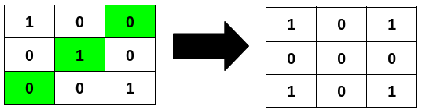
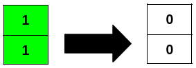

### [3240\. 最少翻转次数使二进制矩阵回文 II](https://leetcode.cn/problems/minimum-number-of-flips-to-make-binary-grid-palindromic-ii/)

难度：中等

给你一个 <code>m &times; n</code> 的二进制矩阵 `grid`。

如果矩阵中一行或者一列从前往后与从后往前读是一样的，那么我们称这一行或者这一列是 **回文** 的。

你可以将 `grid` 中任意格子的值 **翻转** ，也就是将格子里的值从 `0` 变成 `1` ，或者从 `1` 变成 `0`。

请你返回 **最少** 翻转次数，使得矩阵中 **所有** 行和列都是 **回文的** ，且矩阵中 `1` 的数目可以被 `4` **整除**。

**示例 1：**

> **输入：** grid = \[[1,0,0],[0,1,0],[0,0,1]]
> **输出：** 3
> **解释：**
> 

**示例 2：**

> **输入：** grid = \[[0,1],[0,1],[0,0]]
> **输出：** 2
> **解释：**
> 

**示例 3：**

> **输入：** grid = \[[1],[1]]
> **输出：** 2
> **解释：**
> 

**提示：**

- `m == grid.length`
- `n == grid[i].length`
- <code>1 <= m &times; n <= 2 &times; 105</code>
- `0 <= grid[i][j] <= 1`
