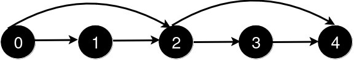
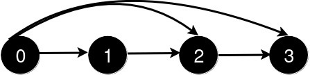

### [3244\. 新增道路查询后的最短距离 II](https://leetcode.cn/problems/shortest-distance-after-road-addition-queries-ii/)

难度：困难

给你一个整数 `n` 和一个二维整数数组 `queries`。

有 `n` 个城市，编号从 `0` 到 `n - 1`。初始时，每个城市 `i` 都有一条**单向**道路通往城市 `i + 1`（ `0 <= i < n - 1`）。

<code>queries[i] = [ui, vi]</code> 表示新建一条从城市 <code>ui</code> 到城市 <code>vi</code> 的**单向**道路。每次查询后，你需要找到从城市 `0` 到城市 `n - 1` 的**最短路径**的**长度**。

所有查询中不会存在两个查询都满足 `queries[i][0] < queries[j][0] < queries[i][1] < queries[j][1]`。

返回一个数组 `answer`，对于范围 `[0, queries.length - 1]` 中的每个 `i`，`answer[i]` 是处理完**前** `i + 1` 个查询后，从城市 `0` 到城市 `n - 1` 的最短路径的_长度_。

**示例 1：**

> **输入：** n = 5, queries = \[[2, 4], [0, 2], [0, 4]]
> **输出：** [3, 2, 1]
> **解释：**
> 
> 新增一条从 2 到 4 的道路后，从 0 到 4 的最短路径长度为 3。
> 
> 新增一条从 0 到 2 的道路后，从 0 到 4 的最短路径长度为 2。
> 
> 新增一条从 0 到 4 的道路后，从 0 到 4 的最短路径长度为 1。

**示例 2：**

> **输入：** n = 4, queries = \[[0, 3], [0, 2]]
> **输出：** [1, 1]
> **解释：**
> 
> 新增一条从 0 到 3 的道路后，从 0 到 3 的最短路径长度为 1。
> 
> 新增一条从 0 到 2 的道路后，从 0 到 3 的最短路径长度仍为 1。

**提示:**

- <code>3 <= n <= 105</code>
- <code>1 <= queries.length <= 105</code>
- `queries[i].length == 2`
- `0 <= queries[i][0] < queries[i][1] < n`
- `1 < queries[i][1] - queries[i][0]`
- 查询中不存在重复的道路。
- 不存在两个查询都满足 `i != j` 且 `queries[i][0] < queries[j][0] < queries[i][1] < queries[j][1]`。
