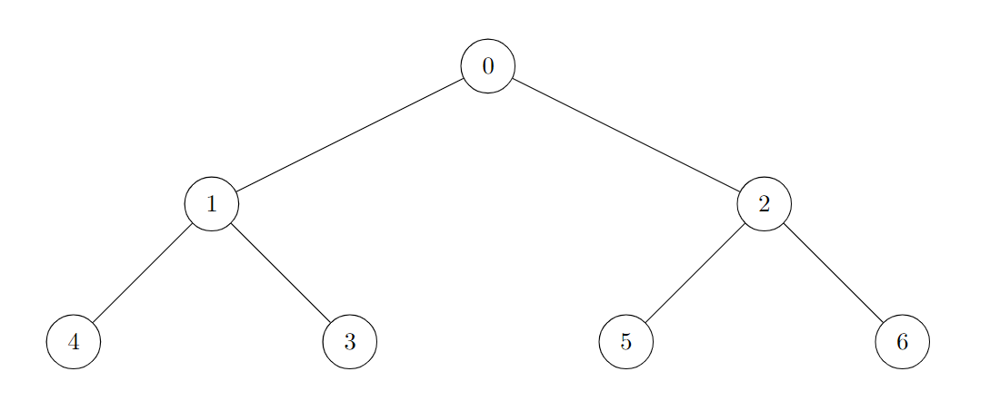
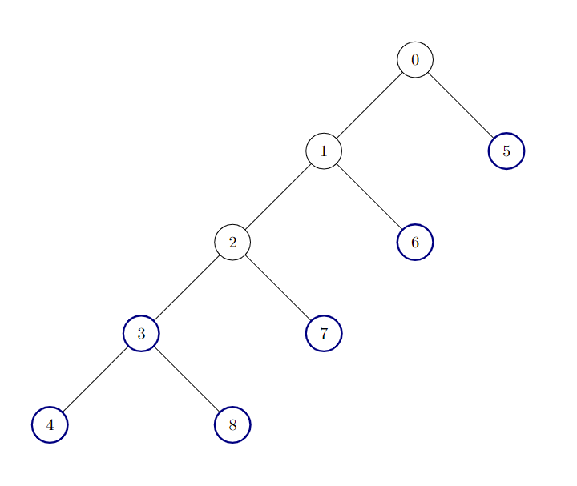

### [3249\. 统计好节点的数目](https://leetcode.cn/problems/count-the-number-of-good-nodes/)

难度：中等

现有一棵 **无向** 树，树中包含 `n` 个节点，按从 `0` 到 `n - 1` 标记。树的根节点是节点 `0`。给你一个长度为 `n - 1` 的二维整数数组 `edges`，其中 <code>edges[i] = [ai, bi]</code> 表示树中节点 <code>ai</code> 与节点 <code>bi</code> 之间存在一条边。

如果一个节点的所有子节点为根的**子树**[^1]包含的节点数相同，则认为该节点是一个 **好节点**。

返回给定树中 **好节点** 的数量。

**子树** 指的是一个节点以及它所有后代节点构成的一棵树。

**示例 1：**

> **输入：** edges = \[[0,1],[0,2],[1,3],[1,4],[2,5],[2,6]]
> **输出：** 7
> **说明：**
> 
> 树的所有节点都是好节点。

**示例 2：**

> **输入：** edges = \[[0,1],[1,2],[2,3],[3,4],[0,5],[1,6],[2,7],[3,8]]
> **输出：** 6
> **说明：**
> 
> 树中有 6 个好节点。上图中已将这些节点着色。

**示例 3：**

> **输入：** edges = \[[0,1],[1,2],[1,3],[1,4],[0,5],[5,6],[6,7],[7,8],[0,9],[9,10],[9,12],[10,11]]
> **输出：** 12
> **解释：**
> 
> 除了节点 9 以外其他所有节点都是好节点。

**提示：**

- <code>2 <= n <= 105</code>
- <code>edges.length == n - 1</code>
- <code>edges[i].length == 2</code>
- <code>0 <= ai, bi < n</code>
- 输入确保 `edges` 总表示一棵有效的树。

[^1]: `treeName` 树中的一个节点及其所有子孙节点所构成的树称为 `treeName` 的 **子树**。
