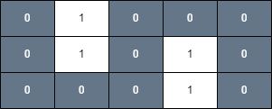

### [3286\. 穿越网格图的安全路径](https://leetcode.cn/problems/find-a-safe-walk-through-a-grid/)

难度：中等

给你一个 <code>m &times; n</code> 的二进制矩形 `grid` 和一个整数 `health` 表示你的健康值。

你开始于矩形的左上角 `(0, 0)`，你的目标是矩形的右下角 `(m - 1, n - 1)`。

你可以在矩形中往上下左右相邻格子移动，但前提是你的健康值始终是 **正数**。

对于格子 `(i, j)`，如果 `grid[i][j] = 1`，那么这个格子视为 **不安全** 的，会使你的健康值减少 1。

如果你可以到达最终的格子，请你返回 `true`，否则返回 `false`。

**注意**，当你在最终格子的时候，你的健康值也必须为 **正数**。

**示例 1：**

> **输入：** grid = \[[0,1,0,0,0],[0,1,0,1,0],[0,0,0,1,0]], health = 1
> **输出：** true
> **解释：**
> 沿着下图中灰色格子走，可以安全到达最终的格子。
> 

**示例 2：**

> **输入：** grid = \[[0,1,1,0,0,0],[1,0,1,0,0,0],[0,1,1,1,0,1],[0,0,1,0,1,0]], health = 3
> **输出：** false
> **解释：**
> 健康值最少为 4 才能安全到达最后的格子。
> 

**示例 3：**

> **输入：** grid = \[[1,1,1],[1,0,1],[1,1,1]], health = 5
> **输出：** true
> **解释：**
> 沿着下图中灰色格子走，可以安全到达最终的格子。
> 
> 任何不经过格子 `(1, 1)` 的路径都是不安全的，因为你的健康值到达最终格子时，都会小于等于 0。

**提示：**

- `m == grid.length`
- `n == grid[i].length`
- `1 <= m, n <= 50`
- <code>2 <= m &times; n</code>
- `1 <= health <= m + n`
- `grid[i][j]` 要么是 0，要么是 1。
