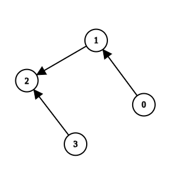
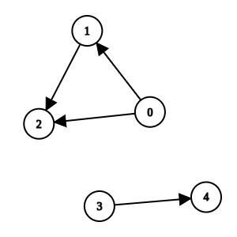

### [3310\. 移除可疑的方法](https://leetcode.cn/problems/remove-methods-from-project/)

难度：中等

你正在维护一个项目，该项目有 `n` 个方法，编号从 `0` 到 `n - 1`。

给你两个整数 `n` 和 `k`，以及一个二维整数数组 `invocations`，其中 <code>invocations[i] = [ai, bi]</code> 表示方法 <code>ai</code> 调用了方法 <code>bi</code>。

已知如果方法 `k` 存在一个已知的 bug。那么方法 `k` 以及它直接或间接调用的任何方法都被视为 **可疑方法**，我们需要从项目中移除这些方法。

只有当一组方法没有被这组之外的任何方法调用时，这组方法才能被移除。

返回一个数组，包含移除所有 **可疑方法** 后剩下的所有方法。你可以以任意顺序返回答案。如果无法移除 **所有** 可疑方法，则 **不** 移除任何方法。

**示例 1:**

> **输入:** n = 4, k = 1, invocations = \[[1,2],[0,1],[3,2]]
> **输出:** [0,1,2,3]
> **解释:**
> 
> 方法 2 和方法 1 是可疑方法，但它们分别直接被方法 3 和方法 0 调用。由于方法 3 和方法 0 不是可疑方法，我们无法移除任何方法，故返回所有方法。

**示例 2:**

> **输入:** n = 5, k = 0, invocations = \[[1,2],[0,2],[0,1],[3,4]]
> **输出:** [3,4]
> **解释:**
> 
> 方法 0、方法 1 和方法 2 是可疑方法，且没有被任何其他方法直接调用。我们可以移除它们。

**示例 3:**

> **输入:** n = 3, k = 2, invocations = \[[1,2],[0,1],[2,0]]
> **输出:** []
> **解释:**
> 
> 所有方法都是可疑方法。我们可以移除它们。

**提示:**

- <code>1 <= n <= 105</code>
- `0 <= k <= n - 1`
- <code>0 <= invocations.length <= 2 &times; 105</code>
- <code>invocations[i] == [ai, bi]</code>
- <code>0 <= ai, bi <= n - 1</code>
- <code>ai != bi</code>
- `invocations[i] != invocations[j]`
