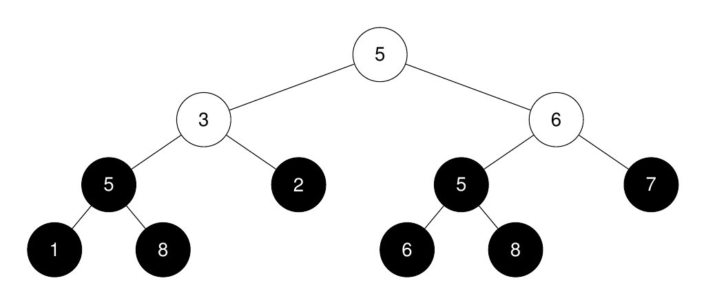
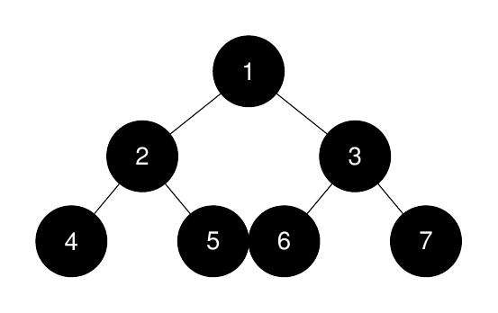
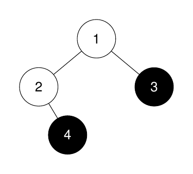

### [3319\. 第 K 大的完美二叉子树的大小](https://leetcode.cn/problems/k-th-largest-perfect-subtree-size-in-binary-tree/)

难度：中等

给你一棵 **二叉树** 的根节点 `root` 和一个整数`k`。

返回第 `k` 大的 **完美二叉** **子树[^1]** 的大小，如果不存在则返回 `-1`。

**完美二叉树** 是指所有叶子节点都在同一层级的树，且每个父节点恰有两个子节点。

**示例 1：**

> **输入：** root = [5,3,6,5,2,5,7,1,8,null,null,6,8], k = 2
> **输出：** 3
> **解释：**
> 
> 完美二叉子树的根节点在图中以黑色突出显示。它们的大小按非递增顺序排列为 `[3, 3, 1, 1, 1, 1, 1, 1]`。 
> 第 `2` 大的完美二叉子树的大小是 3。

**示例 2：**

> **输入：** root = [1,2,3,4,5,6,7], k = 1
> **输出：** 7
> **解释：**
> 
> 完美二叉子树的大小按非递增顺序排列为 `[7, 3, 3, 1, 1, 1, 1]`。最大的完美二叉子树的大小是 7。

**示例 3：**

> **输入：** root = [1,2,3,null,4], k = 3
> **输出：** -1
> **解释：**
> 
> 完美二叉子树的大小按非递增顺序排列为 `[1, 1]`。完美二叉子树的数量少于 3。

**提示：**

- 树中的节点数目在 `[1, 2000]` 范围内。
- `1 <= Node.val <= 2000`
- `1 <= k <= 1024`

[^1]: `treeName` 树中的一个节点及其所有子孙节点所构成的树称为 `treeName` 的 **子树**。
