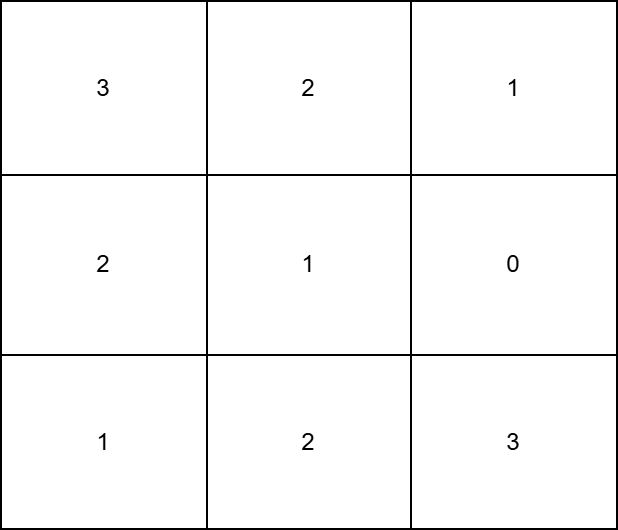
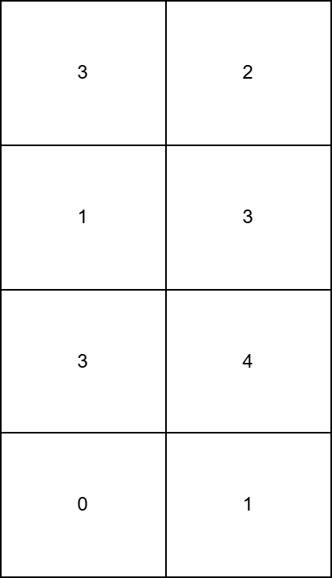

[3402\. 使每一列严格递增的最少操作次数](https://leetcode.cn/problems/minimum-operations-to-make-columns-strictly-increasing/)

难度：简单

给你一个由 **非负** 整数组成的 <code>m &times; n</code> 矩阵 `grid`。

在一次操作中，你可以将任意元素 `grid[i][j]` 的值增加 1。

返回使 `grid` 的所有列 **严格递增** 所需的 **最少** 操作次数。

**示例 1：**

> **输入:** grid = \[[3,2],[1,3],[3,4],[0,1]]
> **输出:** 15
> **解释:**
>
> - 为了让第 `0` 列严格递增，可以对 `grid[1][0]` 执行 3 次操作，对 `grid[2][0]` 执行 2 次操作，对 `grid[3][0]` 执行 6 次操作。
> - 为了让第 `1` 列严格递增，可以对 `grid[3][1]` 执行 4 次操作。
>
> 

**示例 2：**

> **输入:** grid = \[[3,2,1],[2,1,0],[1,2,3]]
> **输出:** 12
> **解释:**
>
> - 为了让第 `0` 列严格递增，可以对 `grid[1][0]` 执行 2 次操作，对 `grid[2][0]` 执行 4 次操作。
> - 为了让第 `1` 列严格递增，可以对 `grid[1][1]` 执行 2 次操作，对 `grid[2][1]` 执行 2 次操作。
> - 为了让第 `2` 列严格递增，可以对 `grid[1][2]` 执行 2 次操作。
>
> 

**提示:**

- `m == grid.length`
- `n == grid[i].length`
- `1 <= m, n <= 50`
- `0 <= grid[i][j] < 2500`
