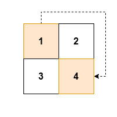
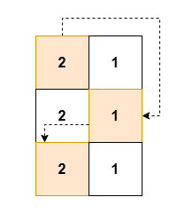
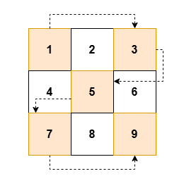

### [3417\. 跳过交替单元格的之字形遍历](https://leetcode.cn/problems/zigzag-grid-traversal-with-skip/)

难度：简单

给你一个 <code>m &times; n</code> 的二维数组 `grid`，数组由 **正整数** 组成。

你的任务是以 **之字形** 遍历 `grid`，同时跳过每个 **交替** 的单元格。

之字形遍历的定义如下：

- 从左上角的单元格 `(0, 0)` 开始。
- 在当前行中向 **右** 移动，直到到达该行的末尾。
- 下移到下一行，然后在该行中向 **左** 移动，直到到达该行的开头。
- 继续在行间交替向右和向左移动，直到所有行都被遍历完。

**注意：** 在遍历过程中，必须跳过每个 **交替** 的单元格。

返回一个整数数组 `result`，其中包含按 **顺序** 记录的、且跳过交替单元格后的之字形遍历中访问到的单元格值。

**示例 1：**

> **输入：** grid = \[[1,2],[3,4]]
> **输出：** [1,4]
> **解释：**
> 

**示例 2：**

> **输入：** grid = \[[2,1],[2,1],[2,1]]
> **输出：** [2,1,2]
> **解释：**
> 

**示例 3：**

> **输入：** grid = \[[1,2,3],[4,5,6],[7,8,9]]
> **输出：** [1,3,5,7,9]
> **解释：**
> 

**提示：**

- `2 <= n == grid.length <= 50`
- `2 <= m == grid[i].length <= 50`
- `1 <= grid[i][j] <= 2500`
