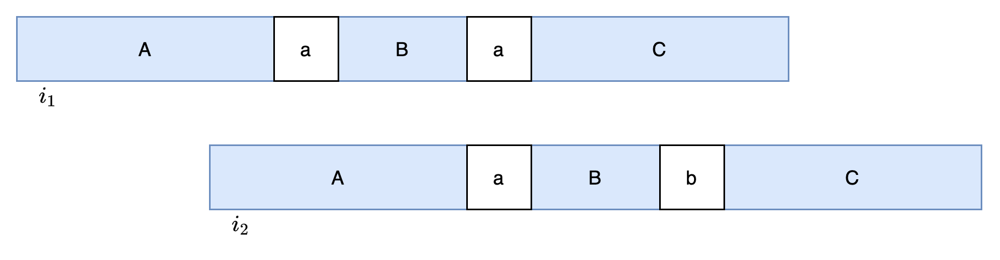

### [字典序最小的生成字符串](https://leetcode.cn/problems/lexicographically-smallest-generated-string/solutions/3938813/zi-dian-xu-zui-xiao-de-sheng-cheng-zi-fu-cuw8/)

#### 方法一：贪心

**思路与算法**

我们首先处理 $'T'$ 约束，再处理 $'F'$ 约束。

我们遍历 $str_1$ 中的 $'T'$，将 $str_2$ 填入目标字符串 $word$。如果在填充过程中发生冲突（即某个位置已经填入了一个不同的字符），则说明无解，返回空字符串。另外，我们在过程中使用一个 $fixed$ 数组记录哪些位置是被 $'T'$ 固定住的。

然后，我们将没有固定住的位置，都默认填入 $'a'$，这是为了让字典序尽可能的小。接着处理 $'F'$ 约束，遍历所有 $str_1$ 中的 $'F'$，检查对应的子串 $word[i...i+m-1]$ 是否正好等于 $str_2$。若正好等于，那我们需要考虑修改该窗口内的一个非固定字符。为了保持字典序最小，我们应该尽可能修改窗口中靠右的非固定字符，将其修改为 $'b'$。

也许你会问，我们把当前修改窗口最靠右的非固定字符修改为 $'b'$ 后，是否会违反前面的 $'F'$ 约束？接下来我们证明这种情况是不可能发生的。

我们记 $str_1$ 中下标 $i_1$ 和 $i_2$ 处是两个 $'F'$，在处理 $i_2$ 时，需要修改某个 $'a'$ 为 $'b'$，导致 $i_1$ 处的子串等于 $str_2$。构造一个字符串 $str_2$ 为 $A+'a'+B+'b'+C$，在 $i_1$ 处的子串为 $A+'a'+B+'a'+C$，在 $i_2$ 处的子串为 $A+'a'+B+'b'+C$。现在我们需要将 $i_2$ 子串中的 $'a'$ 变成 $'b'$，导致 $i_1$ 处子串中的第二个 $'a'$ 变成 $'b'$，从而违反了 $'F'$ 约束。



如图所示，我们可以得到如下信息：

1. 由于 $i_2$ 处子串最右侧的非固定字符是第一个 $'a'$，因此后面紧跟的 $B+'b'+C$ 中不存在非固定字符，$B$ 的开头是一个 $'T'$ 约束，因此 $B+'b'+C$ 是 $str_2$ 的前缀。
2. $A$ 是 $A+'a'+B$ 的后缀

现在 $A$ 和 $B$ 的长度还无法确定，我们讨论三种情况：

1. $A$ 的长度和 $B$ 的长度相等，由于 $B+'b'+C$ 是 $str_2$ 的前缀，而 $str_2$ 为 $A+'a'+B+'b'+C$，可推断出 $'b'$ 等于 $'a'$，这显然不可能。
2. $A$ 的长度大于 $B$ 的长度，由于 $B+'b'+C$ 是 $str_2$ 的前缀，而 $A$ 也是 $str_2$ 的前缀，因此我们令 $A$ 等于 $B+'b'+D$。又因为 $A$ 是 $A+'a'+B$ 的后缀，因此 $(B+'b'+D)$ 是 $(B+'b'+D)+'a'+B$ 的后缀，进而有 $B+'b'+D$ 等于 $D+'a'+B$，等式两侧都包含 $B$ 和 $D$，从字符集的角度去掉 $B$ 和 $D$ 后，$'b'$ 需要等于 $'a'$，这显然不可能。
3. $A$ 的长度小于 $B$ 的长度，由于 $A$ 是 $A+'a'+B$ 的后缀，因此我们令 $B$ 等于 $D+A$。又因为 $B+'b'+C$ 是 $A+'a'+B+'b'+C$ 的前缀，因此 $(D+A)+'b'+C$ 是 $A+'a'+(D+A)+'b'+C$ 的前缀。这样一来，$(D+A)+'b'$ 就需要等于 $A+'a'+D$，等式两侧都包含 $D$ 和 $A$，从字符集的角度去掉 $D$ 和 $A$ 后，$'b'$ 需要等于 $'a'$，这显然不可能。

综上所述，上述三种情况都不可能成立，每次修改最右侧的非固定字符不会违反之前已经满足的 $'F'$ 约束，同时对最终的字符串字典序影响最小。

**代码**

```C++
class Solution {
public:
    string generateString(string str1, string str2) {
        int n = str1.size(), m = str2.size();
        string s(n + m - 1, 'a');
        vector<int> fixed(n + m - 1, 0);
        for (int i = 0; i < n; i++) {
            if (str1[i] == 'T') {
                for (int j = i; j < i + m; j++) {
                    if (fixed[j] && s[j] != str2[j - i]) {
                        return "";
                    } else {
                        s[j] = str2[j - i];
                        fixed[j] = 1;
                    }
                }
            }
        }

        for (int i = 0; i < n; i++) {
            if (str1[i] == 'F') {
                bool flag = false;
                int idx = -1;
                for (int j = i + m - 1; j >= i; j--) {
                    if (str2[j - i] != s[j]) {
                        flag = true;
                    }
                    if (idx == -1 && !fixed[j]) {
                        idx = j;
                    }
                }
                if (flag) {
                    continue;
                } else if (idx != -1) {
                    s[idx] = 'b';
                } else {
                    return "";
                }
            }
        }
        return s;
    }
};
```

```Python
class Solution:
    def generateString(self, str1: str, str2: str) -> str:
        n, m = len(str1), len(str2)
        s = ['a'] * (n + m - 1)
        fixed = [False] * (n + m - 1)

        # 处理 'T' 的情况
        for i, ch in enumerate(str1):
            if ch == 'T':
                for j, c in enumerate(str2, i):
                    if fixed[j] and s[j] != c:
                        return ""
                    s[j], fixed[j] = c, True

        # 处理 'F' 的情况
        for i, ch in enumerate(str1):
            if ch == 'F':
                # 检查是否已经有不同字符
                if any(str2[j-i] != s[j] for j in range(i, i+m)):
                    continue

                # 找第一个可修改的位置
                for j in range(i+m-1, i-1, -1):
                    if not fixed[j]:
                        s[j] = 'b'
                        break
                else:
                    return ""

        return ''.join(s)
```

```Rust
impl Solution {
    pub fn generate_string(str1: String, str2: String) -> String {
        let n = str1.len();
        let m = str2.len();
        let str1_chars: Vec<char> = str1.chars().collect();
        let str2_chars: Vec<char> = str2.chars().collect();

        let mut s = vec!['a'; n + m - 1];
        let mut fixed = vec![false; n + m - 1];

        for i in 0..n {
            if str1_chars[i] == 'T' {
                for j in i..i + m {
                    let target_char = str2_chars[j - i];
                    if fixed[j] && s[j] != target_char {
                        return String::new();
                    } else {
                        s[j] = target_char;
                        fixed[j] = true;
                    }
                }
            }
        }

        for i in 0..n {
            if str1_chars[i] == 'F' {
                let mut flag = false;
                let mut idx = -1;

                for j in (i..i + m).rev() {
                    let target_char = str2_chars[j - i];
                    if target_char != s[j] {
                        flag = true;
                    }
                    if idx == -1 && !fixed[j] {
                        idx = j as i32;
                    }
                }

                if flag {
                    continue;
                } else if idx != -1 {
                    s[idx as usize] = 'b';
                } else {
                    return String::new();
                }
            }
        }

        s.into_iter().collect()
    }
}
```

```Java
class Solution {
    public String generateString(String str1, String str2) {
        int n = str1.length(), m = str2.length();
        char[] s = new char[n + m - 1];
        int[] fixed = new int[n + m - 1];

        for (int i = 0; i < s.length; i++) {
            s[i] = 'a';
        }

        for (int i = 0; i < n; i++) {
            if (str1.charAt(i) == 'T') {
                for (int j = i; j < i + m; j++) {
                    if (fixed[j] == 1 && s[j] != str2.charAt(j - i)) {
                        return "";
                    } else {
                        s[j] = str2.charAt(j - i);
                        fixed[j] = 1;
                    }
                }
            }
        }

        for (int i = 0; i < n; i++) {
            if (str1.charAt(i) == 'F') {
                boolean flag = false;
                int idx = -1;
                for (int j = i + m - 1; j >= i; j--) {
                    if (str2.charAt(j - i) != s[j]) {
                        flag = true;
                    }
                    if (idx == -1 && fixed[j] == 0) {
                        idx = j;
                    }
                }
                if (flag) {
                    continue;
                } else if (idx != -1) {
                    s[idx] = 'b';
                } else {
                    return "";
                }
            }
        }
        return new String(s);
    }
}
```

```CSharp
public class Solution {
    public string GenerateString(string str1, string str2) {
        int n = str1.Length, m = str2.Length;
        char[] s = new char[n + m - 1];
        int[] fixed_ = new int[n + m - 1];

        for (int i = 0; i < s.Length; i++) {
            s[i] = 'a';
        }

        for (int i = 0; i < n; i++) {
            if (str1[i] == 'T') {
                for (int j = i; j < i + m; j++) {
                    if (fixed_[j] == 1 && s[j] != str2[j - i]) {
                        return "";
                    } else {
                        s[j] = str2[j - i];
                        fixed_[j] = 1;
                    }
                }
            }
        }

        for (int i = 0; i < n; i++) {
            if (str1[i] == 'F') {
                bool flag = false;
                int idx = -1;
                for (int j = i + m - 1; j >= i; j--) {
                    if (str2[j - i] != s[j]) {
                        flag = true;
                    }
                    if (idx == -1 && fixed_[j] == 0) {
                        idx = j;
                    }
                }
                if (flag) {
                    continue;
                } else if (idx != -1) {
                    s[idx] = 'b';
                } else {
                    return "";
                }
            }
        }
        return new string(s);
    }
}
```

```Go
func generateString(str1 string, str2 string) string {
    n, m := len(str1), len(str2)
    s := make([]byte, n+m-1)
    fixed := make([]int, n+m-1)

    for i := range s {
        s[i] = 'a'
    }

    for i := 0; i < n; i++ {
        if str1[i] == 'T' {
            for j := i; j < i+m; j++ {
                if fixed[j] == 1 && s[j] != str2[j-i] {
                    return ""
                } else {
                    s[j] = str2[j-i]
                    fixed[j] = 1
                }
            }
        }
    }

    for i := 0; i < n; i++ {
        if str1[i] == 'F' {
            flag := false
            idx := -1
            for j := i + m - 1; j >= i; j-- {
                if str2[j-i] != s[j] {
                    flag = true
                }
                if idx == -1 && fixed[j] == 0 {
                    idx = j
                }
            }
            if flag {
                continue
            } else if idx != -1 {
                s[idx] = 'b'
            } else {
                return ""
            }
        }
    }
    return string(s)
}
```

```C
char* generateString(const char* str1, const char* str2) {
    int n = strlen(str1), m = strlen(str2);
    int len = n + m - 1;
    char* s = (char*)malloc((len + 1) * sizeof(char));
    int* fixed = (int*)calloc(len, sizeof(int));

    for (int i = 0; i < len; i++) {
        s[i] = 'a';
    }
    s[len] = '\0';

    for (int i = 0; i < n; i++) {
        if (str1[i] == 'T') {
            for (int j = i; j < i + m; j++) {
                if (fixed[j] == 1 && s[j] != str2[j - i]) {
                    free(s);
                    free(fixed);
                    return "";
                } else {
                    s[j] = str2[j - i];
                    fixed[j] = 1;
                }
            }
        }
    }

    for (int i = 0; i < n; i++) {
        if (str1[i] == 'F') {
            int flag = 0;
            int idx = -1;
            for (int j = i + m - 1; j >= i; j--) {
                if (str2[j - i] != s[j]) {
                    flag = 1;
                }
                if (idx == -1 && fixed[j] == 0) {
                    idx = j;
                }
            }
            if (flag) {
                continue;
            } else if (idx != -1) {
                s[idx] = 'b';
            } else {
                free(s);
                free(fixed);
                return "";
            }
        }
    }

    free(fixed);
    return s;
}
```

```JavaScript
var generateString = function(str1, str2) {
    const n = str1.length, m = str2.length;
    const s = new Array(n + m - 1).fill('a');
    const fixed = new Array(n + m - 1).fill(0);

    for (let i = 0; i < n; i++) {
        if (str1[i] === 'T') {
            for (let j = i; j < i + m; j++) {
                if (fixed[j] === 1 && s[j] !== str2[j - i]) {
                    return "";
                } else {
                    s[j] = str2[j - i];
                    fixed[j] = 1;
                }
            }
        }
    }

    for (let i = 0; i < n; i++) {
        if (str1[i] === 'F') {
            let flag = false;
            let idx = -1;
            for (let j = i + m - 1; j >= i; j--) {
                if (str2[j - i] !== s[j]) {
                    flag = true;
                }
                if (idx === -1 && fixed[j] === 0) {
                    idx = j;
                }
            }
            if (flag) {
                continue;
            } else if (idx !== -1) {
                s[idx] = 'b';
            } else {
                return "";
            }
        }
    }
    return s.join('');
};
```

```TypeScript
function generateString(str1: string, str2: string): string {
    const n: number = str1.length, m: number = str2.length;
    const s: string[] = new Array(n + m - 1).fill('a');
    const fixed: number[] = new Array(n + m - 1).fill(0);

    for (let i = 0; i < n; i++) {
        if (str1[i] === 'T') {
            for (let j = i; j < i + m; j++) {
                if (fixed[j] === 1 && s[j] !== str2[j - i]) {
                    return "";
                } else {
                    s[j] = str2[j - i];
                    fixed[j] = 1;
                }
            }
        }
    }

    for (let i = 0; i < n; i++) {
        if (str1[i] === 'F') {
            let flag: boolean = false;
            let idx: number = -1;
            for (let j = i + m - 1; j >= i; j--) {
                if (str2[j - i] !== s[j]) {
                    flag = true;
                }
                if (idx === -1 && fixed[j] === 0) {
                    idx = j;
                }
            }
            if (flag) {
                continue;
            } else if (idx !== -1) {
                s[idx] = 'b';
            } else {
                return "";
            }
        }
    }
    return s.join('');
};
```

**复杂度分析**

- 时间复杂度：$O(nm)$，其中 $n$ 是 $str_1$ 的长度，$m$ 是 $str_2$ 的长度。
- 空间复杂度：$O(n+m)$。
