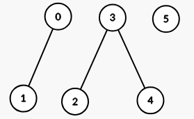
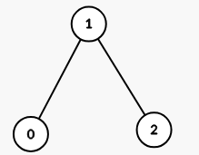

### [3493\. 属性图](https://leetcode.cn/problems/properties-graph/)

难度：中等

给你一个二维整数数组 `properties`，其维度为 `n x m`，以及一个整数 `k`。

定义一个函数 `intersect(a, b)`，它返回数组 `a` 和 `b` 中 **共有的不同整数的数量**。

构造一个 **无向图**，其中每个索引 `i` 对应 `properties[i]`。如果且仅当 `intersect(properties[i], properties[j]) >= k`（其中 `i` 和 `j` 的范围为 `[0, n - 1]` 且 `i != j`），节点 `i` 和节点 `j` 之间有一条边。

返回结果图中 **连通分量** 的数量。

**示例 1：**

> **输入：** properties = \[[1,2],[1,1],[3,4],[4,5],[5,6],[7,7]], k = 1
> **输出：** 3
> **解释：**
> 生成的图有 3 个连通分量：
> 

**示例 2：**

> **输入：** properties = \[[1,2,3],[2,3,4],[4,3,5]], k = 2
> **输出：** 1
> **解释：**
> 生成的图有 1 个连通分量：
> 

**示例 3：**

> **输入：** properties = \[[1,1],[1,1]], k = 2
> **输出：** 2
> **解释：**
> `intersect(properties[0], properties[1]) = 1`，小于 `k`。因此在图中 `properties[0]` 和 `properties[1]` 之间没有边。

**提示：**

- `1 <= n == properties.length <= 100`
- `1 <= m == properties[i].length <= 100`
- `1 <= properties[i][j] <= 100`
- `1 <= k <= m`
