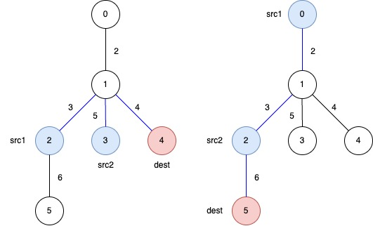
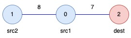

### [3553\. 包含要求路径的最小带权子图 II](https://leetcode.cn/problems/minimum-weighted-subgraph-with-the-required-paths-ii/)

难度：困难

给你一个 **无向带权** 树，共有 `n` 个节点，编号从 `0` 到 `n - 1`。这棵树由一个二维整数数组 `edges` 表示，长度为 `n - 1`，其中 <code>edges[i] = [ui, vi, wi]</code> 表示存在一条连接节点 <code>ui</code> 和 <code>vi</code> 的边，权重为 <code>wi</code>。

此外，给你一个二维整数数组 `queries`，其中 <code>queries[j] = [src1j, src2j, destj]</code>。

返回一个长度等于 `queries.length` 的数组 `answer`，其中 `answer[j]` 表示一个子树的 **最小总权重**，使用该子树的边可以从 <code>src1j</code> 和 <code>src2j</code> 到达 <code>destj</code>。

这里的 **子树** 是指原树中任意节点和边组成的连通子集形成的一棵有效树。

**示例 1：**

> **输入：** edges = \[[0,1,2],[1,2,3],[1,3,5],[1,4,4],[2,5,6]], queries = \[[2,3,4],[0,2,5]]
> **输出：** [12,11]
> **解释：**
> 蓝色边表示可以得到最优答案的子树之一。
> 
>
> - `answer[0]`：在选出的子树中，从 `src1 = 2` 和 `src2 = 3` 到 `dest = 4` 的路径总权重为 `3 + 5 + 4 = 12`。
> - `answer[1]`：在选出的子树中，从 `src1 = 0` 和 `src2 = 2` 到 `dest = 5` 的路径总权重为 `2 + 3 + 6 = 11`。

**示例 2：**

> **输入：** edges = \[[1,0,8],[0,2,7]], queries = \[[0,1,2]]
> **输出：** [15]
> **解释：**
> 
>
> - `answer[0]`：选出的子树中，从 `src1 = 0` 和 `src2 = 1` 到 `dest = 2` 的路径总权重为 `8 + 7 = 15`。

**提示：**

- <code>3 <= n <= 105</code>
- `edges.length == n - 1`
- `edges[i].length == 3`
- <code>0 <= ui, vi < n</code>
- <code>1 <= wi <= 104</code>
- <code>1 <= queries.length <= 105</code>
- `queries[j].length == 3`
- <code>0 <= src1j, src2j, destj < n</code>
- <code>src1j</code>、<code>src2j</code> 和 <code>destj</code> 互不不同。
- 输入数据保证 `edges` 表示的是一棵有效的树。
