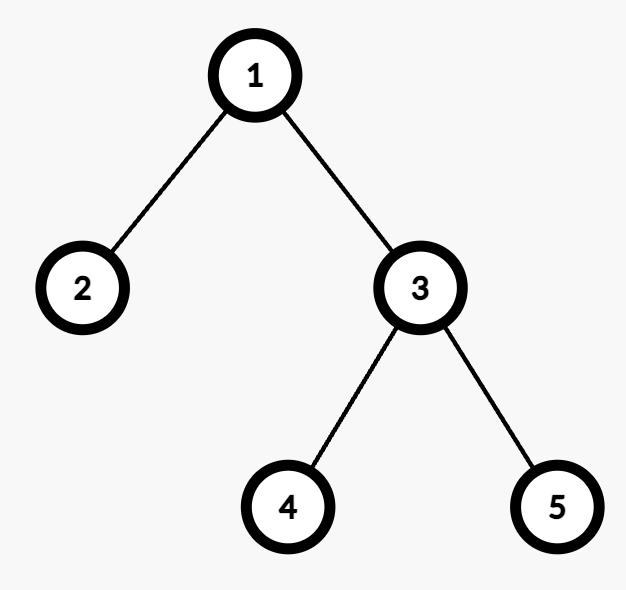

### [3558\. 给边赋权值的方案数 I](https://leetcode.cn/problems/number-of-ways-to-assign-edge-weights-i/)

难度：中等

给你一棵 `n` 个节点的无向树，节点从 1 到 `n` 编号，树以节点 1 为根。树由一个长度为 `n - 1` 的二维整数数组 `edges` 表示，其中 <code>edges[i] = [ui, vi]</code> 表示在节点 <code>ui</code> 和 <code>vi</code> 之间有一条边。

一开始，所有边的权重为 0。你可以将每条边的权重设为 **1** 或 **2**。

两个节点 `u` 和 `v` 之间路径的 **代价** 是连接它们路径上所有边的权重之和。

选择任意一个 **深度最大** 的节点 `x`。返回从节点 1 到 `x` 的路径中，边权重之和为 **奇数** 的赋值方式数量。

由于答案可能很大，返回它对 <code>109 + 7</code> 取模的结果。

**注意：** 忽略从节点 1 到节点 `x` 的路径外的所有边。

**示例 1：**

> 
>
> **输入：** edges = \[[1,2]]
> **输出：** 1
> **解释：**
>
> - 从节点 1 到节点 2 的路径有一条边（`1 \rightarrow  2`）。
> - 将该边赋权为 1 会使代价为奇数，赋权为 2 则为偶数。因此，合法的赋值方式有 1 种。

**示例 2：**

> 
>
> **输入：** edges = \[[1,2],[1,3],[3,4],[3,5]]
> **输出：** 2
> **解释：**
>
> - 最大深度为 2，节点 4 和节点 5 都在该深度，可以选择任意一个。
> - 例如，从节点 1 到节点 4 的路径包括两条边（`1 \rightarrow  3` 和 `3 \rightarrow  4`）。
> - 将两条边赋权为 (1,2) 或 (2,1) 会使代价为奇数，因此合法赋值方式有 2 种。

**提示：**

- <code>2 <= n <= 105</code>
- `edges.length == n - 1`
- <code>edges[i] == [ui, vi]</code>
- <code>1 <= ui, vi <= n</code>
- `edges` 表示一棵合法的树。
