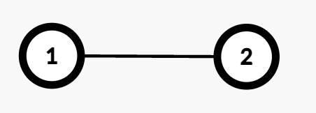

### [3559\. 给边赋权值的方案数 II](https://leetcode.cn/problems/number-of-ways-to-assign-edge-weights-ii/)

难度：困难

给你一棵有 `n` 个节点的无向树，节点从 1 到 `n` 编号，树以节点 1 为根。树由一个长度为 `n - 1` 的二维整数数组 `edges` 表示，其中 <code>edges[i] = [ui, vi]</code> 表示在节点 <code>ui</code> 和 <code>vi</code> 之间有一条边。

一开始，所有边的权重为 0。你可以将每条边的权重设为 **1** 或 **2**。

两个节点 `u` 和 `v` 之间路径的 **代价** 是连接它们路径上所有边的权重之和。

给定一个二维整数数组 `queries`。对于每个 <code>queries[i] = [ui, vi]</code>，计算从节点 <code>ui</code> 到 <code>vi</code> 的路径中，使得路径代价为 **奇数** 的权重分配方式数量。

返回一个数组 `answer`，其中 `answer[i]` 表示第 `i` 个查询的合法赋值方式数量。

由于答案可能很大，请对每个 `answer[i]` 取模 <code>109 + 7</code>。

**注意：** 对于每个查询，仅考虑 <code>ui</code> 到 <code>vi</code> 路径上的边，忽略其他边。

**示例 1：**

> 
>
> **输入：** edges = \[[1,2]], queries = \[[1,1],[1,2]]
> **输出：** [0,1]
> **解释：**
>
> - 查询 `[1,1]`：节点 1 到自身没有边，代价为 0，因此合法赋值方式为 0。
> - 查询 `[1,2]`：从节点 1 到节点 2 的路径有一条边（`1 \rightarrow  2`）。将权重设为 1 时代价为奇数，设为 2 时为偶数，因此合法赋值方式为 1。

**示例 2：**

> 
>
> **输入：** edges = \[[1,2],[1,3],[3,4],[3,5]], queries = \[[1,4],[3,4],[2,5]]
> **输出：** [2,1,4]
> **解释：**
>
> - 查询 `[1,4]`：路径为两条边（`1 \rightarrow  3` 和 `3 \rightarrow  4`），(1,2) 或 (2,1) 的组合会使代价为奇数，共 2 种。
> - 查询 `[3,4]`：路径为一条边（`3 \rightarrow  4`），仅权重为 1 时代价为奇数，共 1 种。
> - 查询 `[2,5]`：路径为三条边（`2 \rightarrow  1 \rightarrow  3 \rightarrow  5`），组合 (1,2,2)、(2,1,2)、(2,2,1)、(1,1,1) 均为奇数代价，共 4 种。

**提示：**

- <code>2 <= n <= 105</code>
- `edges.length == n - 1`
- <code>edges[i] == [ui, vi]</code>
- <code>1 <= queries.length <= 105</code>
- <code>queries[i] == [ui, vi]</code>
- <code>1 <= ui, vi <= n</code>
- `edges` 表示一棵合法的树。
