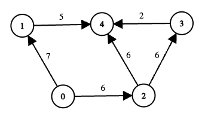

### [3620\. 恢复网络路径](https://leetcode.cn/problems/network-recovery-pathways/)

难度：困难

给你一个包含 `n` 个节点（编号从 0 到 `n - 1`）的有向无环图。图由长度为 `m` 的二维数组 `edges` 表示，其中 <code>edges[i] = [ui, vi, costi]</code> 表示从节点 <code>ui</code> 到节点 <code>vi</code> 的单向通信，恢复成本为 <code>costi</code>。

一些节点可能处于离线状态。给定一个布尔数组 `online`，其中 `online[i] = true` 表示节点 `i` 在线。节点 0 和 `n - 1` 始终在线。

从 0 到 `n - 1` 的路径如果满足以下条件，那么它是 **有效** 的：

- 路径上的所有中间节点都在线。
- 路径上所有边的总恢复成本不超过 `k`。

对于每条有效路径，其 **分数** 定义为该路径上的最小边成本。

返回所有有效路径中的 **最大** 路径分数（即最大 **最小** 边成本）。如果没有有效路径，则返回 -1。

**示例 1:**

> **输入:** edges = \[[0,1,5],[1,3,10],[0,2,3],[2,3,4]], online = [true,true,true,true], k = 10
> **输出:** 3
> **解释:**
> 
>
> - 图中有两条从节点 0 到节点 3 的可能路线：
>     1. 路径 <code>0 &rightarrow; 1 &rightarrow; 3</code>
>         - 总成本 = `5 + 10 = 15`，超过了 k (`15 > 10`)，因此此路径无效。
>     2. 路径 <code>0 &rightarrow; 2 &rightarrow; 3</code>
>         - 总成本 = `3 + 4 = 7 <= k`，因此此路径有效。
>         - 此路径上的最小边成本为 `min(3, 4) = 3`。
> - 没有其他有效路径。因此，所有有效路径分数中的最大值为 3。

**示例 2:**

> **输入:** edges = \[[0,1,7],[1,4,5],[0,2,6],[2,3,6],[3,4,2],[2,4,6]], online = [true,true,true,false,true], k = 12
> **输出:** 6
> **解释:**
> 
>
> - 节点 3 离线，因此任何通过 3 的路径都是无效的。
> - 考虑从 0 到 4 的其余路线：
>     1. 路径 <code>0 &rightarrow; 1 &rightarrow; 4</code>
>         - 总成本 = `7 + 5 = 12 <= k`，因此此路径有效。
>         - 此路径上的最小边成本为 `min(7, 5) = 5`。
>     2. 路径 <code>0 &rightarrow; 2 &rightarrow; 3 &rightarrow; 4</code>
>         - 节点 3 离线，因此无论成本多少，此路径无效。
>     3. 路径 <code>0 &rightarrow; 2 &rightarrow; 4</code>
>         - 总成本 = `6 + 6 = 12 <= k`，因此此路径有效。
>         - 此路径上的最小边成本为 `min(6, 6) = 6`。
> - 在两条有效路径中，它们的分数分别为 5 和 6。因此，答案是 6。

**提示:**

- `n == online.length`
- <code>2 <= n <= 5 &times; 104</code>
- <code>0 <= m == edges.length <= min(105, n &times; (n - 1) / 2)</code>
- <code>edges[i] = [ui, vi, costi]</code>
- <code>0 <= ui, vi < n</code>
- <code>ui != vi</code>
- <code>0 <= costi <= 109</code>
- <code>0 <= k <= 5 &times; 1013</code>
- `online[i]` 是 `true` 或 `false`，且 `online[0]` 和 `online[n - 1]` 均为 `true`。
- 给定的图是一个有向无环图。
