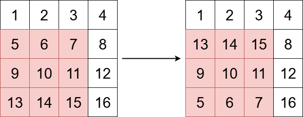
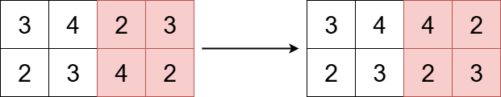

### [3643\. 垂直翻转子矩阵](https://leetcode.cn/problems/flip-square-submatrix-vertically/)

难度：简单

给你一个 <code>m &times; n</code> 的整数矩阵 `grid`，以及三个整数 `x`、`y` 和 `k`。

整数 `x` 和 `y` 表示一个 **正方形子矩阵** 的左上角下标，整数 `k` 表示该正方形子矩阵的边长。

你的任务是垂直翻转子矩阵的行顺序。

返回更新后的矩阵。

**示例 1：**

> **输入：** grid = \[[1,2,3,4],[5,6,7,8],[9,10,11,12],[13,14,15,16]], x = 1, y = 0, k = 3
> **输出：** \[[1,2,3,4],[13,14,15,8],[9,10,11,12],[5,6,7,16]]
> **解释：**
> 上图展示了矩阵在变换前后的样子。

**示例 2：**

> **输入：** grid = \[[3,4,2,3],[2,3,4,2]], x = 0, y = 2, k = 2
> **输出：** \[[3,4,4,2],[2,3,2,3]]
> **解释：**
> 上图展示了矩阵在变换前后的样子。

**提示：**

- `m == grid.length`
- `n == grid[i].length`
- `1 <= m, n <= 50`
- `1 <= grid[i][j] <= 100`
- `0 <= x < m`
- `0 <= y < n`
- `1 <= k <= min(m - x, n - y)`
