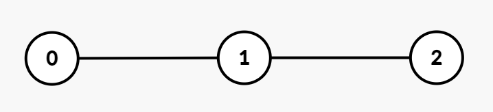
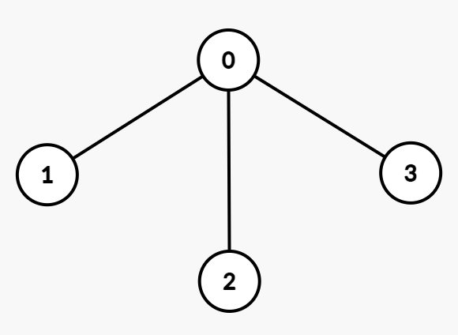

### [3786\. 树组的交互代价总和](https://leetcode.cn/problems/total-sum-of-interaction-cost-in-tree-groups/)

难度：困难

给你一个整数 `n` 和一棵包含 `n` 个节点、编号从 `0` 到 `n - 1` 的无向树。树由一个长度为 `n - 1` 的二维数组 `edges` 表示，其中 <code>edges[i] = [ui, vi]</code> 表示节点 <code>ui</code> 和 <code>vi</code> 之间存在一条无向边。

同时给定一个长度为 `n` 的整数数组 `group`，其中 `group[i]` 表示分配给节点 `i` 的组标签。

- 如果 `group[u] == group[v]`，则认为节点 `u` 和 `v` 属于同一组。
- **交互代价** 定义为节点 `u` 和 `v` 之间的唯一路径上的边数。

返回所有满足条件的 **无序** 节点对 `(u, v)` （其中 `u != v` 且 `group[u] == group[v]`）的交互代价之和。如果没有这样的节点对，返回 0。

**示例 1：**

> **输入：** n = 3, edges = \[[0,1],[1,2]], group = [1,1,1]
> **输出：** 4
> **解释：**
> 
> 所有节点都属于组 1，节点对的交互代价如下：
>
> - 节点 `(0, 1)`：1
> - 节点 `(1, 2)`：1
> - 节点 `(0, 2)`：2
>
> 因此，总交互代价为 `1 + 1 + 2 = 4`。

**示例 2：**

> **输入：** n = 3, edges = \[[0,1],[1,2]], group = [3,2,3]
> **输出：** 2
> **解释：**
>
> - 节点 0 和节点 2 属于组 3，它们之间的交互代价为 2。
> - 节点 1 属于不同的组，因此没有有效的节点对。
>
> 总交互代价为 2。

**示例 3：**

> **输入：** n = 4, edges = \[[0,1],[0,2],[0,3]], group = [1,1,4,4]
> **输出：** 3
> **解释：**
> 
> 组内的节点对及其交互代价如下：
>
> - 组 1：节点对 `(0, 1)` 的交互代价为 1。
> - 组 4：节点对 `(2, 3)` 的交互代价为 2。
>
> 因此，总交互代价为 `1 + 2 = 3`。

**示例 4：**

> **输入：** n = 2, edges = \[[0,1]], group = [9,8]
> **输出：** 0
> **解释：**
> 所有节点属于不同组，没有有效的节点对，因此总交互代价为 0。

**提示：**

- <code>1 <= n <= 105</code>
- `edges.length == n - 1`
- <code>edges[i] = [ui, vi]</code>
- <code>0 <= ui, vi <= n - 1</code>
- `group.length == n`
- `1 <= group[i] <= 20`
- 输入保证 `edges` 表示一棵有效的树。
