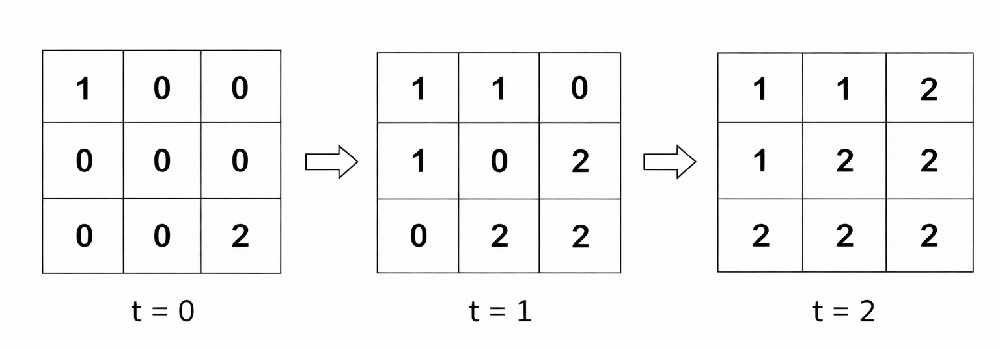
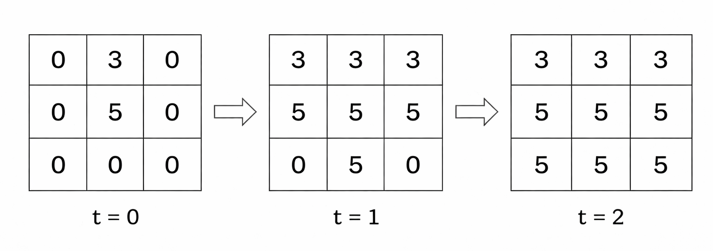
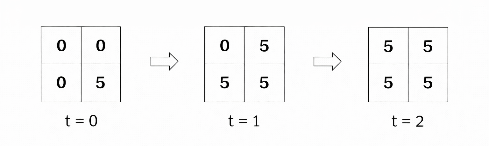

### [3905\. 多源图像渲染](https://leetcode.cn/problems/multi-source-flood-fill/)

难度：中等

给你两个整数 `n` 和 `m`，分别表示一个网格的行数和列数。

同时给你一个二维整数数组 `sources`，其中 <code>sources[i] = [ri, ci, colori]</code> 表示单元格 <code>(ri, ci)</code> 初始被涂上颜色 <code>colori</code>。所有其他单元格初始均未着色，用 0 表示。

在每一单位时间中，所有当前已着色的单元格都会将其颜色向上下左右四个方向扩散到所有相邻的 **未着色** 单元格。所有扩散同时发生。

如果 **多个** 颜色在同一时间步到达同一个未着色单元格，该单元格将采用具有 **最大** 值的颜色。

这个过程持续进行，直到没有更多的单元格可以被着色。

返回一个二维整数数组，表示网格的最终状态，其中每个单元格包含其最终的颜色。

**示例 1：**

> **输入：** n = 3, m = 3, sources = \[[0,0,1],[2,2,2]]
> **输出：** \[[1,1,2],[1,2,2],[2,2,2]]
> **解释：**
> 每个时间步的网格如下：
> 
> 在时间步 2，单元格 `(0, 2)`，`(1, 1)` 和 `(2, 0)` 同时被两种颜色到达，因此它们被分配颜色 2，因为它是其中的最大值。

**示例 2：**

> **输入：** n = 3, m = 3, sources = \[[0,1,3],[1,1,5]]
> **输出：** \[[3,3,3],[5,5,5],[5,5,5]]
> **解释：**
> 每个时间步的网格如下：
> 

**示例 3：**

> **输入：** n = 2, m = 2, sources = \[[1,1,5]]
> **输出：** \[[5,5],[5,5]]
> **解释：**
> 每个时间步的网格如下：
> 
> 由于只有一个源，所有单元格都被分配相同的颜色。

**提示：**

- <code>1 <= n, m <= 105</code>
- <code>1 <= n &times; m <= 105</code>
- `1 <= sources.length <= n * m`
- <code>sources[i] = [ri, ci, colori]</code>
- <code>0 <= ri <= n - 1</code>
- <code>0 <= ci <= m - 1</code>
- <code>1 <= colori <= 106</code>
- `sources` 中的所有 <code>(ri, ci)</code> 互不相同。
