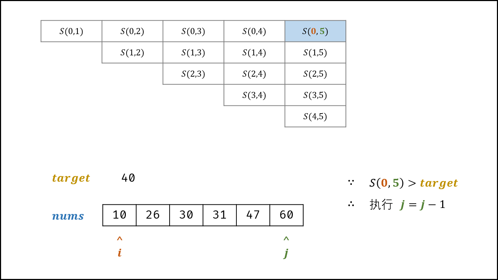
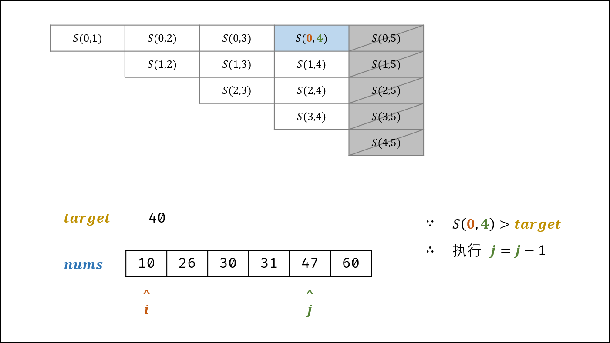
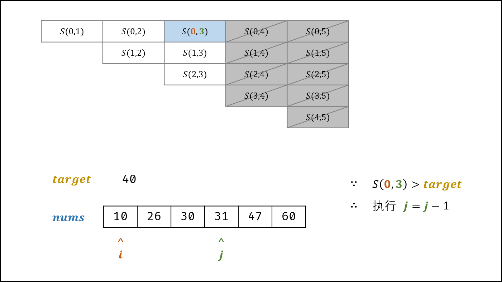
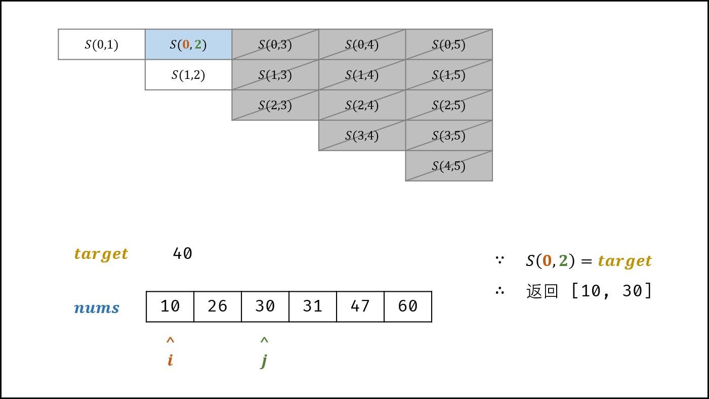

#### [和为 s 的两个数字（双指针 + 证明，清晰图解）](https://leetcode.cn/problems/he-wei-sde-liang-ge-shu-zi-lcof/solutions/164083/mian-shi-ti-57-he-wei-s-de-liang-ge-shu-zi-shuang-/)

#### 解题思路：

利用 HashMap 可以通过遍历数组找到数字组合，时间和空间复杂度均为 $O(N)$ ； 注意本题的 $nums$ 是 **排序数组** ，因此可使用 **双指针法** 将空间复杂度降低至 $O(1)$ 。

##### 算法流程：

1.  **初始化：** 双指针 $i$ , $j$ 分别指向数组 $nums$ 的左右两端 _（俗称对撞双指针）_。
2.  **循环搜索：** 当双指针相遇时跳出；
    1.  计算和 $s = nums[i] + nums[j]$ ；
    2.  若 $s > target$ ，则指针 $j$ 向左移动，即执行 $j = j - 1$ ；
    3.  若 $s < target$ ，则指针 $i$ 向右移动，即执行 $i = i + 1$ ；
    4.  若 $s = target$ ，立即返回数组 $[[nums[i], nums[j]]$ ；
3.  返回空数组，代表无和为 $target$ 的数字组合。






##### 正确性证明：

> 记每个状态为 $S(i, j)$ ，即 $S(i, j) = nums[i] + nums[j]$ 。假设 $S(i, j) < target$ ，则执行 $i = i + 1$ ，即状态切换至 $S(i + 1, j)$ 。

-   状态 $S(i, j)$ 切换至 $S(i + 1, j)$ ，则会消去一行元素，相当于 **消去了状态集合** $\{S(i, i + 1), S(i, i + 2), \dots, S(i, j - 2), S(i, j - 1), S(i, j) \}$ 。（由于双指针都是向中间收缩，因此这些状态之后不可能再遇到）。
-   由于 $nums$ 是排序数组，因此这些 **消去的状态** 都一定满足 $S(i, j) < target$ ，即这些状态都 **不是解** 。
-   **结论：** 以上分析已证明 “每次指针 $i$ 的移动操作，都不会导致解的丢失” ，即指针 $i$ 的移动操作是 **安全的** ；同理，对于指针 $j$ 可得出同样推论；因此，此双指针法是正确的。


##### 复杂度分析：

-   **时间复杂度 $O(N)$ ：** $N$ 为数组 $nums$ 的长度；双指针共同线性遍历整个数组。
-   **空间复杂度 $O(1)$ ：** 变量 $i$, $j$ 使用常数大小的额外空间。

#### 代码：

```python
class Solution:
    def twoSum(self, nums: List[int], target: int) -> List[int]:
        i, j = 0, len(nums) - 1
        while i < j:
            s = nums[i] + nums[j]
            if s > target: j -= 1
            elif s < target: i += 1
            else: return nums[i], nums[j]
        return []
```

```java
class Solution {
    public int[] twoSum(int[] nums, int target) {
        int i = 0, j = nums.length - 1;
        while(i < j) {
            int s = nums[i] + nums[j];
            if(s < target) i++;
            else if(s > target) j--;
            else return new int[] { nums[i], nums[j] };
        }
        return new int[0];
    }
}
```
