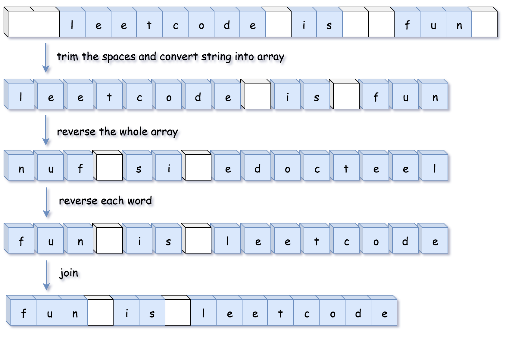
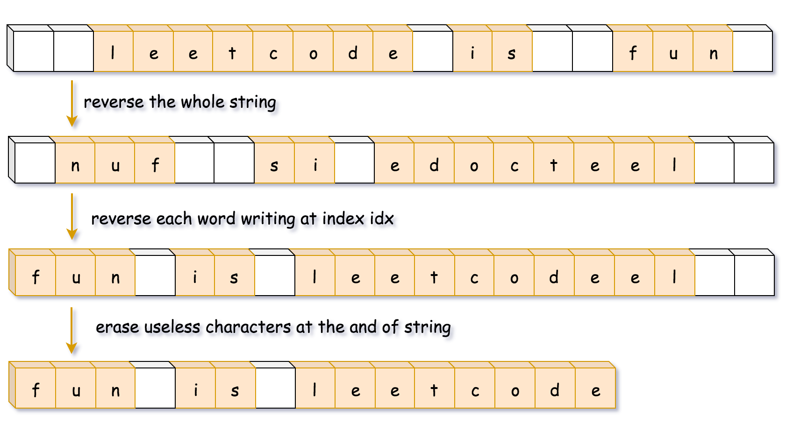

#### [方法二：自行编写对应的函数](https://leetcode.cn/problems/fan-zhuan-dan-ci-shun-xu-lcof/solutions/1398807/fan-zhuan-dan-ci-shun-xu-by-leetcode-sol-vnwj/)

**思路和算法**

我们也可以不使用语言中的 API，而是自己编写对应的函数。在不同语言中，这些函数实现是不一样的，主要的差别是有些语言的字符串不可变（如 Java 和 Python)，有些语言的字符串可变（如 C++)。

对于字符串不可变的语言，首先得把字符串转化成其他可变的数据结构，同时还需要在转化的过程中去除空格。



对于字符串可变的语言，就不需要再额外开辟空间了，直接在字符串上原地实现。在这种情况下，反转字符和去除空格可以一起完成。



```python
class Solution:
    def trim_spaces(self, s: str) -> list:
        left, right = 0, len(s) - 1
        # 去掉字符串开头的空白字符
        while left <= right and s[left] == ' ':
            left += 1
        
        # 去掉字符串末尾的空白字符
        while left <= right and s[right] == ' ':
            right -= 1
        
        # 将字符串间多余的空白字符去除
        output = []
        while left <= right:
            if s[left] != ' ':
                output.append(s[left])
            elif output[-1] != ' ':
                output.append(s[left])
            left += 1
        
        return output
            
    def reverse(self, l: list, left: int, right: int) -> None:
        while left < right:
            l[left], l[right] = l[right], l[left]
            left, right = left + 1, right - 1
            
    def reverse_each_word(self, l: list) -> None:
        n = len(l)
        start = end = 0
        
        while start < n:
            # 循环至单词的末尾
            while end < n and l[end] != ' ':
                end += 1
            # 翻转单词
            self.reverse(l, start, end - 1)
            # 更新start，去找下一个单词
            start = end + 1
            end += 1
                
    def reverseWords(self, s: str) -> str:
        l = self.trim_spaces(s)
        
        # 翻转字符串
        self.reverse(l, 0, len(l) - 1)
        
        # 翻转每个单词
        self.reverse_each_word(l)
        
        return ''.join(l)
```

```java
class Solution {
    public String reverseWords(String s) {
        StringBuilder sb = trimSpaces(s);

        // 翻转字符串
        reverse(sb, 0, sb.length() - 1);

        // 翻转每个单词
        reverseEachWord(sb);

        return sb.toString();
    }

    public StringBuilder trimSpaces(String s) {
        int left = 0, right = s.length() - 1;
        // 去掉字符串开头的空白字符
        while (left <= right && s.charAt(left) == ' ') {
            ++left;
        }

        // 去掉字符串末尾的空白字符
        while (left <= right && s.charAt(right) == ' ') {
            --right;
        }

        // 将字符串间多余的空白字符去除
        StringBuilder sb = new StringBuilder();
        while (left <= right) {
            char c = s.charAt(left);

            if (c != ' ') {
                sb.append(c);
            } else if (sb.charAt(sb.length() - 1) != ' ') {
                sb.append(c);
            }

            ++left;
        }
        return sb;
    }

    public void reverse(StringBuilder sb, int left, int right) {
        while (left < right) {
            char tmp = sb.charAt(left);
            sb.setCharAt(left++, sb.charAt(right));
            sb.setCharAt(right--, tmp);
        }
    }

    public void reverseEachWord(StringBuilder sb) {
        int n = sb.length();
        int start = 0, end = 0;

        while (start < n) {
            // 循环至单词的末尾
            while (end < n && sb.charAt(end) != ' ') {
                ++end;
            }
            // 翻转单词
            reverse(sb, start, end - 1);
            // 更新start，去找下一个单词
            start = end + 1;
            ++end;
        }
    }
}
```

```cpp
class Solution {
public:
    string reverseWords(string s) {
        // 反转整个字符串
        reverse(s.begin(), s.end());

        int n = s.size();
        int idx = 0;
        for (int start = 0; start < n; ++start) {
            if (s[start] != ' ') {
                // 填一个空白字符然后将idx移动到下一个单词的开头位置
                if (idx != 0) s[idx++] = ' ';

                // 循环遍历至单词的末尾
                int end = start;
                while (end < n && s[end] != ' ') s[idx++] = s[end++];

                // 反转整个单词
                reverse(s.begin() + idx - (end - start), s.begin() + idx);

                // 更新start，去找下一个单词
                start = end;
            }
        }
        s.erase(s.begin() + idx, s.end());
        return s;
    }
};
```

**复杂度分析**

-   时间复杂度：$O(n)$，其中 $n$ 为输入字符串的长度。
-   空间复杂度：`Java` 和 `Python` 的方法需要 $O(n)$ 的空间来存储字符串，而 `C++` 方法只需要 $O(1)$ 的额外空间来存放若干变量。
