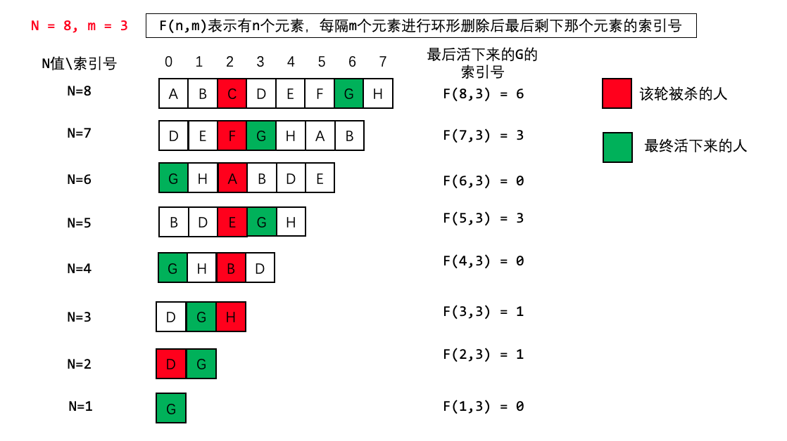

#### [解题思路](https://leetcode.cn/problems/yuan-quan-zhong-zui-hou-sheng-xia-de-shu-zi-lcof/solutions/178427/huan-ge-jiao-du-ju-li-jie-jue-yue-se-fu-huan-by-as/)

阅前提示（全文最重要的点）： **只关心最终活着那个人的序号变化**

#### 1 约瑟夫问题

这个问题实际上是约瑟夫问题，这个问题描述是

> N个人围成一圈，第一个人从1开始报数，报M的将被杀掉，下一个人接着从1开始报。如此反复，最后剩下一个，求最后的胜利者。

这个问题自己之前刷剑指的时候写过，但是今天根本想不起之前的思路了，说明没有深刻理解，为了不再犯错，这次深入理解了一遍，于是有了这篇文章

看了很多大佬的题解，都是用数字在进行举例，看完还是有一些疑惑，直到看了底部参考资料那篇文章才豁然开朗

这里换了个角度举例，或许会更清晰一些，欢迎大家讨论，并不吝赐教！

#### 2 问题转换

既然约塞夫问题就是用人来举例的，那我们也**给每个人一个编号**（索引值），每个人用**字母**代替

下面这个例子是`N=8 m=3`的例子

我们定义`F(n,m)`表示最后剩下那个人的`索引号`，因此我们只关系最后剩下来这个人的索引号的变化情况即可



从8个人开始，每次杀掉一个人，去掉被杀的人，然后把杀掉那个人之后的第一个人作为开头重新编号

-   第一次C被杀掉，人数变成7，D作为开头，（最终活下来的G的编号从6变成3）
-   第二次F被杀掉，人数变成6，G作为开头，（最终活下来的G的编号从3变成0）
-   第三次A被杀掉，人数变成5，B作为开头，（最终活下来的G的编号从0变成3）
-   以此类推，当只剩一个人时，他的编号必定为0！（重点！）

#### 3 最终活着的人编号的反推

现在我们知道了G的索引号的变化过程，那么我们反推一下 从`N = 7` 到`N = 8` 的过程

如何才能将`N = 7` 的排列变回到`N = 8` 呢？

我们先把被杀掉的C补充回来，然后右移m个人，发现溢出了，再把溢出的补充在最前面

**神奇了** 经过这个操作就恢复了`N = 8` 的排列了！


因此我们可以推出递推公式$f(8, 3) = [f(7, 3) + 3] \% 8$ 进行推广泛化，即$f(n, m) = [f(n-1, m) + m] \% n$

#### 4 递推公式的导出

再把`n=1`这个最初的情况加上，就得到递推公式

$$f(n, m) = \left\{ \begin{aligned} &0 & & {n = 1} \\ &[f(n-1, m) + m] \% n & & {n > 1} \\ \end{aligned} \right.$$

为了更好理解，这里是拿着约瑟夫环的结论进行举例解释，具体的数学证明请参考维基百科。

#### 5 代码

照着递推公式写即可，也可写成递归的形式

```cpp
class Solution {
public:
    int lastRemaining(int n, int m) {
        int pos = 0; // 最终活下来那个人的初始位置
        for(int i = 2; i <= n; i++){
            pos = (pos + m) % i;  // 每次循环右移
        }
        return pos;
    }
};
```

#### 6 参考资料

[约瑟夫环——公式法（递推公式）](https://leetcode.cn/link/?target=https%3A%2F%2Fblog.csdn.net%2Fu011500062%2Farticle%2Fdetails%2F72855826)