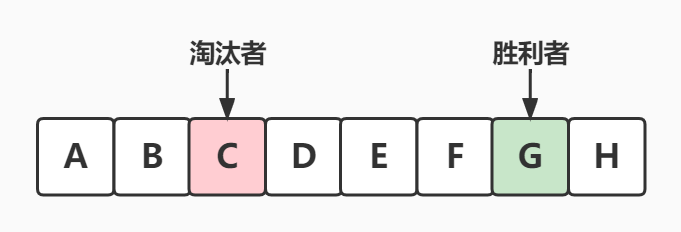
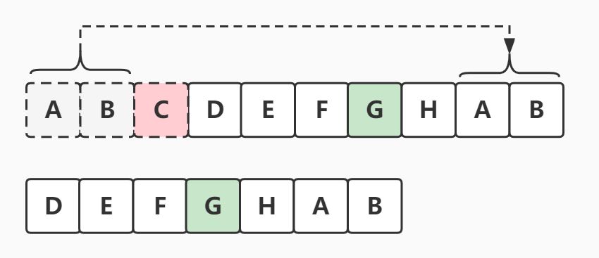

#### [公式](https://leetcode.cn/problems/yuan-quan-zhong-zui-hou-sheng-xia-de-shu-zi-lcof/solutions/1301345/yue-se-fu-huan-wen-ti-di-gui-shu-xue-die-nxdx/)

#### **`f(n, m) = (f(n−1, m) + m) % n`**

`f(n, m)`表示，`n`个人报数，每报到`m`时杀掉那个人，返回最终胜利者的编号

#### 核心思路

因为我们知道最后剩下一个人的情况时胜利者的下标是`0`，也就是我们已知胜利者最后的位置，**逆推**到最初的时候胜利者所在的位置：

1.  关注胜利者的下标位置是怎么变的
2.  每杀掉一个人，其实就是把这个数组向前移动了`m`位

-   **为什么是向前移动了`m`位** 因为每次都会从杀掉的人后面一个开始重新报数（C为被杀的，G为最后胜利者） 把`A`和`B`接到`H`后面形成一个新的队列，并且以`D`为新的队伍头 可以看到`G`的位置向左移动了`m`位，也就是减少了`m`，所以**逆推**`G`的位置时就要加上`m`就是公式中的 **`(f(n - 1) + m) % n`**
-   **为什么`% n`（注意`n`是会随着人数的变化而改变）** 因为当`+ m`后超过当前的总人数`n`时，需要回到队伍头计数

#### 实现

【递归做法】

```cpp
class Solution {
    int f(int n, int m) {
        if (n == 1) return 0;
        return (f(n - 1, m) + m) % n;
    }
public:
    int lastRemaining(int n, int m) {
        return f(n, m);
    }
};
```

【迭代优化空间】

```cpp
class Solution {
public:
    int lastRemaining(int n, int m) {
        int f = 0;//最后剩下一个人的情况时胜利者的下标是0
        //开始逆推
        for (int i = 2; i != n + 1; ++i) {
            f = (f + m) % i;//循环右移m位
        }
        return f;
    }
};
```
